# MyBatis

## 持久化与ORM

持久化是程序数据在瞬时状态和持久状态间转化的过程（内存 -> 数据库）

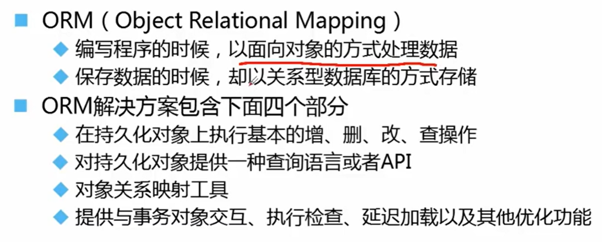

## Mybatis简介

### Mybatis开发步骤

## Mybatis核心对象

### SqlSessionFactoryBuilder

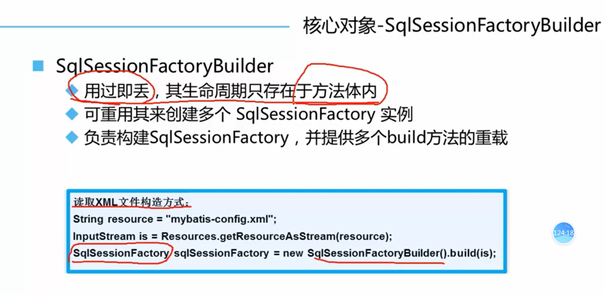

### SqlSessionFactory

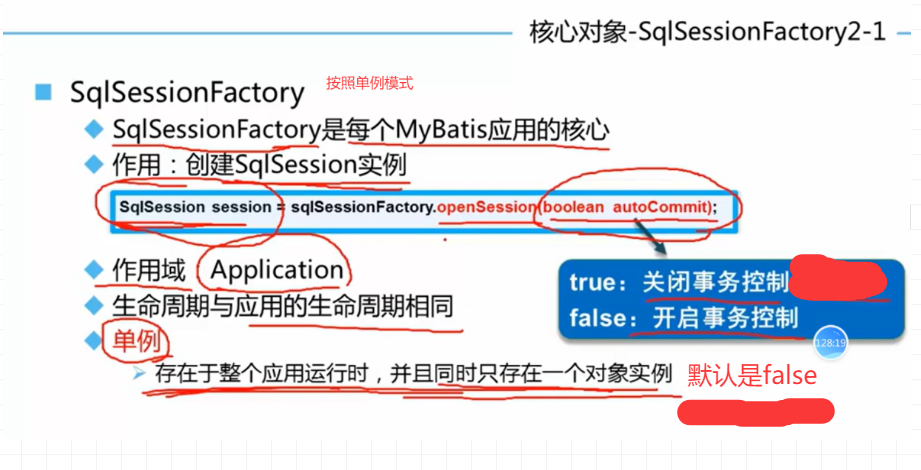

单例模式：这里通过创建一个工具类来将SqlSessionFactory实现为单例模式。后续在学习spring时，可以通过依赖注入中的

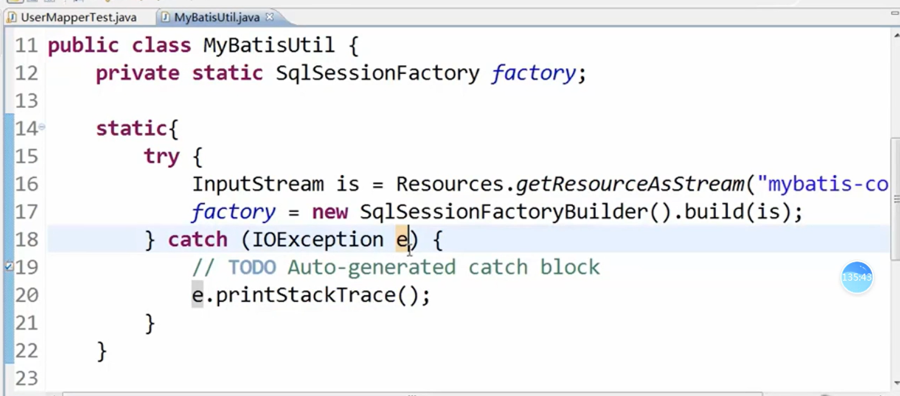

### SqlSession

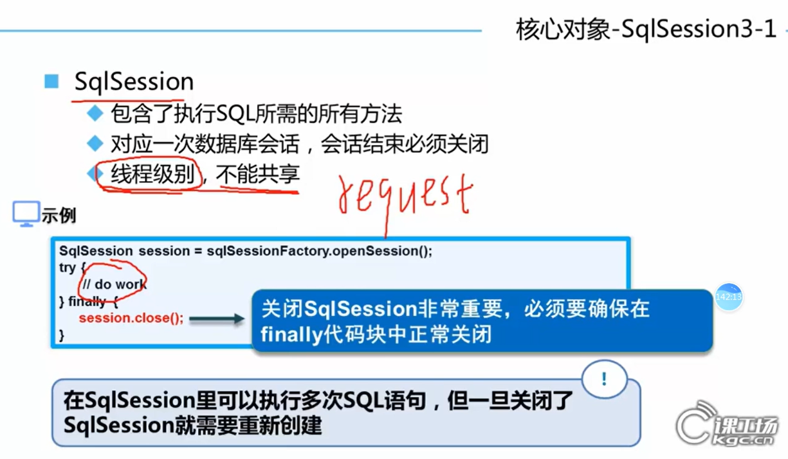

## Mybatis核心配置文件

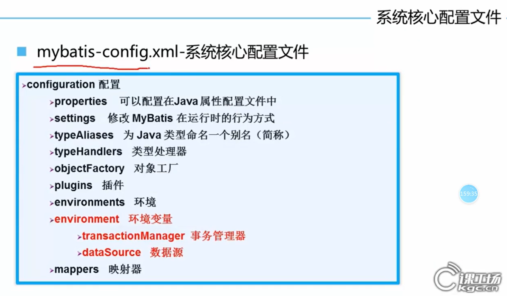

### 配置properties文件

#### 方式一

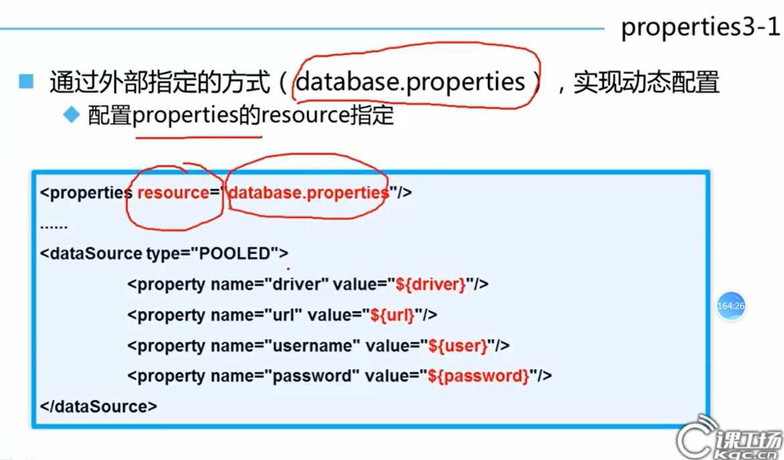

#### 方式二

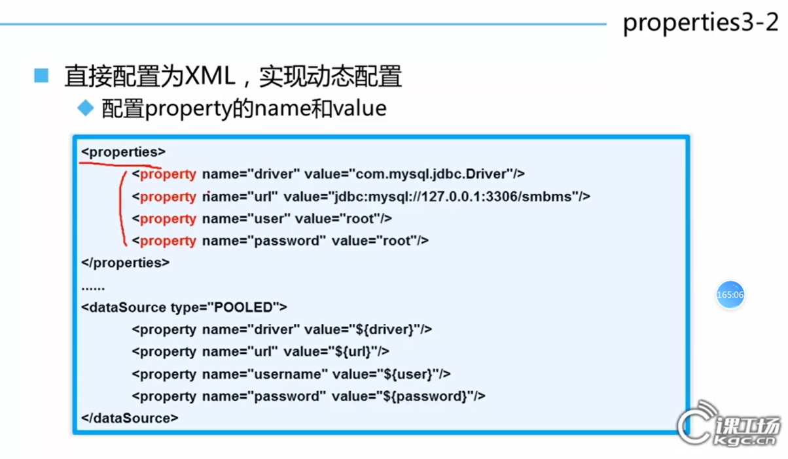

### settings配置

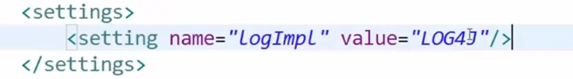

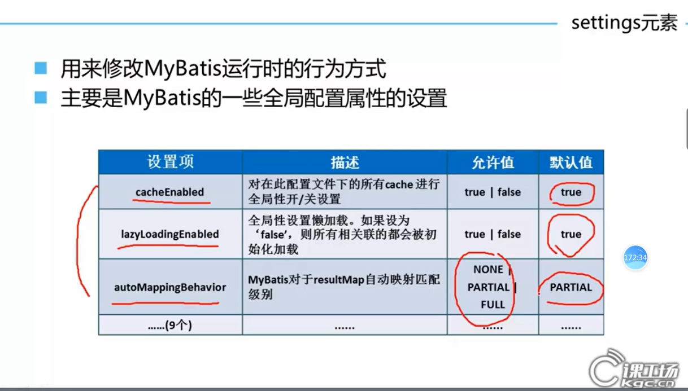

### typeAliases配置

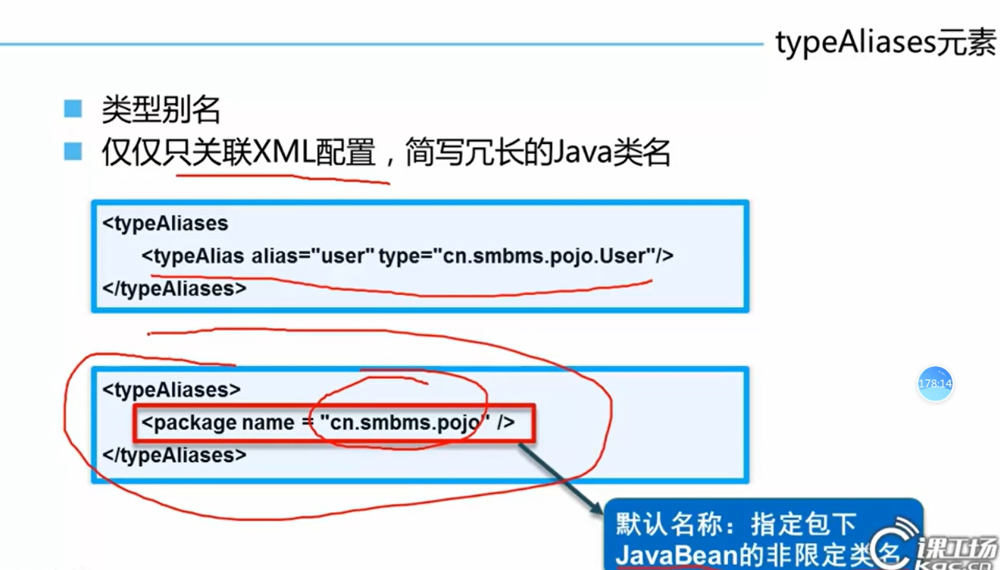

如果存在多个类需要取别名：

1. 将\<typeAlias>复制多份，比较费时麻烦。
2. 通过==包扫描==方式来让mybatis帮我们自动取别名，类全限定名的别名就是类名，首字母小写
   \<package name='包名'/>g
3. 对于基础类型不需要取别名

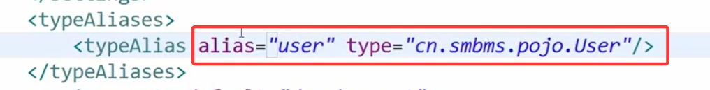

### environments配置

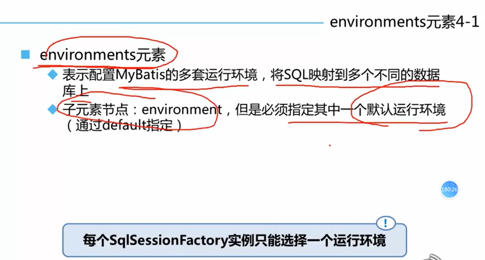

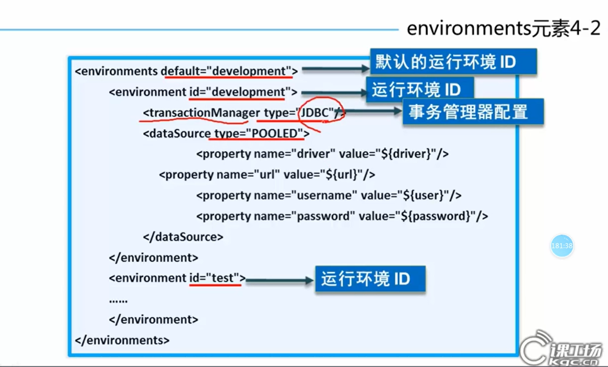

#### transactionManager

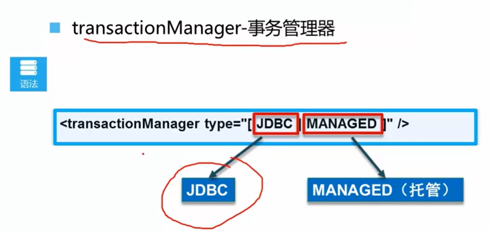

#### dataSource

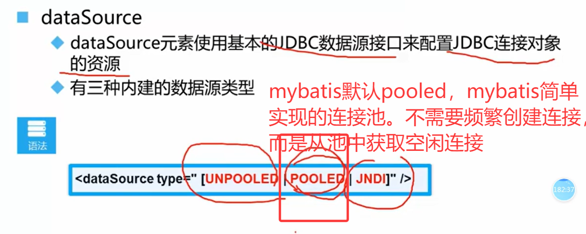

### mappers

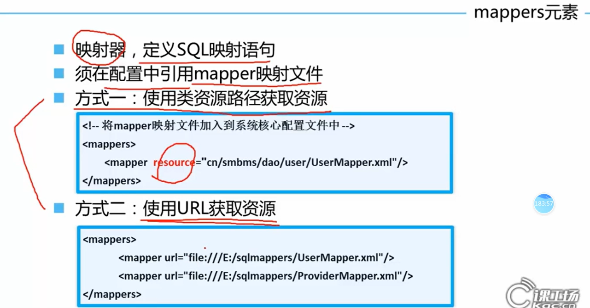
