## SQL映射文件XML元素

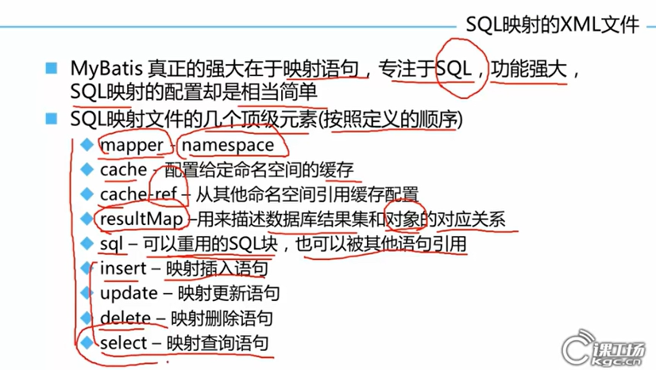

### mapper

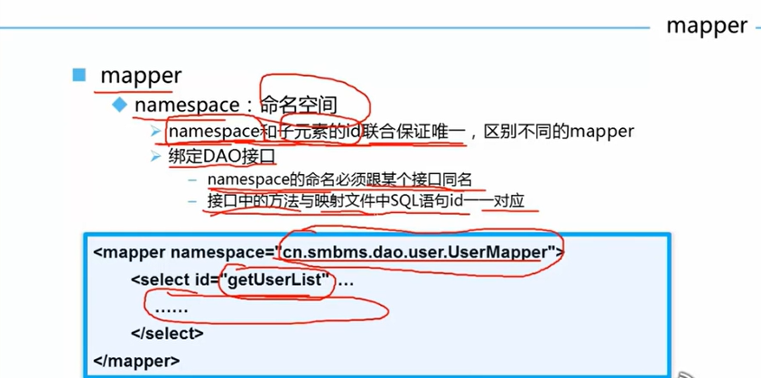

> 如果通过==绑定DAO接口==方式（常用）来编写，==namespace必须跟某个接口同名，同时接口中的方法要与映射文件中SQL语句id一一对应==！！！

### select

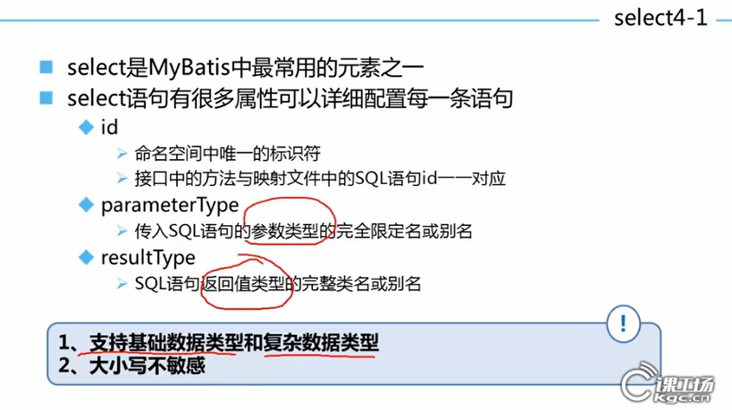

### insert

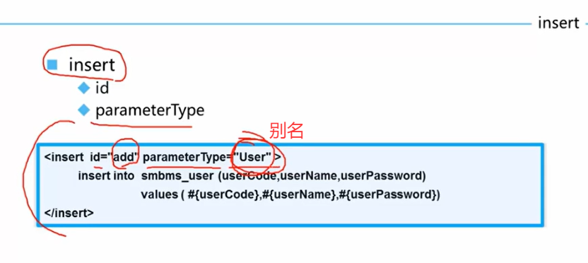

### update

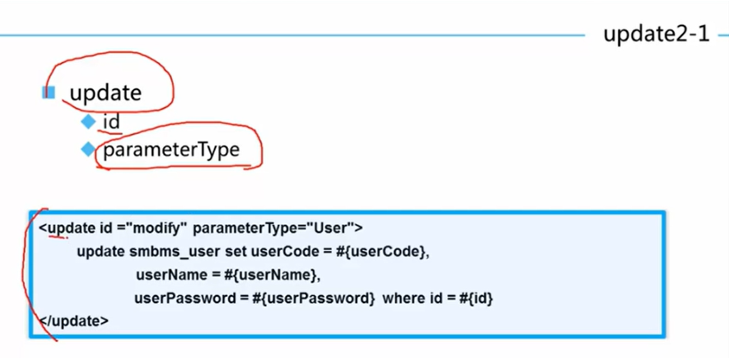

### delete

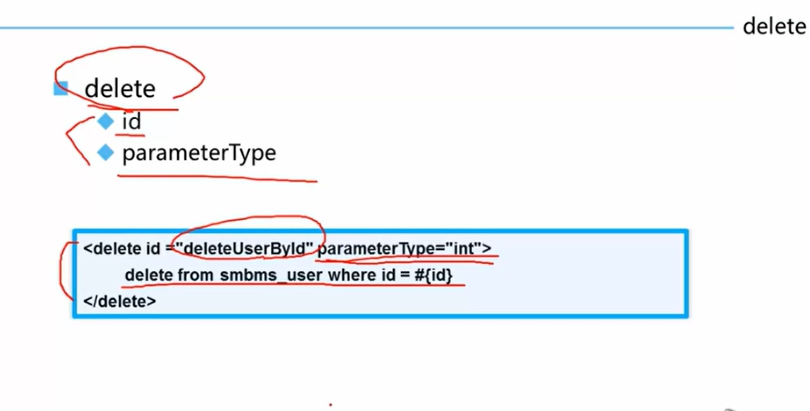

### 总结

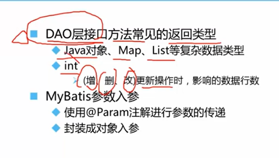

### 参数

#### 单参数

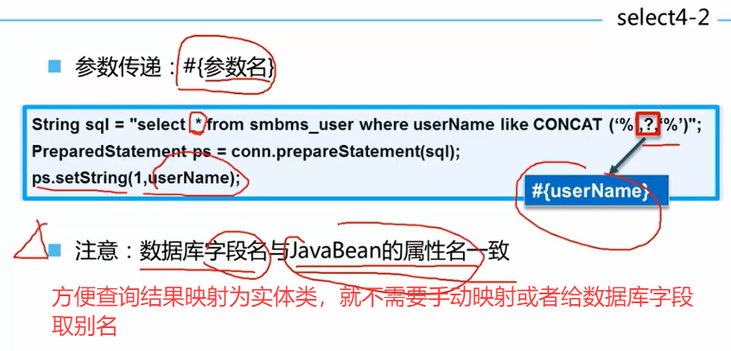

#### 多参数

1. 如果多个参数属于一个对象，可以将其通过对象的形式传入
2. 将多个参数映射到map中
3. 多个参数，每个参数通过@Param来传入多个参数

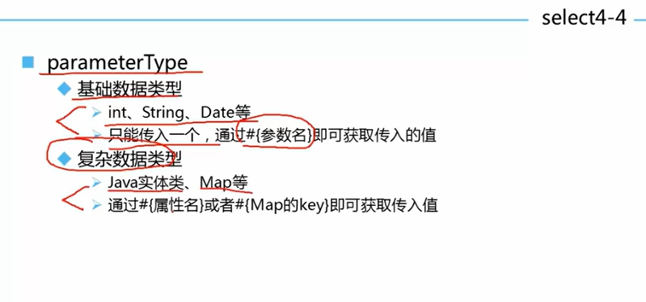

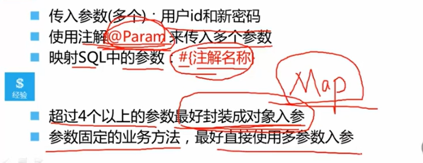

#### 总结

> 1. 不管是==resultMap==还是==resultType==，亦或是==paramType==，类型都是Map结构数据类型。
>
>    如果只有==一个参数==，并且没有使用@Param注解进行声明key时，mybatis会以其==name==作为key，==值==作为value传进来。当时==多参时==，没加@Param注解，就相当于没给其指定key，就无法找到参数相应的入参。
>
> 2. 什么时候使用@Param或者使用封装对象入参？
>
>    看参数个数，一般新增需要一整个对象。而对于修改密码这些只需要id和新密码，所以只需要两个@Param注解即可！！！

### ResultMap-了解

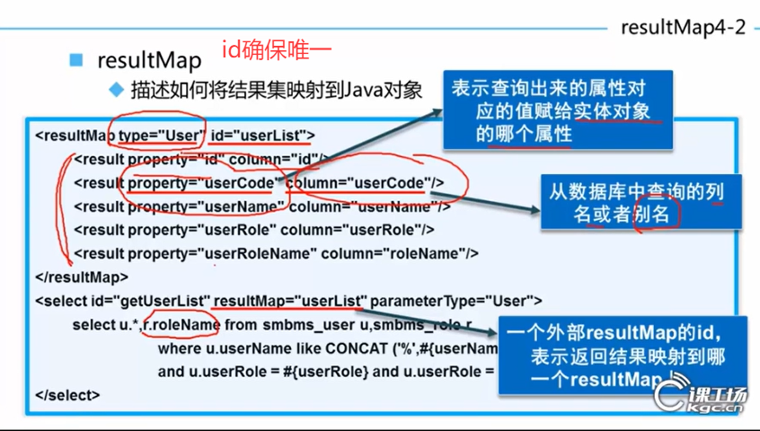

#### resultMap自动映射匹配

​	$如果设置autoMappingBehavior为NONE，表示不进行自动匹配，此时只会向映射的实体类中给出ResultMap里面声明的映射字段。$

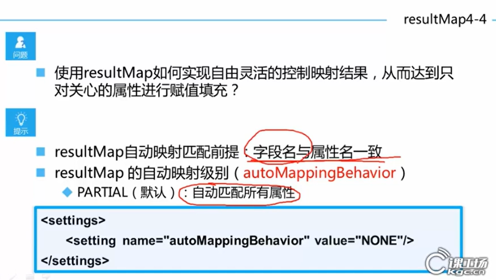

==对于复杂映射，只会映射resultMap中写的字段属性，如果需要将查询的sql结果都映射，需要修改value=FULL==

#### resultType和resultMap

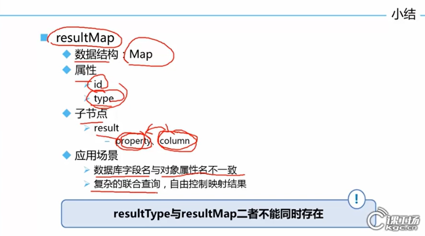

### resultMap-知识点

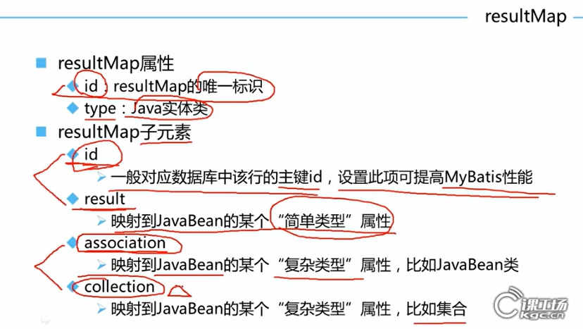

#### association

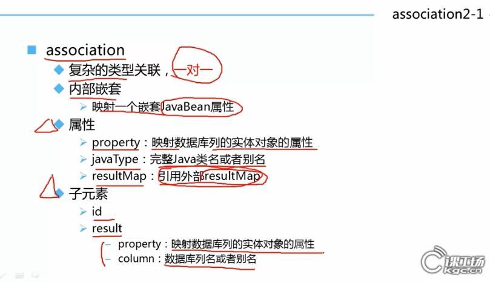

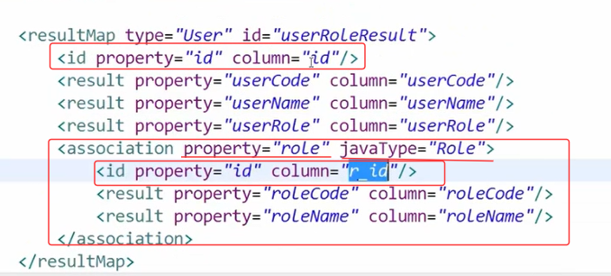

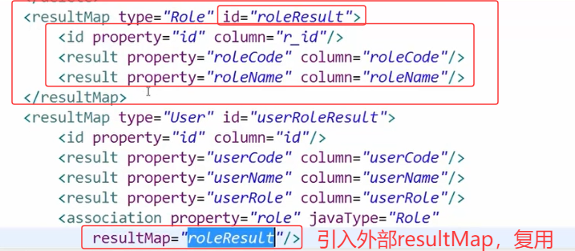

#### collection

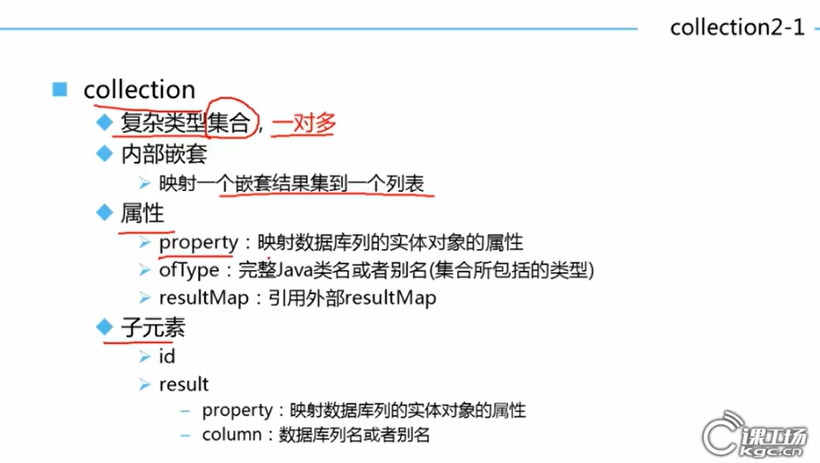

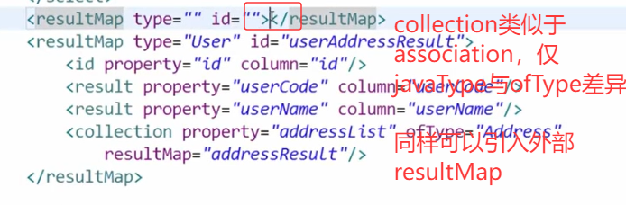

#### resultMap自动映射级别

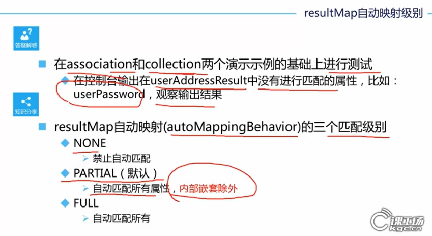

#### 缓存

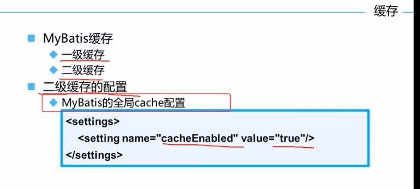

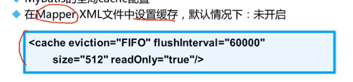

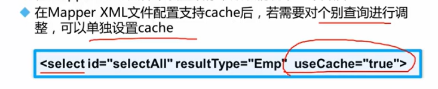
