# 动态SQL

## select中动态拼接where条件

### if

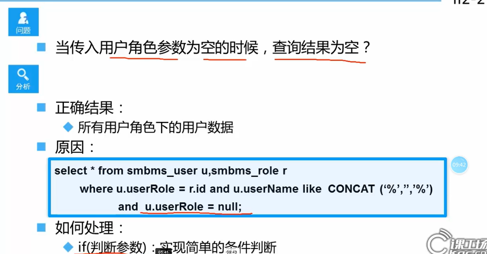

### where

### trim

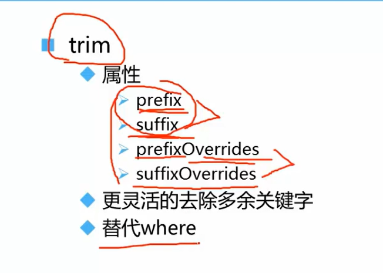

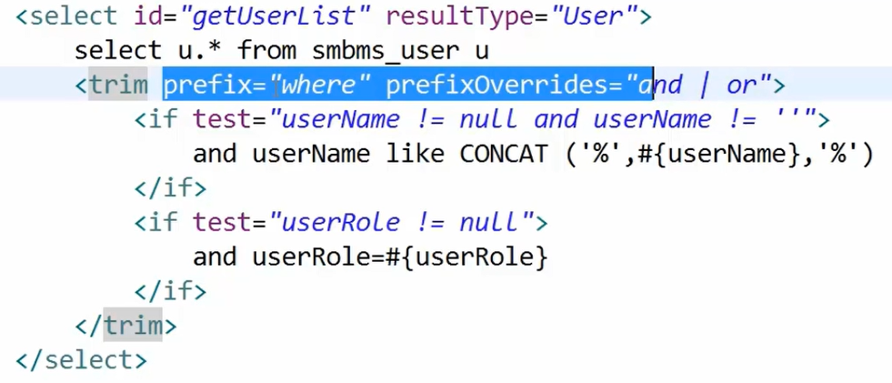

## update动态更新语句

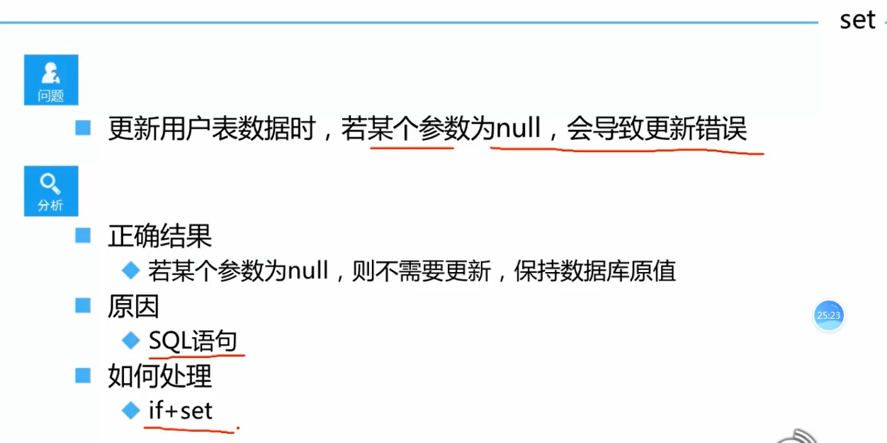

### \<set> + \<if>

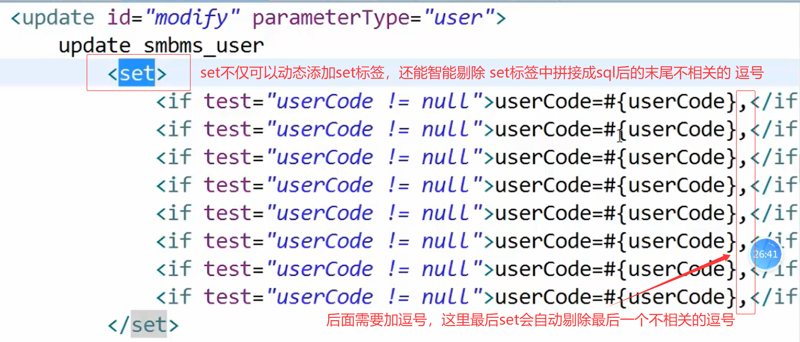

### \<trim> + \<if>

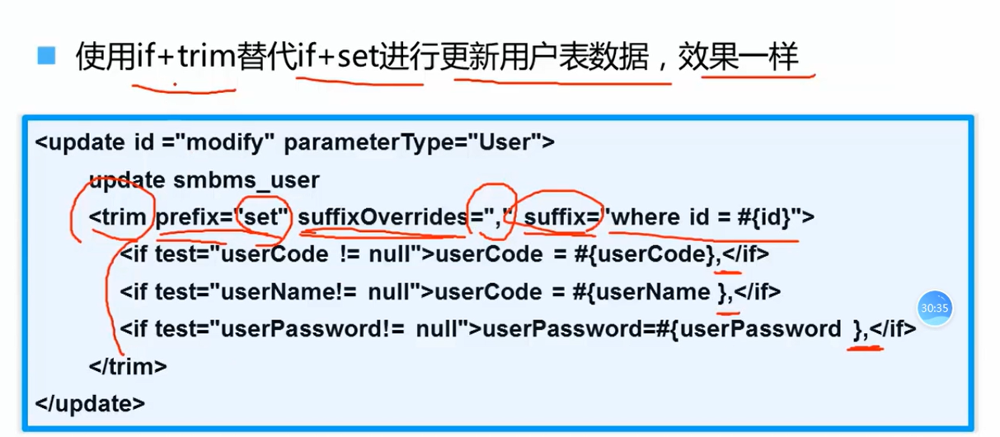

## 总结

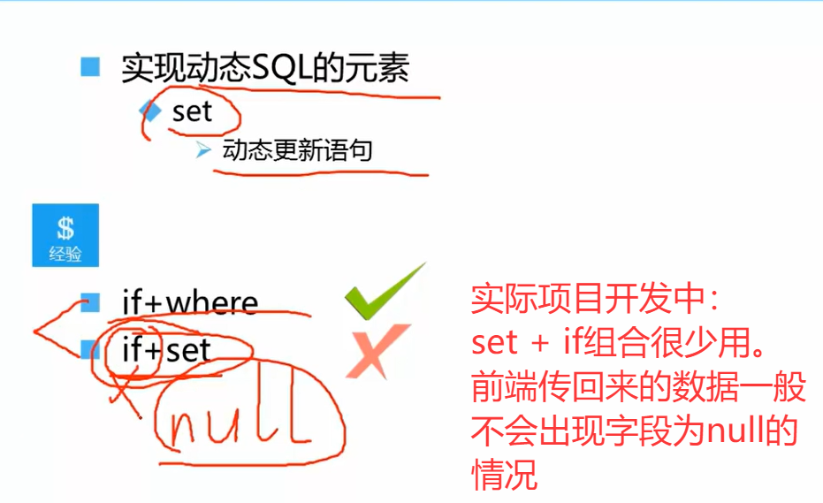

## foreach完成复杂查询

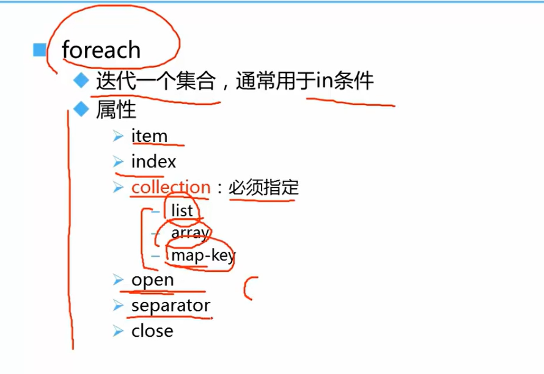

###   collection - list

### collection - array

### collection - may对应的key

## choose(when、otherwise)

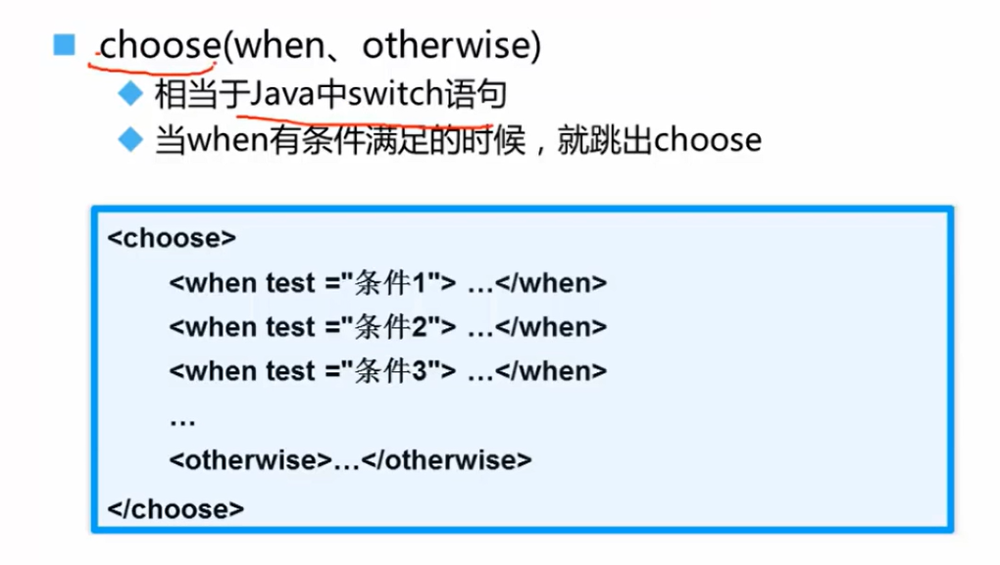

## Mybatis接受的参数类型

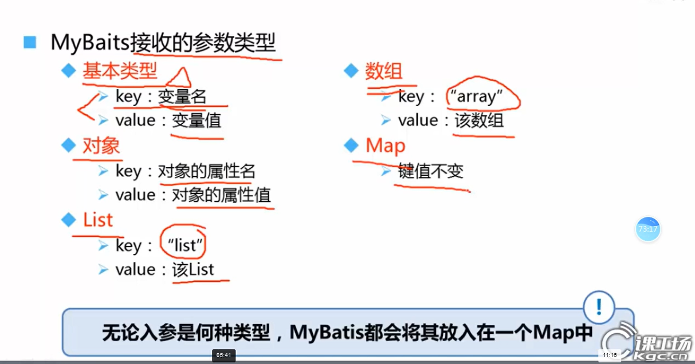

## 分页

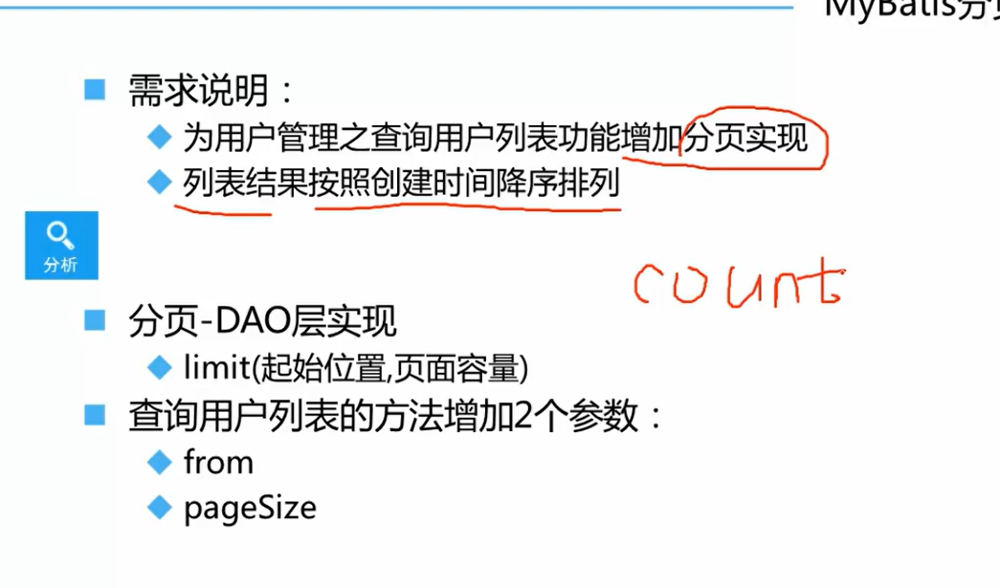
