## DI

### 构造注入

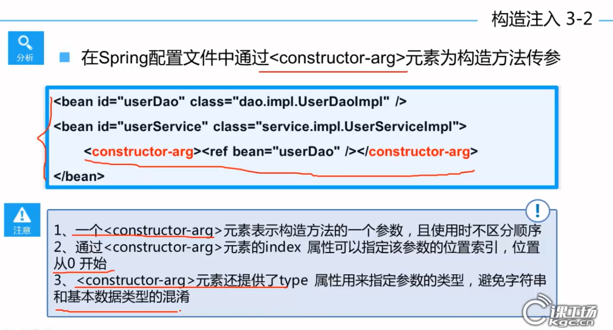

### 构造注入和设值注入

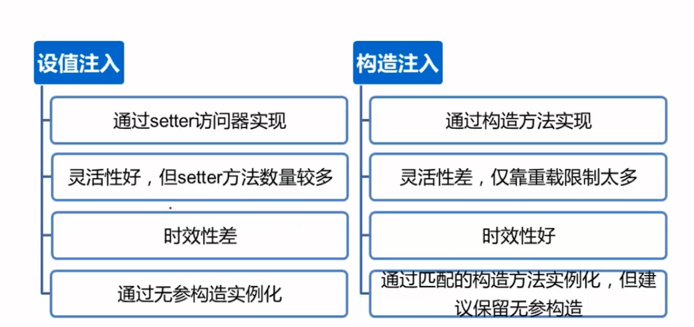

### 使用p命令空间注入属性值（提供get/set方法）


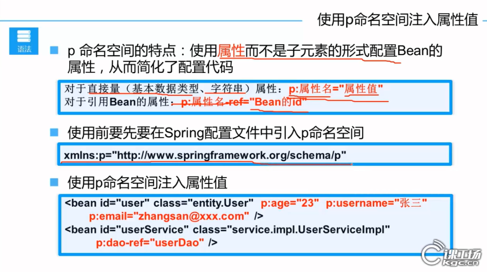

### 注入不同的数据类型

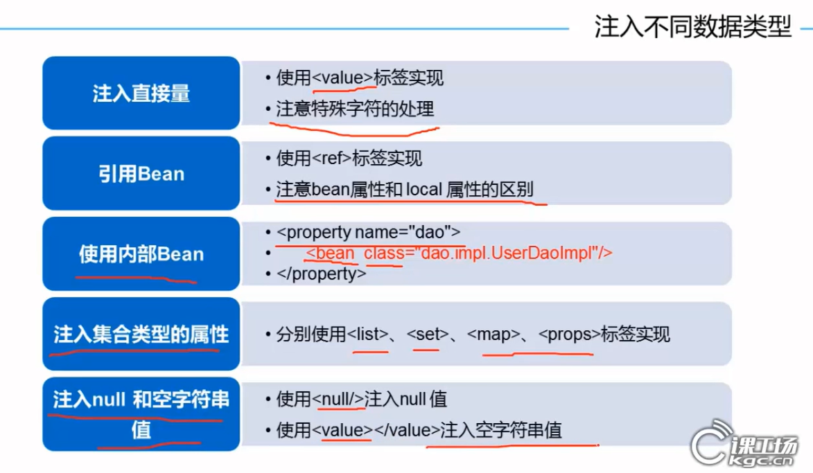

#### 特殊字符

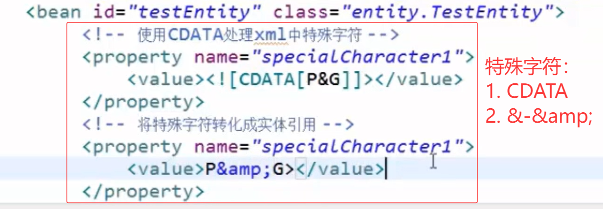

#### 内部bean

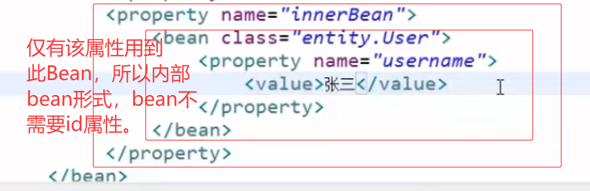

#### 集合(set,map,property)

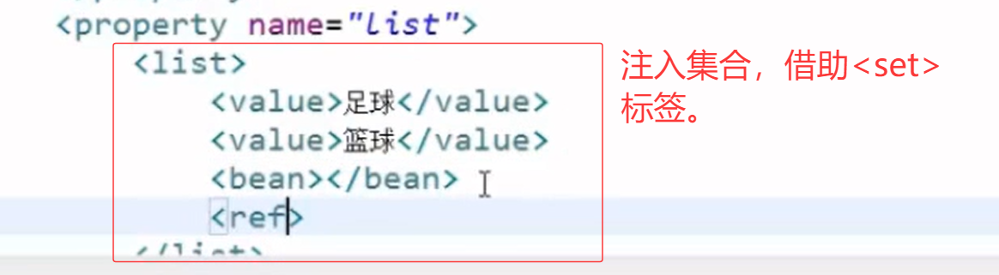

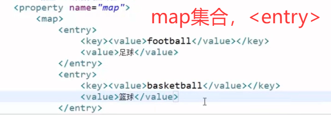

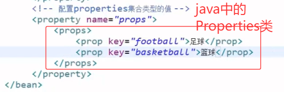

#### 空字符串&null

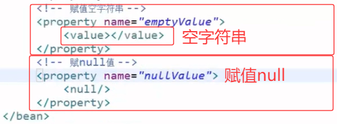

## AOP

### 异常抛出增强

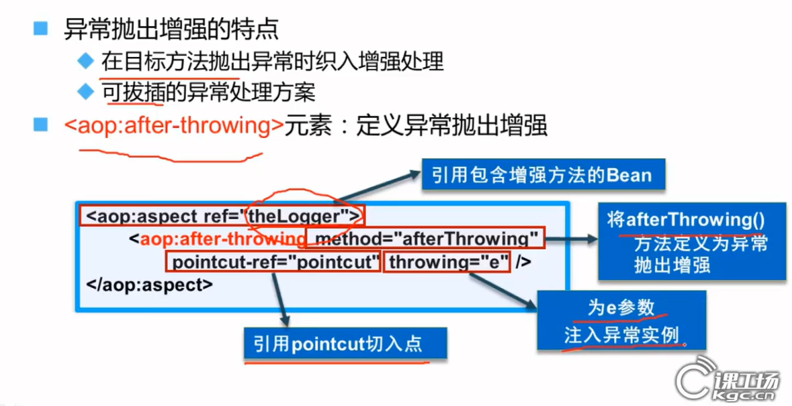

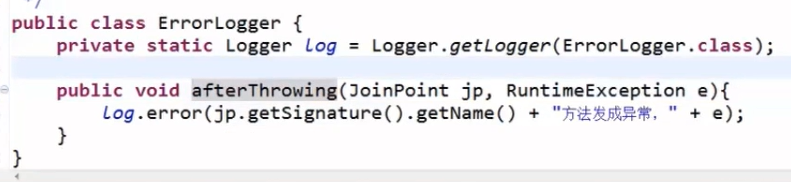

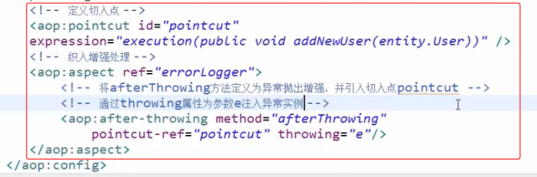

### 最终增强

<span style="font-size:1.2rem;color:red;">类似于try-catch语句中的finally的作用</span>

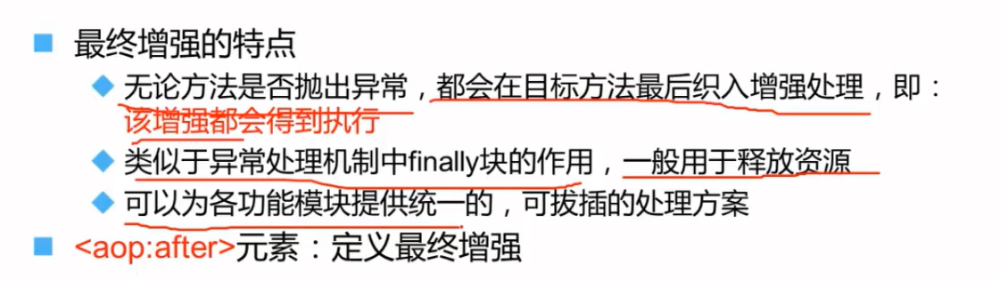

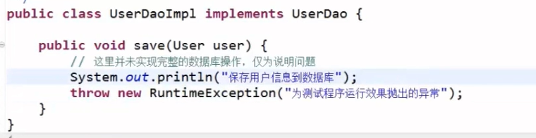

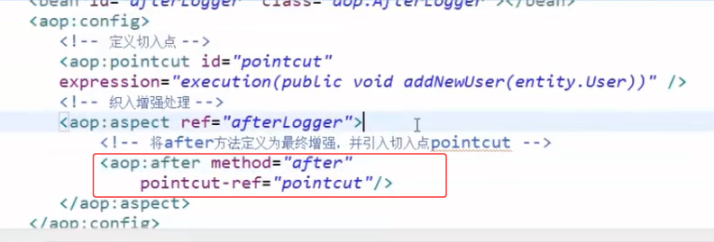

### 环绕增强

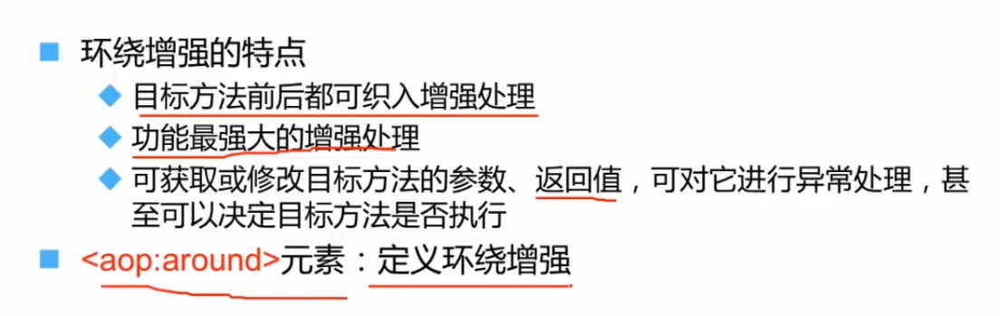

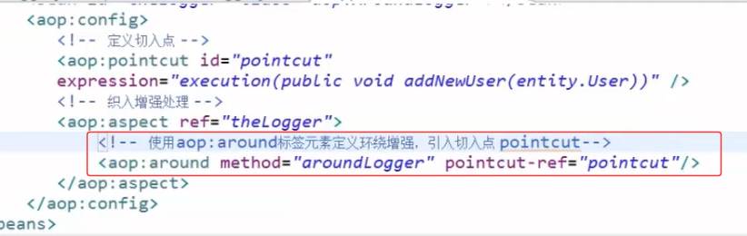

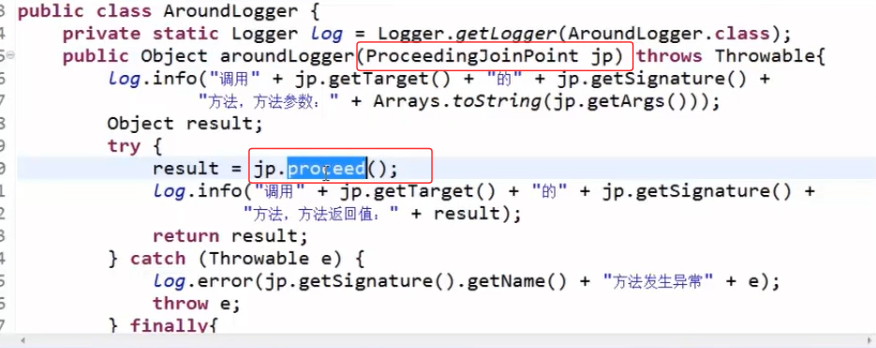

### 总结

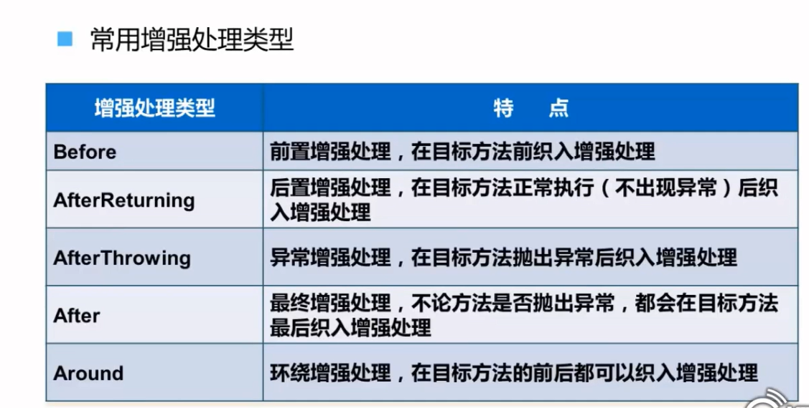

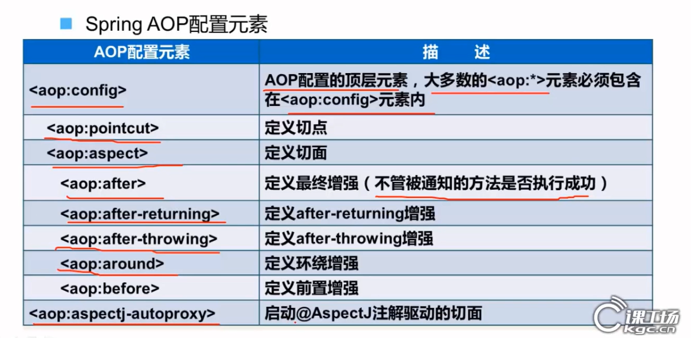

## 使用注解实现IOC

### 声明Bean注解

<span style="font-size:1.2rem;color:red;">1、配置bean直接在bean的实现类中进行操作，通过如下注解，就不用到xml配置文件中进行配置</span>

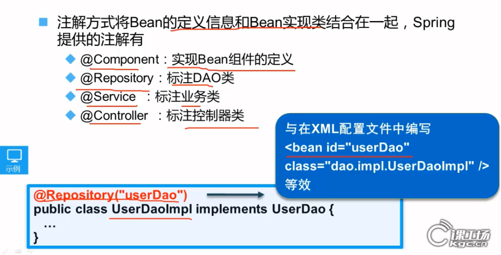

### 自动装配注解@Autowired

<span style="font-size:1.2rem;color:red;">2、因为用的是注解，前面的只相当于声明了一个bean_id，但是bean里面属性的注入没有处理。此时通过自动注入的注解在相对应的属性上进行声明。由Spring将值注入进来</span>

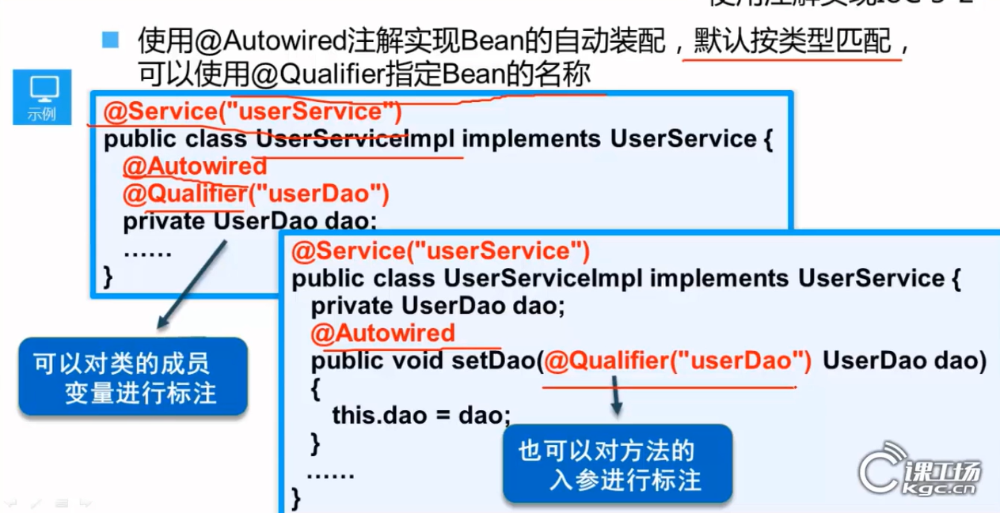

<span style="font-size:1.2rem;color:red;">3、使用注解还需要告诉Spring这些bean在哪里，同时引入相关的schame文件（context，与aop引入类似）</span>

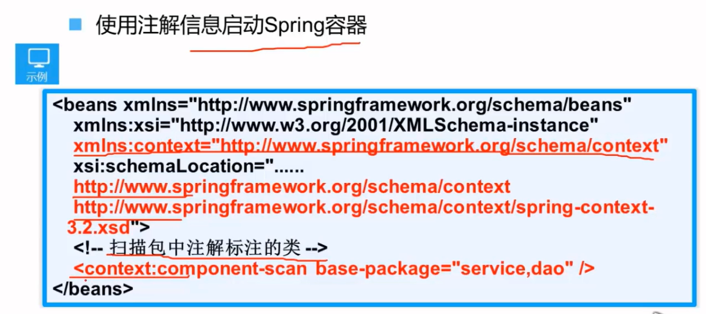

#### 简单案例：

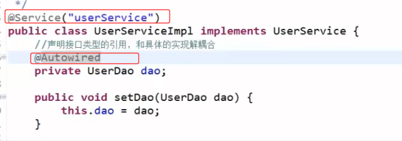

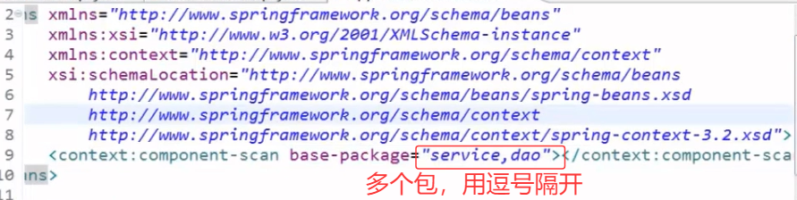

#### 需要Qualifier注解的案例：

<span style="font-size:1.2rem;color:red;">UserDao的实现类不止一个，此时在运行上面的代码会报错，因为@Autowired是按照类型进行注入，此时需要通过@Qualifier注解按照bean的id进行注入</span>

**一、在属性上方**

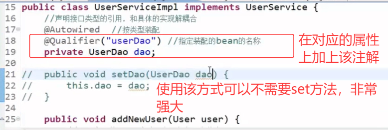

**二、在setXxx方法参数中加**

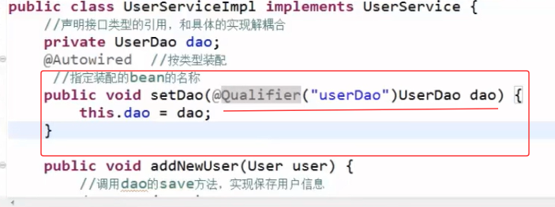

**三、在带参构造方法上使用**

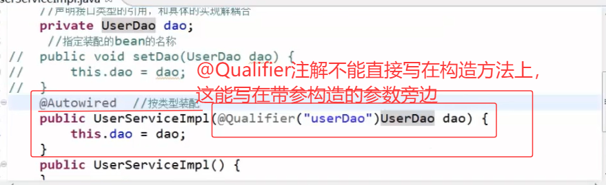

#### Autowired属性

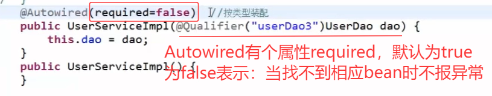

### @Resource自动装配

`@Resource`是Java标准注解（JSR-250），Spring框架支持该注解用于依赖注入（自动装配）

#### 基本用法

`@Resource`可以用于字段或setter方法上，用于自动装配bean：

```java
@Component
public class MyService {
    @Resource(name="xxx")
    private MyRepository repository;
    
    // 或者用在setter方法上
    @Resource
    public void setRepository(MyRepository repository) {
        this.repository = repository;
    }
}
```

#### 装配规则

`@Resource`的自动装配遵循以下顺序：

1. **按名称匹配**：首先尝试根据名称匹配bean，写了name属性就按照name属性值匹配，没写则按照属性名进行匹配
2. **按类型匹配**：如果没有找到匹配名称的bean，则按类型匹配
3. **指定名称**：如果明确指定了name属性，则只按名称匹配

### 总结

#### 实现IoC的主要注解

在Spring框架中，用于实现控制反转(IoC)和依赖注入的主要注解包括：

1. **@Autowired** - Spring提供的自动装配注解
2. **@Resource** - Java标准(JSR-250)的自动装配注解
3. **@Inject** - Java标准(JSR-330)的自动装配注解
4. **@Component** - 通用组件注解
5. **@Service** - 服务层组件注解
6. **@Repository** - 数据访问层组件注解
7. **@Controller/@RestController** - 控制器层组件注解
8. **@Configuration** - 配置类注解
9. **@Bean** - 方法级别声明bean的注解

#### @Autowired与@Resource的区别

|       特性       |          @Autowired          |        @Resource         |
| :--------------: | :--------------------------: | :----------------------: |
|     **来源**     |      Spring框架特有注解      |  Java标准注解(JSR-250)   |
| **默认装配方式** |          按类型装配          |   先按名称再按类型装配   |
|   **指定名称**   |    需要配合@Qualifier使用    |   直接使用name属性指定   |
|    **必需性**    | 可通过required=false设为可选 |        默认为必需        |
| **构造函数注入** |             支持             |          不支持          |
|   **适用场景**   |        Spring专用项目        | 需要兼容其他DI框架的项目 |

#### 详细说明

1. **装配顺序不同**：

   - `@Autowired`默认按类型(byType)装配
   - `@Resource`默认先按名称(byName)装配，找不到再按类型(byType)装配

2. **指定特定bean的方式**：

   ```java
   // 使用@Autowired指定特定bean
   @Autowired
   @Qualifier("specialService")
   private MyService service;
   
   // 使用@Resource指定特定bean
   @Resource(name = "specialService")
   private MyService service;
   ```

3. **构造函数注入**：

   - `@Autowired`可以用于构造函数实现构造函数注入
   - `@Resource`不能用于构造函数

4. **框架依赖性**：

   - `@Autowired`是Spring特有的，绑定于Spring框架
   - `@Resource`是Java标准，不依赖于Spring，可在其他支持JSR-250的框架中使用

## 使用注解定义切面

### AspectJ

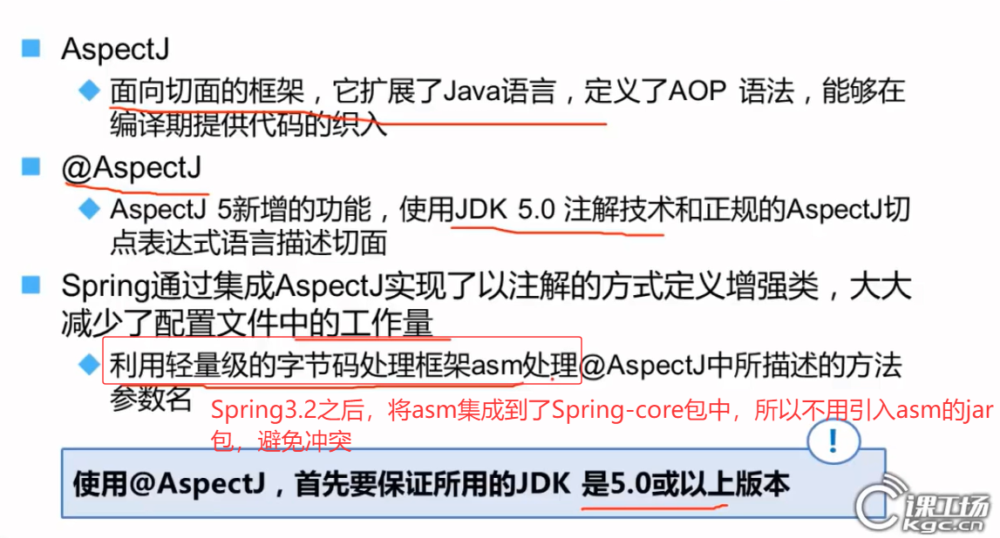

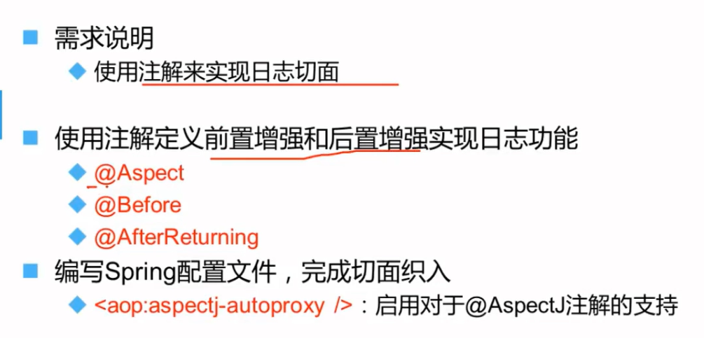

### 案例（before+after+切入点签名）

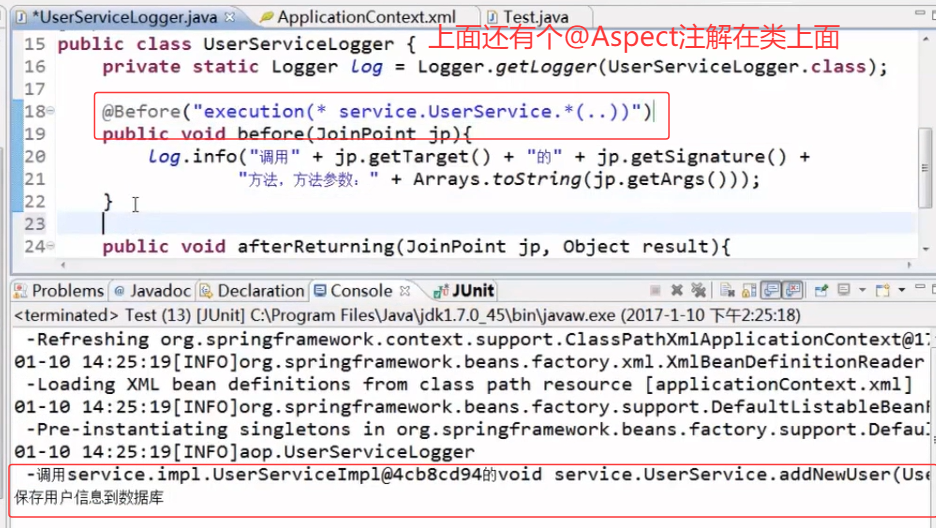

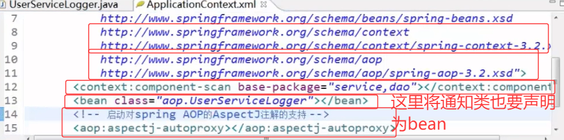

#### 切入点签名

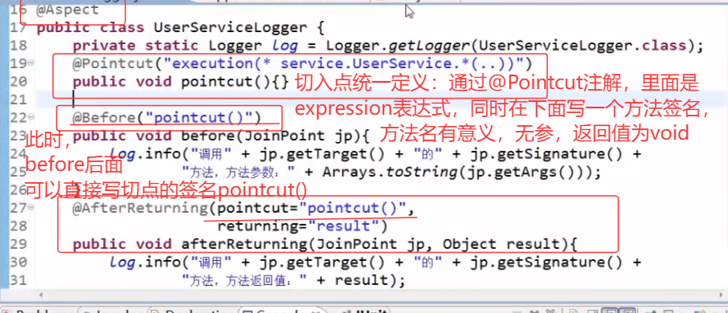

### @AfterThrowing

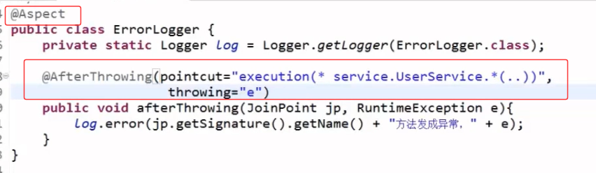

### @After

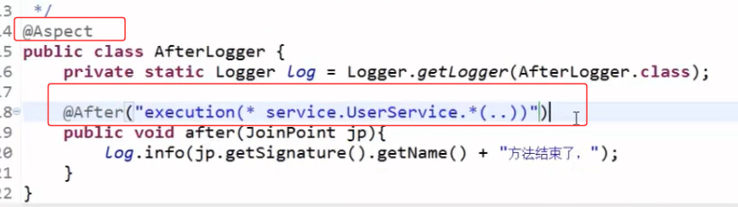

### @Around

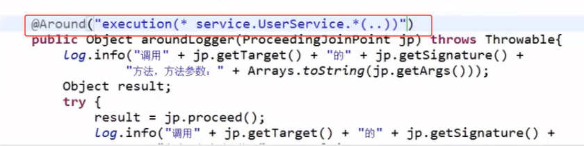

### 总结

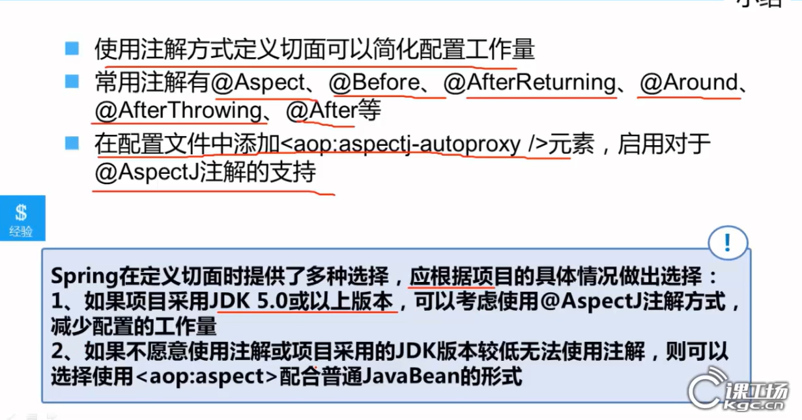
