# Spring整合Mybatis

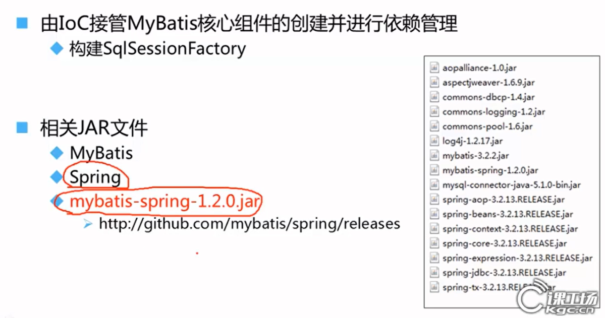

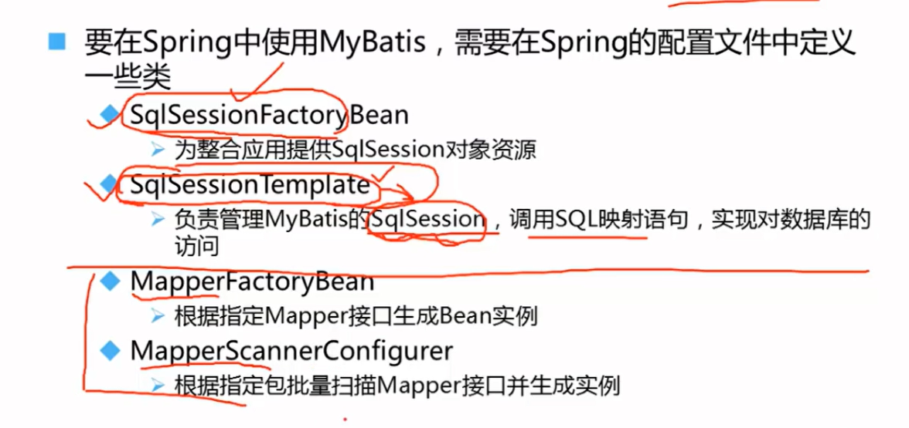

## 步骤

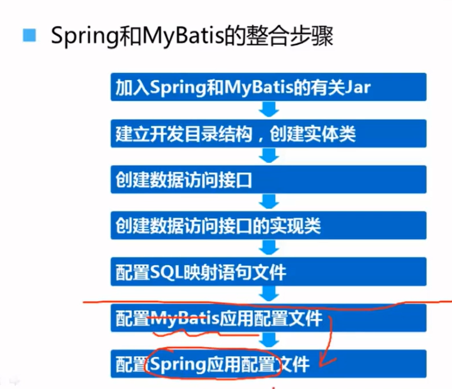

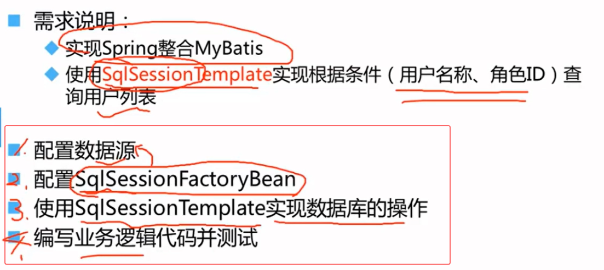

### 配置数据源

~~~xml
<!-- 配置 Druid 数据源 -->
<bean id="dataSource" class="com.alibaba.druid.pool.DruidDataSource" init-method="init" destroy-method="close">
    <!-- 数据库连接信息 -->
    <property name="url" value="jdbc:mysql://localhost:3306/test?useSSL=false&amp;serverTimezone=UTC"/>
    <property name="username" value="root"/>
    <property name="password" value="123456"/>
    <property name="driverClassName" value="com.mysql.cj.jdbc.Driver"/>

    <!-- 连接池核心配置 -->
    <property name="initialSize" value="5"/>      <!-- 初始化连接数 -->
    <property name="minIdle" value="5"/>          <!-- 最小空闲连接数 -->
    <property name="maxActive" value="20"/>       <!-- 最大连接数 -->
    <property name="maxWait" value="60000"/>      <!-- 获取连接超时时间（毫秒） -->

    <!-- 监控和扩展功能 -->
    <property name="filters" value="stat,wall"/>   <!-- 启用监控和SQL防火墙 -->
</bean>
~~~

### 配置SqlSessionFactoryBean

~~~xml
<!--SqlSessionFactoryBean：将MyBatis的SqlSessionFactory交给Spring管理-->
<bean id="sqlSessionFactory" class="org.mybatis.spring.SqlSessionFactoryBean">
    <!-- 注入数据源 -->
    <property name="dataSource" ref="dataSource"/>
    <!-- 指定MyBatis全局配置文件（可选）当仍需要mybatis-confix.xml这个全局配置文件时，可以通过configLocation指定该其classpath路径 -->
    <property name="configLocation" value="classpath:mybatis-config.xml"/>
    <!-- 指定Mapper XML文件的位置（如果未在mybatis-config.xml中配置） -->
    <property name="mapperLocations" value="classpath:mapper/*.xml"/>
    <!-- 配置别名扫描包（简化resultType的类名） -->
    <property name="typeAliasesPackage" value="com.example.model"/>
</bean>
~~~

### 配置SqlSessionTemplate

没有提供setter方法，只能通过构造方法进行注入

~~~xml-dtd
<!-- SqlSessionTemplate：线程安全的MyBatis会话模板 -->
<bean id="sqlSessionTemplate" class="org.mybatis.spring.SqlSessionTemplate">
    <!--通过构造器注入SqlSessionFactory，构造方法有单参的，还有两个参数的-->
    <constructor-arg index="0" ref="sqlSessionFactory"/>
    <!-- 可选：指定执行器类型（默认SIMPLE，可选REUSE/BATCH） -->
    <constructor-arg index="1" value="BATCH"/>
</bean>
~~~

### 案例（手动实现Mapper映射器）

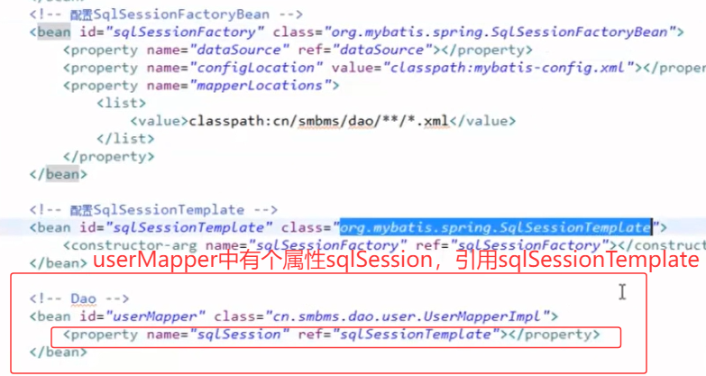

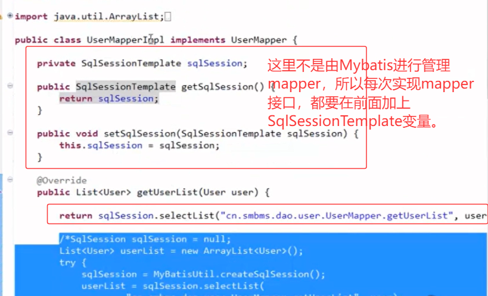

#### 优化 - SqlSessionDaoSupport

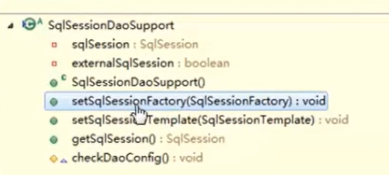

- mapper实习类直接继承SqlSessionDaoSupport，只需要在配置该bean时，通过setter注入将SqlSessionFactory进行注入，后面直接可以通过getSqlSession来替代上面的操作。

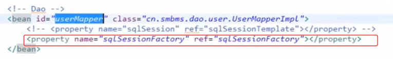

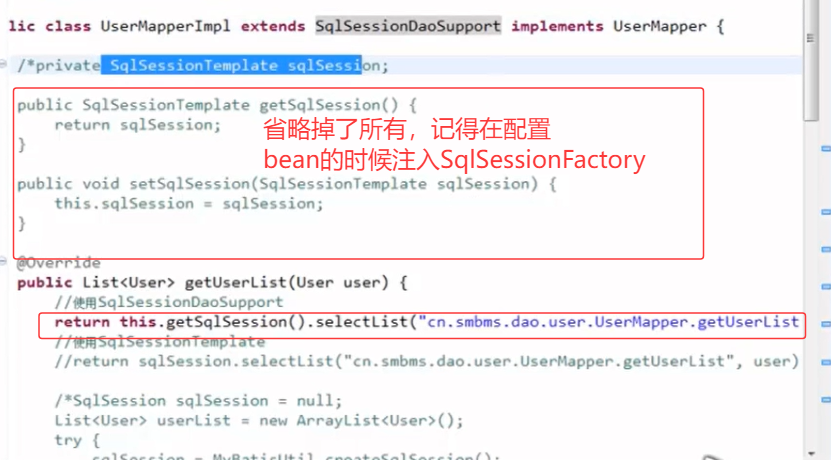

## 注入映射器的实现

上面案例的局限性：

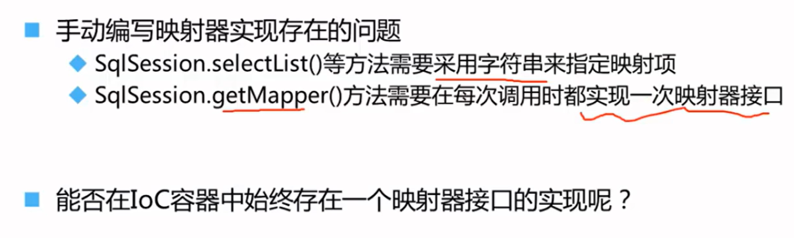

### MapperFactoryBean

- 继承自 `SqlSessionDaoSupport`
- 将 MyBatis 的 Mapper 接口转换为 Spring 容器中的 Bean
- 替代原生 MyBatis 的 `SqlSession.getMapper()` 方法
- 自动管理 SqlSession 的生命周期
- 通过 `getObject()` 方法返回映射器代理
- 代理实例会被Spring缓存和管理

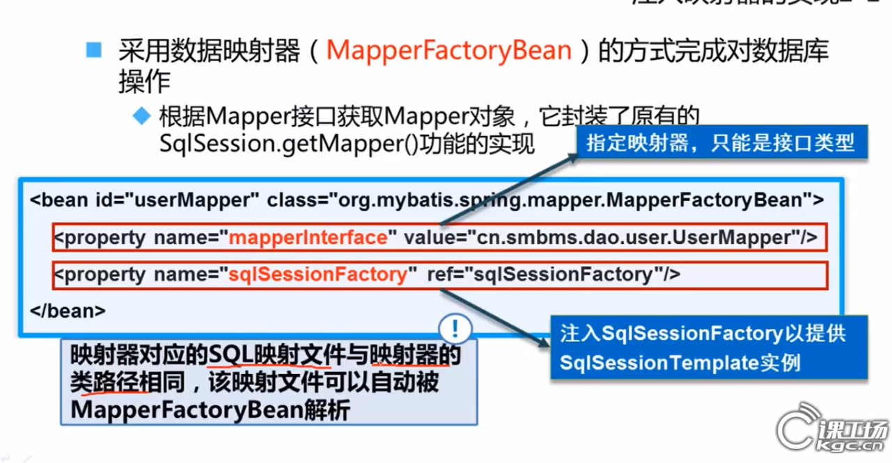

- `mapperInterface`：指定要代理的 MyBatis Mapper 接口
- `sqlSessionFactory`：注入 SqlSessionFactory 实例

spring中xml配置如下（因为MapperFactoryBean继承自SqlSessionDaoSupport，所以仍需要注入sqlSessionFactory）：

~~~xml
<bean id="userMapper" class="org.mybatis.spring.mapper.MapperFactoryBean">
    <property name="mapperInterface" value="cn.smbms.dao.user.UserMapper"/>
    <property name="sqlSessionFactory" ref="sqlSessionFactory"/>
</bean>
~~~

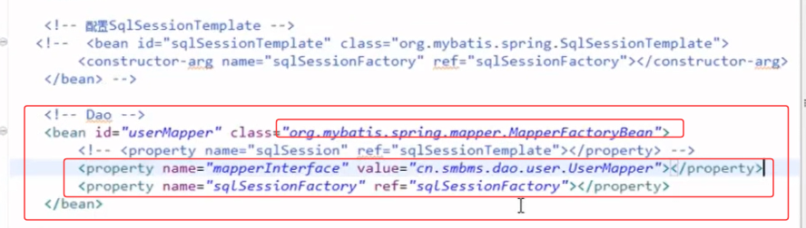

1. 当映射器对应的xxxMapper.xml和xxxMapper.java(映射器)在同一个包下，此时MapperFactoryBean会自动解析该xxxMapper.xml，也就是说在spring配置SqlSessionFactoryBean时就不用指定mapperLocations了。否则必须指定。

   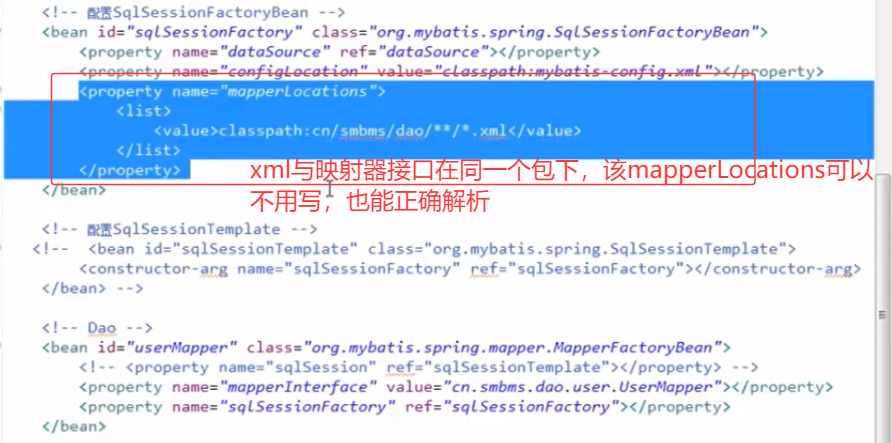

### MapperScannerConfigurer

- 扫描指定包下的映射器接口

- 为每个接口注册一个 `MapperFactoryBean`

  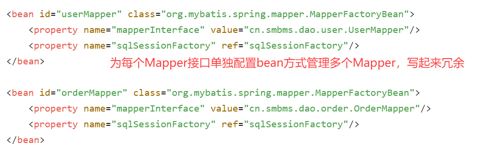

- 通过MapperScannerConfigurer扫描
  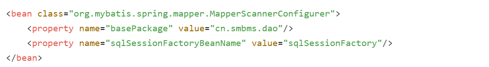

### 对于MapperFactoryBean和MapperScannerConfigurer的理解

1. 两者关系有点类似于mybatis-config中\<mappers>中的两种扫描mapper映射文件的方式
   1. MapperFactoryBean类似于\<mapper resource='xx/yy/zz/*.xml'>，如果配置多个，就需要写多个同样的标签
   2. MapperScannerConfigurer类似于\<package name="xx.yy.zz">，一次项扫描多个mapper映射文件。这种方式通过映射器(java接口)找到对应的xxxMapper.xml文件，需要满足一个要求：在同一个包下，且同名。正好对应上了MapperFactoryBean中的特征，当同包同名，配置SqlSessionFactoryBean时不需要配置mapperLocations。

## 为业务层添加声明式事务

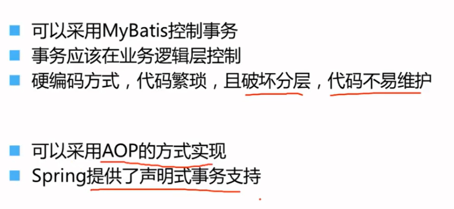

### Spring XML方式

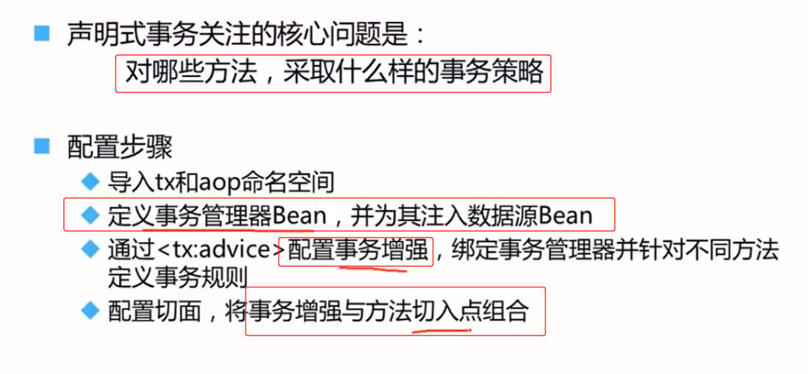

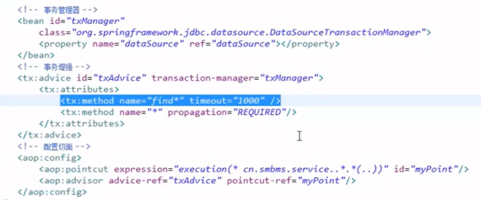

1. 事务管理器配置：

- 定义了一个ID为"txManager"的DataSourceTransactionManager
- 注入了数据源(dataSource)引用
- 这是Spring JDBC事务管理的核心组件

1. 事务增强配置(tx:advice)：

- 关联了事务管理器txManager
- 配置了方法级别的事务属性：
  - 所有以"find"开头的方法设置超时时间为1000毫秒
  - 所有方法(*)设置传播行为为REQUIRED(如果存在事务就加入，没有就新建)

1. AOP切面配置：

- 定义切入点表达式，匹配cn.smbms.service包及其子包下的所有方法
- 将事务增强(txAdvice)应用到切入点(myPoint)上

### 事务属性

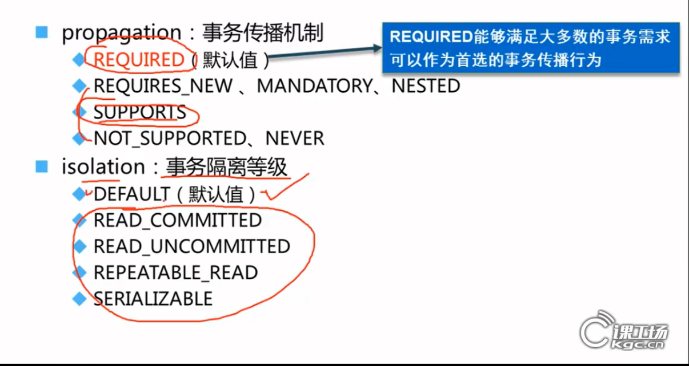

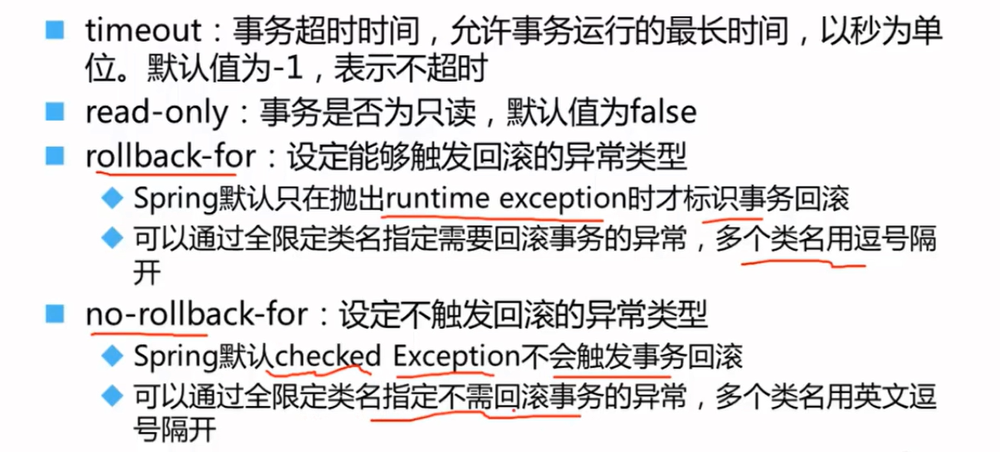

### 注解方式

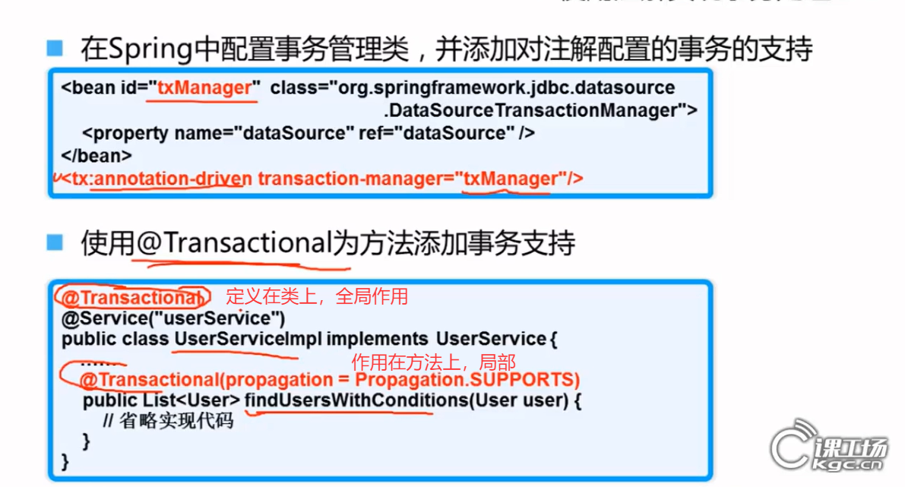

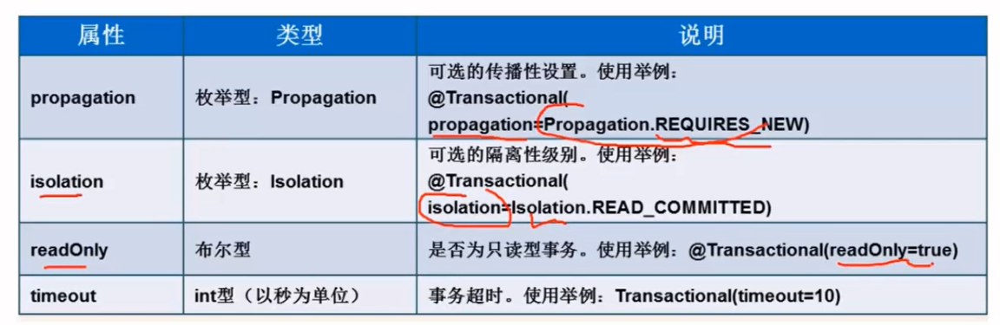

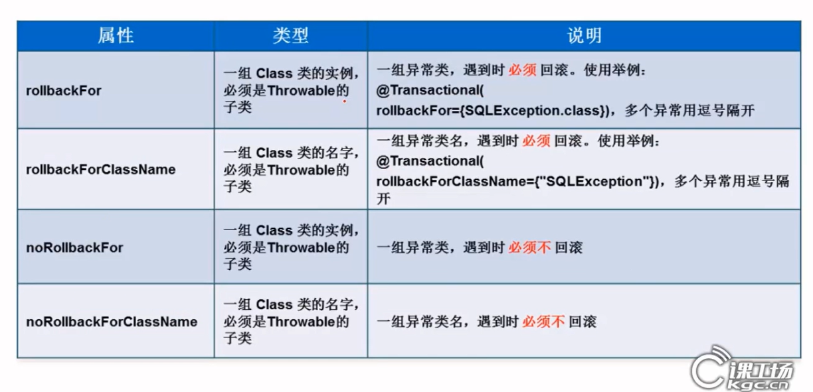

