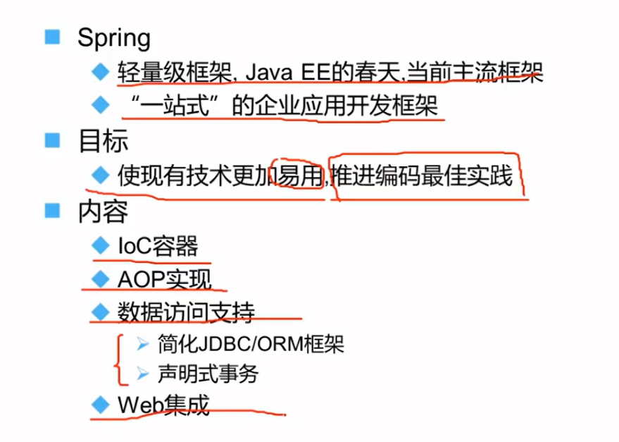
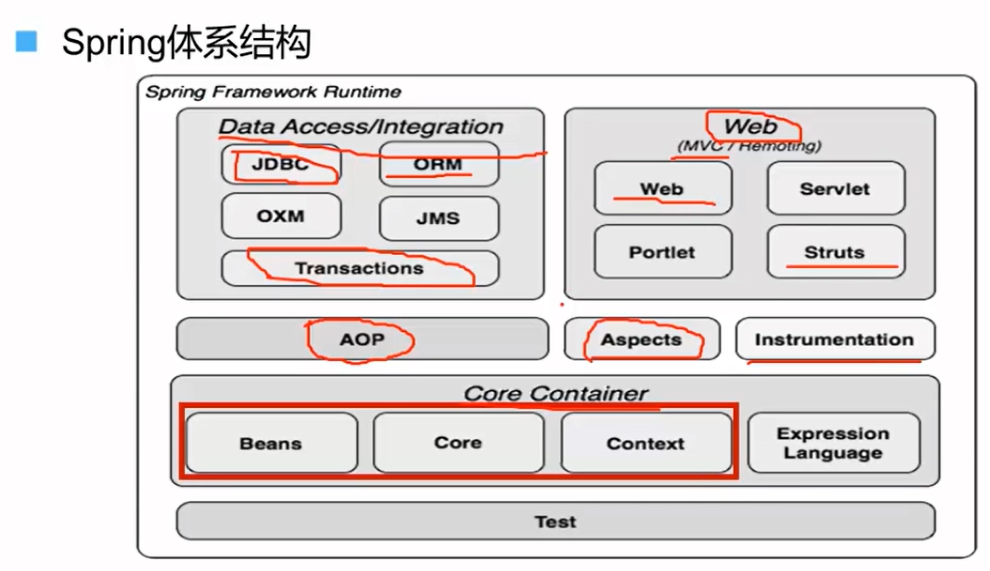
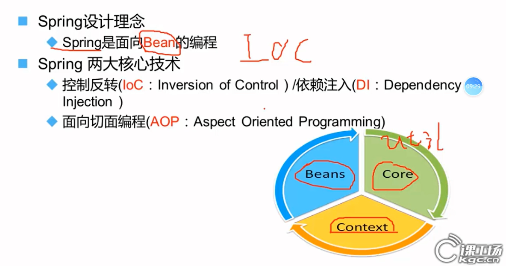
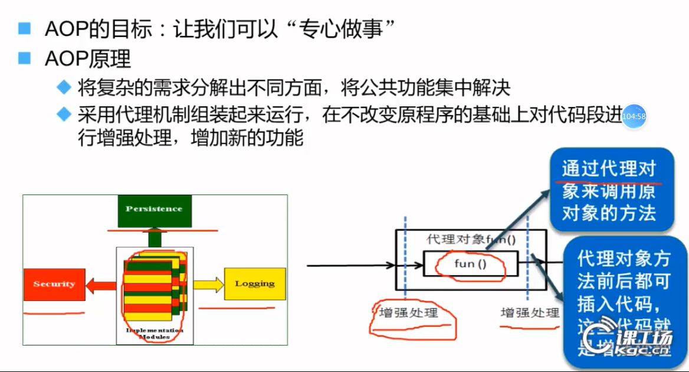
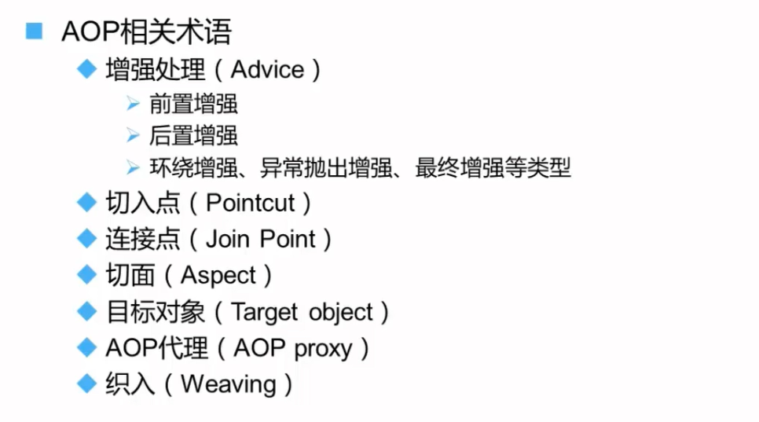
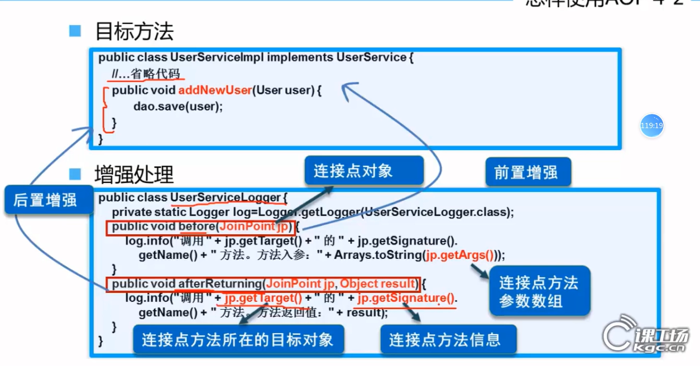
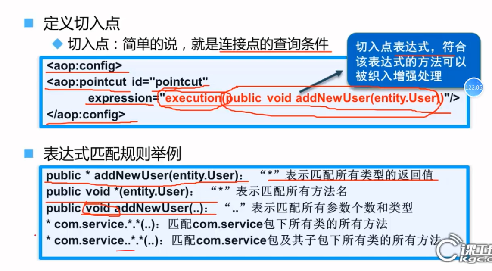
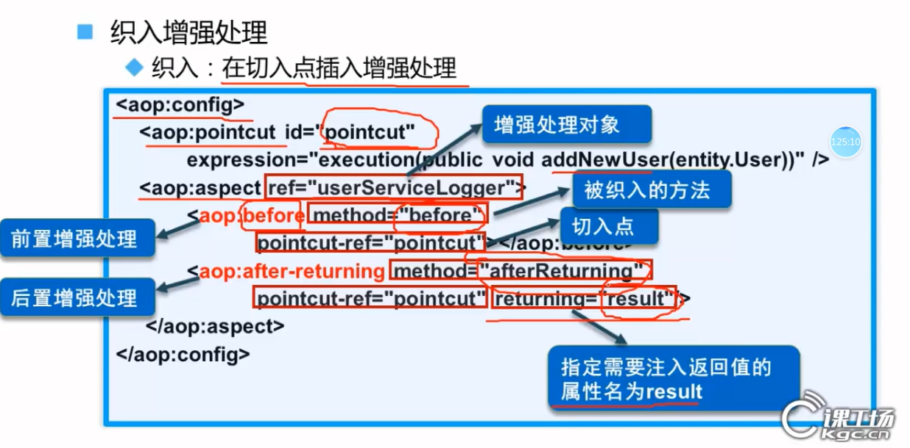

# Spring



## 体系结构





## IOC-控制反转

- **控制反转(Inversion of Control)**：把"创建对象、管理依赖"的权力交给框架（比如Spring），而不是自己用`new`创建对象。
- **依赖注入(Dependency Injection)**：对象需要什么，直接告诉框架"我要A和B"，框架会自动给你（通过构造函数/属性传进来）。

- **IOC好处: ** 解耦合、可拓展

### 使用Spring实现ioc

#### 基本步骤

>1. **添加Spring依赖**
>   - 在Maven或Gradle项目中添加Spring核心依赖
>   - 例如Maven中的`spring-context`依赖
>   - 手动导入jar包
>2. **创建Bean类**
>   - 编写需要由Spring管理的Java类（POJO）
>   - 这些类通常不需要实现特定接口
>3. **配置元数据**
>   - **XML配置方式**：创建`applicationContext.xml`文件
>   - **注解方式**：使用`@Component`, `@Service`, `@Repository`, `@Controller`等注解
>   - **Java配置方式**：使用`@Configuration`和`@Bean`注解
>4. **创建Spring容器**
>   - 通过`ClassPathXmlApplicationContext`(XML方式)或`AnnotationConfigApplicationContext`(注解方式)加载配置
>5. **获取Bean实例**
>   - 从容器中获取Bean对象
>   - 使用`getBean()`方法或自动装配
>
>

#### XML配置方式

~~~java
// 1. 创建Bean类
public class HelloSpring {
    public void sayHello() {
        System.out.println("Hello Spring!");
    }
}

// 2. 配置ApplicationContext.xml
<beans>
    <bean id="helloSpring" class="com.xyy.pojo.HelloSpring"/>
</beans>

// 3. 使用IOC容器
ApplicationContext context = new		ClassPathXmlApplicationContext("ApplicationContext.xml");
HelloSpring helloSpring = (UserService) context.getBean("helloSpring");
helloSpring.sayHello();
~~~

##### `<property>`元素中`ref`与`value`的区别

| **属性** |          **用途**          |     **注入类型**     |                    **示例**                    |               **适用场景**                |
| :------: | :------------------------: | :------------------: | :--------------------------------------------: | :---------------------------------------: |
|  `ref`   |      引用其他Bean的ID      | 对象引用（复杂类型） | `<property name="service" ref="userService"/>` | 注入其他已定义的Bean（如Service、DAO等）  |
| `value`  | 直接指定基本类型或字符串值 |  字面量（简单类型）  |     `<property name="port" value="8080"/>`     | 注入基本类型（int、String等）或简单配置值 |


#### 注解方式

~~~java
// 1. 使用注解标记Bean
@Component
public class HelloSpring {
    public void sayHello() {
        System.out.println("Hello Spring!");
    }
}
// 2. 配置组件扫描
@Configuration
@ComponentScan("com.xyy.pojo")
public class AppConfig {}

// 3. 使用IOC容器
ApplicationContext context = new AnnotationConfigApplicationContext(AppConfig.class);
HelloSpring helloSpring = context.getBean(HelloSpring.class);
helloSpring.sayHello();
~~~


### BeanFactory与ApplicationContext的区别

<span style="font-size:1.2rem;color:red;">BeanFactory和ApplicationContext都是Spring框架的核心接口，用于管理Spring容器中的Bean对象，但它们之间存在一些重要区别：</span>

#### 主要区别

1. **功能范围**
   - **BeanFactory**：提供基本的依赖注入功能
   - **ApplicationContext**：在BeanFactory基础上扩展，提供更多企业级功能
2. **Bean初始化时机**
   - **BeanFactory**：懒加载（Lazy loading），只有在请求Bean时才初始化
   - **ApplicationContext**：预加载（Eager loading），容器启动时就初始化所有单例Bean
3. **功能扩展**
   - ApplicationContext额外提供：
     - 国际化（i18n）消息支持
     - 事件发布与监听机制
     - 更方便的资源访问（如文件、URL等）
     - 与AOP的集成
     - 特定应用层上下文（如WebApplicationContext）
4. **自动注册**
   - **ApplicationContext**会自动注册一些特殊的Bean后处理器（如BeanPostProcessor）

#### 使用场景

- **BeanFactory**：适用于资源受限的环境，需要严格控制内存使用的情况
- **ApplicationContext**：大多数情况下推荐使用，提供更丰富的功能

#### 代码示例

```java
// 使用BeanFactory
Resource resource = new FileSystemResource("beans.xml");
BeanFactory factory = new XmlBeanFactory(resource);
MyBean bean = (MyBean) factory.getBean("myBean");

// 使用ApplicationContext
ApplicationContext context = new ClassPathXmlApplicationContext("beans.xml");
MyBean bean = context.getBean(MyBean.class);
```

在大多数现代Spring应用中，通常直接使用ApplicationContext，因为它提供了更全面的功能集。


## AOP的定义和原理

### Spring AOP的原理

横切逻辑，也叫横切关注点
业务代码：核心关注点






#### 术语解释

| 术语                          | 解释                                                         | 示例                                                         |
| :---------------------------- | :----------------------------------------------------------- | :----------------------------------------------------------- |
| **Aspect（切面）**            | 将横切关注点（如日志、事务）模块化的类，包含多个Advice和Pointcut。 | `@Aspect public class LoggingAspect { ... }`                 |
| **Join Point（连接点）**      | 程序执行过程中的特定点（如方法调用、异常抛出），Spring AOP仅支持方法执行。 | `UserService.addUser()`方法的执行就是一个连接点。            |
| **Advice（通知）**            | 在特定Join Point执行的动作，分为前置、后置、环绕等类型。     | `@Before("execution(* com.service.*.*(..))")`                |
| **Pointcut（切点）**          | 通过表达式匹配Join Point的谓词，决定哪些方法会被拦截。       | `@Pointcut("execution(* com.service.*.*(..))")`              |
| **Target Object（目标对象）** | 被一个或多个Aspect通知的对象，即被代理的原始Bean。           | `UserServiceImpl`实例（未被AOP增强前的对象）。               |
| **AOP Proxy（代理）**         | 由Spring创建的代理对象，用于实现切面功能（JDK动态代理或CGLIB）。 | `$Proxy13`（JDK代理）或`UserServiceImpl$$EnhancerBySpringCGLIB`。 |

#### 通知类型

| 术语                              | 执行时机                               | 注解/XML配置示例                                             |
| :-------------------------------- | :------------------------------------- | :----------------------------------------------------------- |
| **Before Advice（前置通知）**     | 在方法执行前触发。                     | `@Before("pointcut()")` `<aop:before method="logStart" pointcut-ref="pc1"/>` |
| **After Returning（返回后通知）** | 方法**正常返回**后触发。               | `@AfterReturning(returning="result", pointcut="pc1()")`      |
| **After Throwing（异常通知）**    | 方法**抛出异常**后触发。               | `@AfterThrowing(throwing="ex", pointcut="pc1()")`            |
| **After（最终通知）**             | 方法**结束后**触发（无论是否异常）。   | `@After("pc1()")`                                            |
| **Around（环绕通知）**            | 包裹整个方法，可控制是否执行目标方法。 | `@Around("pc1()")` `public Object around(ProceedingJoinPoint pjp) { ... }` |

#### 切点Pointcut与连接点JoinPoint

| 切点和连接点         | 狙击手比喻             | AOP中的角色                                | 例子                                        |
| :------------------- | :--------------------- | :----------------------------------------- | :------------------------------------------ |
| **JoinPoint 连接点** | 靶场里所有的靶子       | 程序里所有能被拦截的地方（Spring中仅方法） | `addUser()`, `deleteUser()`, `updateUser()` |
| **Pointcut 切点**    | 狙击手用瞄准镜选的靶子 | 用表达式匹配需要拦截的Join Point           | `execution(* add*(..))` → 只匹配`addUser()` |

### 使用AOP







