# SpringBoot初始

## 定义与作用

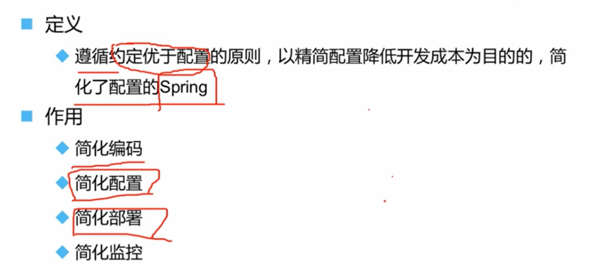

## pom文件

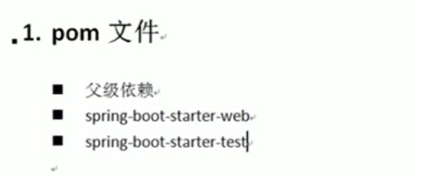

> 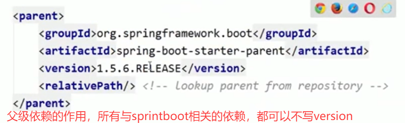
>
> 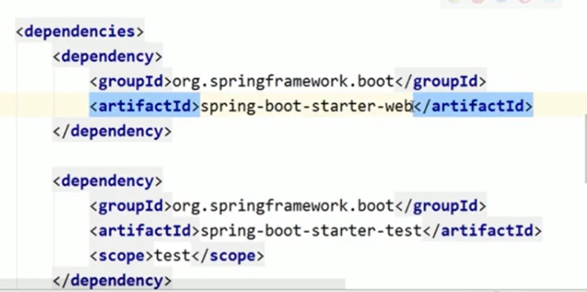
>
> ~~~xml
> <parent>
>     <groupId>org.springframework.boot</groupId>
>     <artifactId>spring-boot-starter-parent</artifactId>
>     <version>1.5.6.RELEASE</version>
>     <relativePath/>
> </parent>
> <dependencies>
>     <dependency>
>       <groupId>org.springframework.boot</groupId>
>       <artifactId>spring-boot-starter-web</artifactId>
>     </dependency>
>     <dependency>
>       <groupId>org.springframework.boot</groupId>
>       <artifactId>spring-boot-starter-test</artifactId>
>       <scope>test</scope>
>     </dependency>
> </dependencies>
> ~~~
>
> 

### 使用jetty作为web容器

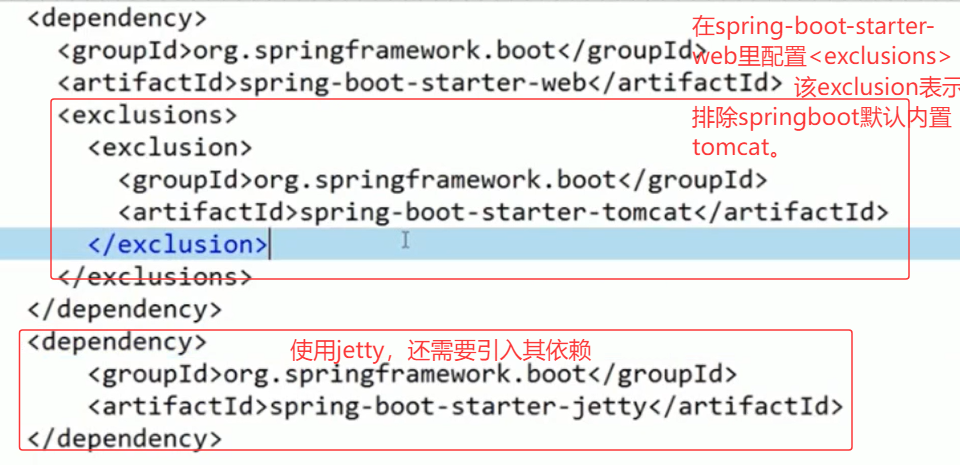

## 启动类

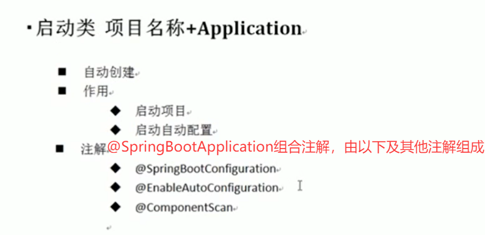

> ### 1. @SpringBootApplication (本身作为入口点)
>
> 这是Spring Boot项目的**主入口注解**，通常应用于项目的启动类上。它的核心作用就是“一键式”开启Spring应用所需的所有关键配置。
>
> ### 2. @SpringBootConfiguration
>
> - **功能**：这是一个特殊的`@Configuration`注解，它标志着这个类是一个**配置类**。
> - **详细解释**：Spring容器会扫描被`@Configuration`标注的类，并处理其中使用`@Bean`注解定义的方法，将这些方法的返回值作为Bean注册到Spring应用上下文中。`@SpringBootConfiguration`进一步表明这个类是Spring Boot的主配置类。
>
> ### 3. @EnableAutoConfiguration
>
> - **功能**：这是Spring Boot**自动配置**的核心魔法所在。它告诉Spring Boot根据您添加的jar包依赖，自动为您配置Spring应用。
> - **详细解释**：当您添加了特定的starter依赖（例如`spring-boot-starter-web`）后，Spring Boot会自动检测到这些依赖，并基于它们为您配置好相关的组件（如内嵌Tomcat服务器、默认的MVC配置等）。这个注解背后利用了大量的“条件化配置”，只有在某些条件满足时（如类路径下存在某个类），对应的自动配置才会生效。
>
> ### 4. @ComponentScan
>
> - **功能**：自动扫描并注册**组件**（如`@Component`, `@Service`, `@Repository`, `@Controller`等）。
> - **详细解释**：默认情况下，它会扫描==**当前包及其所有子包**==。所有被以上注解标记的类都会被自动发现并注册为Spring容器中的Bean。这意味着您无需再在XML配置文件中繁琐地逐个声明Bean。

### 启动方式4种

1. 

2. 

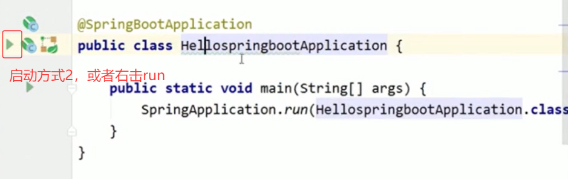

3. 

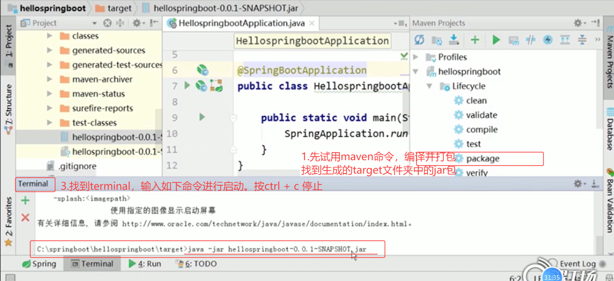

4. 

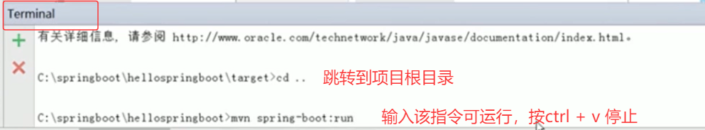

## 配置文件application.properties

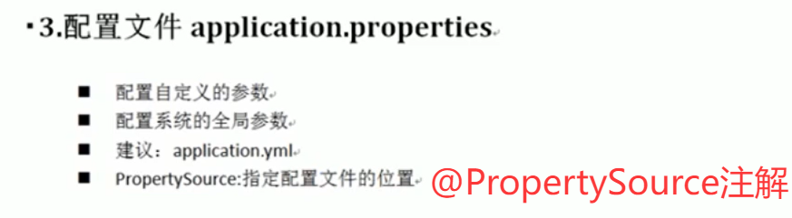

指定配置文件中的前缀，在properties中通过student.name，即student可作为前缀，

在yml中，通过回车空格，用冒号隔开

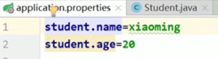

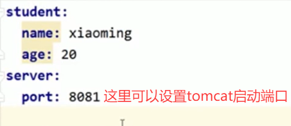

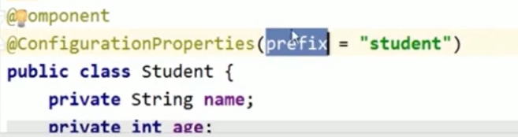

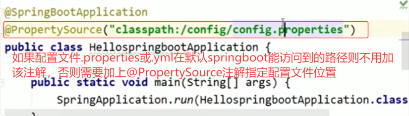

> Spring Boot 项目在启动时，**会自动扫描并加载**的特定路径下的配置文件。您无需使用 `@PropertySource`或 `@ImportResource`等注解进行额外指定，Spring Boot 的默认机制就会读取这些位置的配置。
>
> 这些位置有**优先级顺序**，高优先级配置会覆盖低优先级配置。主要包括以下路径（以常见的 `.properties`或 `.yml`文件为例）：
>
> ------
>
> ### 默认配置文件的搜索路径及优先级（从高到低）
>
> 1. **当前项目根目录下的 `/config`子目录**
>    - `./config/application.properties`
>    - `./config/application.yml`
>    - *（这是最高优先级的路径，常用于部署时在可执行 Jar 包旁放置外部配置文件）*
> 2. **当前项目的根目录**
>    - `./application.properties`
>    - `./application.yml`
> 3. **Classpath 下的 `/config`包**
>    - `classpath:/config/application.properties`
>    - `classpath:/config/application.yml`
>    - *（这是标准项目结构中常用的位置，位于 `src/main/resources/config/`）*
> 4. **Classpath 根目录**
>    - `classpath:/application.properties`
>    - `classpath:/application.yml`
>    - *（这是最常见、最基础的位置，位于 `src/main/resources/`）*
>
> ------
>
> ### 总结与要点
>
> - **自动加载**：只要您将配置文件（通常命名为 `application.properties`或 `application.yml`）放在以上任何一个位置，Spring Boot 都会自动读取它。
> - **覆盖原则**：列表顶部的路径（例如项目根目录下的 `/config`）优先级最高。这意味着如果您在 `./config/application.yml`和 `classpath:/application.yml`中定义了同一个属性，前者的值会生效。
> - **特定环境配置**：Spring Boot 还支持按环境（如开发、测试、生产）加载配置，格式为 `application-{profile}.properties/yml`。例如 `application-dev.yml`。这些文件也遵循同样的位置和优先级规则。
> - **何时使用 `@PropertySource`**：当您的配置文件**不满足**上述任何一条（例如，文件不叫 `application`，或者放在 `src/main/resources/customfolder/`这样的自定义目录下），您就需要使用 `@PropertySource("classpath:customfolder/custom.config")`)` 来明确告诉 Spring Boot 去哪里加载。

## 测试类

## 创建Controller

### @RestController spring4.0 +

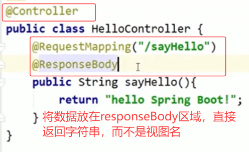

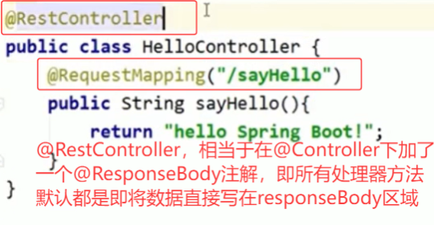

## SpringBoot原理

### 工作机制

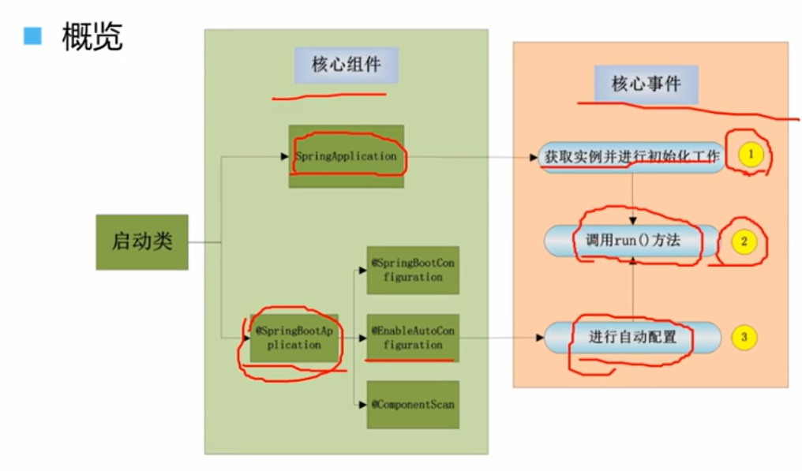

### 获取实例并初始化

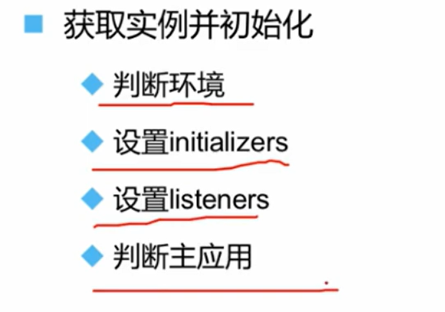

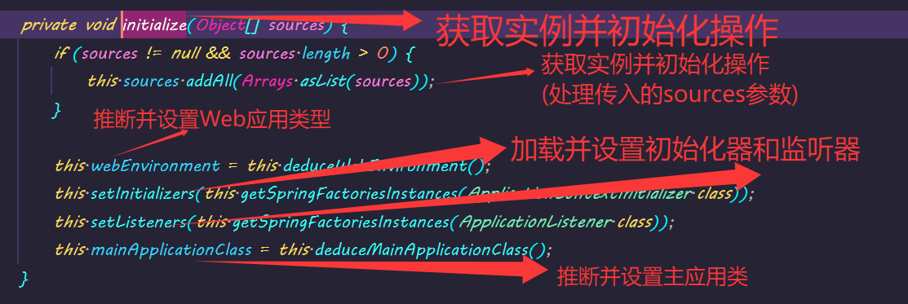

> ### Spring Boot 初始化四步骤详解   $deduce:推断$
>
> #### 步骤一：获取实例并初始化操作 (处理传入的sources参数)
>
> - **对应代码**：`this.sources.addAll(Arrays.asList(sources));`
> - **详细解释**：
>   - 这里的`sources`参数通常就是我们启动类（如`Application.java`），在调用`SpringApplication.run(Application.class, args);`时传入。
>   - 该方法将这些“配置源”保存到`SpringApplication`实例的一个集合中。
>   - **目的**：这些配置源后续会被用来创建和刷新Spring的`ApplicationContext`（应用上下文）。它们定义了应用的配置起点，告诉Spring从哪里开始加载Bean和配置信息。
>
> #### 步骤二：推断并设置Web应用类型
>
> - **对应代码**：`this.webEnvironment = this.deduceWebEnvironment();`(注：在较新版本中，该字段已更名为`webApplicationType`)
> - **详细解释**：
>   - 此步骤Spring Boot会自动检查项目的**类路径（Classpath）**。
>   - **推断逻辑**：
>     - 如果存在`org.springframework.web.reactive.DispatcherHandler`且不存在Spring MVC的`DispatcherServlet`，则推断为**响应式Web应用（WebApplicationType.REACTIVE）**。
>     - 如果存在Servlet相关的类（如`javax.servlet.Servlet`）和`org.springframework.web.servlet.DispatcherServlet`，则推断为**基于Servlet的Web应用（WebApplicationType.SERVLET）**。
>     - 如果以上都不满足，则推断为**非Web应用（WebApplicationType.NONE）**，例如普通的命令行应用。
>   - **目的**：根据应用类型，Spring Boot会创建相应类型的应用上下文（例如`AnnotationConfigServletWebApplicationContext`或`AnnotationConfigReactiveWebApplicationContext`），并决定是否启动内嵌的Web服务器（如Tomcat、Jetty或Netty）。
>
> #### 步骤三：加载并设置初始化器和监听器
>
> - **对应代码**：
>   - `this.setInitializers(this.getSpringFactoriesInstances(ApplicationContextInitializer.class));`
>   - `this.setListeners(this.getSpringFactoriesInstances(ApplicationListener.class));`
> - **详细解释**：
>   - 这是Spring Boot**“约定优于配置”和扩展机制**的核心体现。它使用`SpringFactoriesLoader`从**所有jar包的`META-INF/spring.factories`文件**中加载配置。
>   - **ApplicationContextInitializer (应用上下文初始化器)**：是一些在Spring的`ApplicationContext`被刷新（refresh）**之前**执行的回调接口。可以用来对应用上下文进行编程式的初始化或修改（例如设置环境属性、注册自定义Bean等）。
>   - **ApplicationListener (应用监听器)**：是Spring事件机制的一部分，用于监听在应用启动过程中发布的各类**事件**（例如`ApplicationStartedEvent`、`ApplicationFailedEvent`等）。基于事件驱动，我们可以方便地在应用生命周期的不同节点插入自定义逻辑。
>   - **目的**：通过这种SPI（Service Provider Interface）机制，Spring Boot及其各种Starter包能够自动地、可插拔地为应用添加各种初始化和监听功能，实现了高度的可扩展性。
>
> #### 步骤四：推断并设置主应用类
>
> - **对应代码**：`this.mainApplicationClass = this.deduceMainApplicationClass();`
> - **详细解释**：
>   - 该方法通过分析当前**调用栈（StackTrace）** 来推断出哪个类是包含`main`方法的启动类。
>   - 它从调用栈的底部开始向上查找，直到找到那个包含了`main`方法的类。
>   - **目的**：推断出的主应用类信息主要用于后续的日志记录和显示，让用户在启动日志中清晰地看到是哪个类启动了应用。在某些场景下也可能被用于其他的自动配置逻辑。
>
> 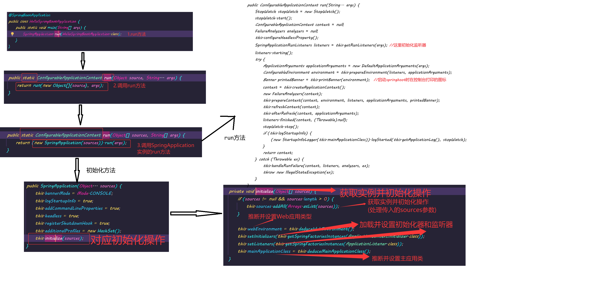

### run()方法工作机制

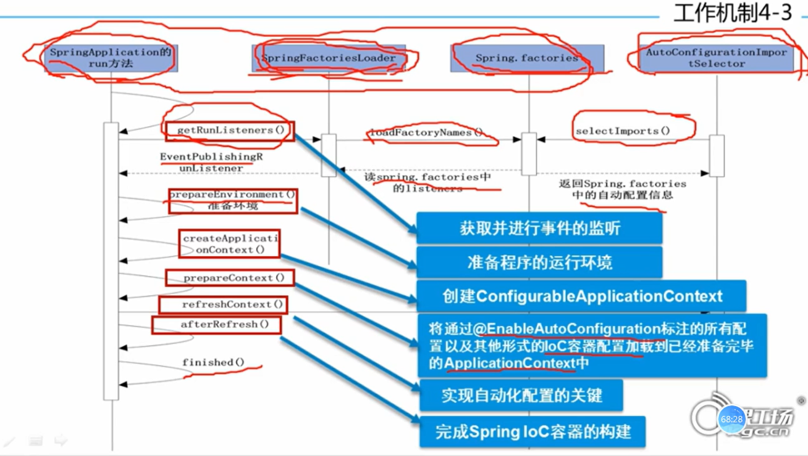

### 自动配置工作机制

