# SpringBoot常用技能

## @ConfigurationProperties

### @Value

> 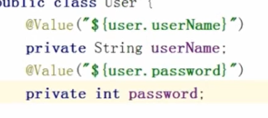
>
> 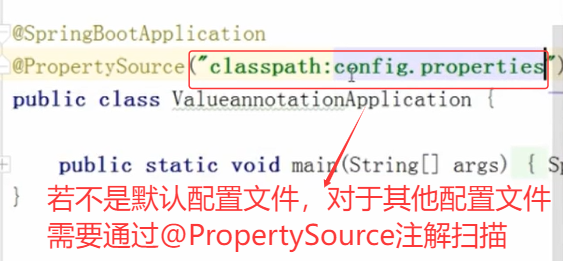
>
> 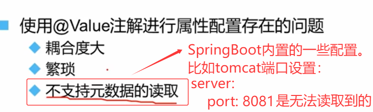

### @ConfigurationProperties(...)

> 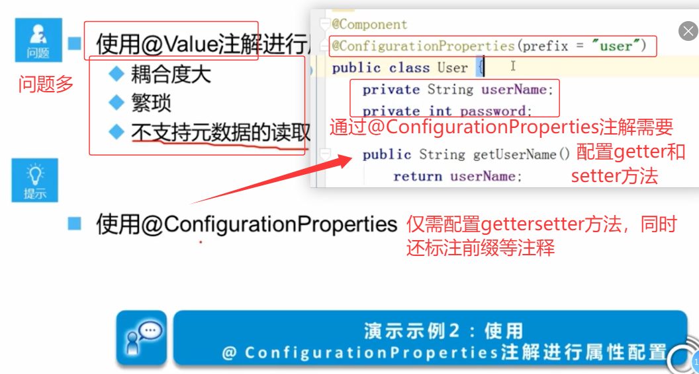

## Junit测试

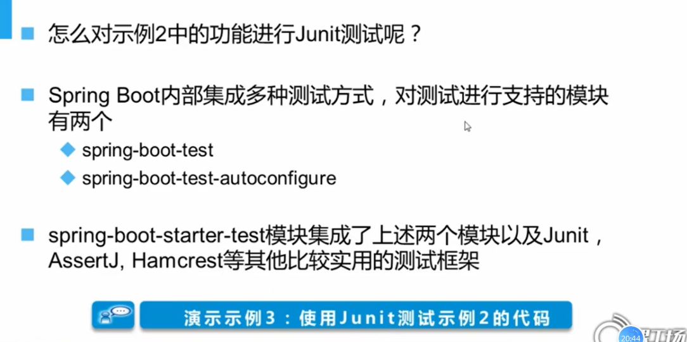

> ==目标：== 使用Junit进行单元测试，并测试User是否属性注入成功
>
> 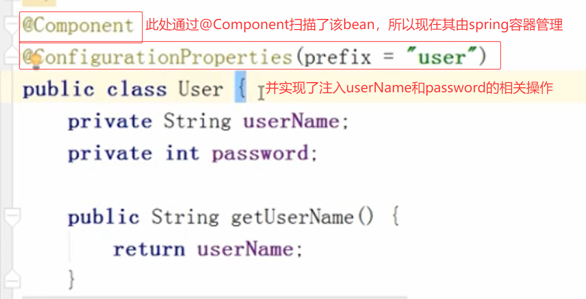
>
> 1. 获取该bean -> 依赖于ApplicationContext -> 写一个工具类实现ApplicationContextAware接口，实现setApplicationContext方法 -> 该工具类加上@Component，由IOC容器管理（这样IOC容器会自动执行setApplicationContext方法）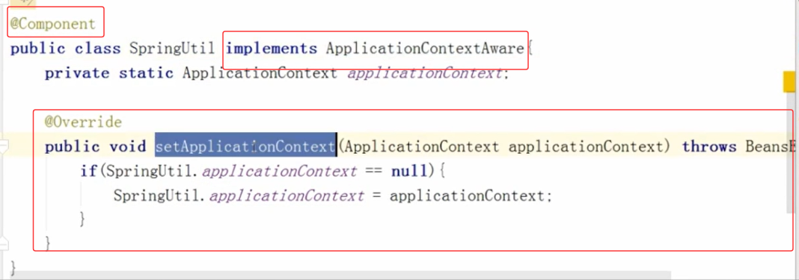
>
>    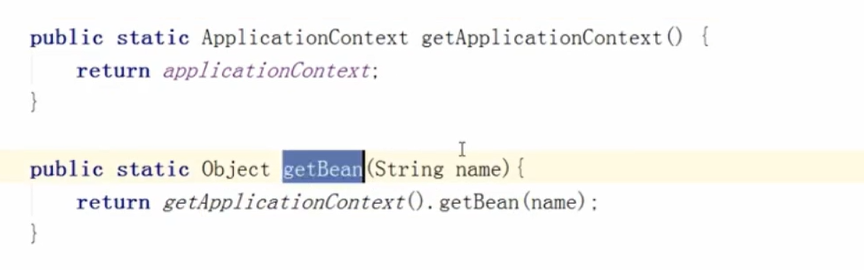
>
> 2. 在测试方法中测试
>
> 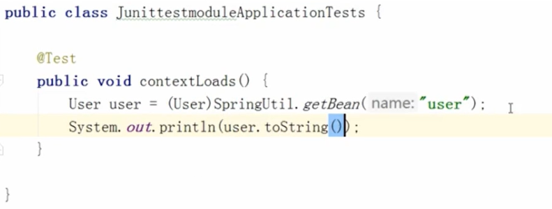

## 多配置环境

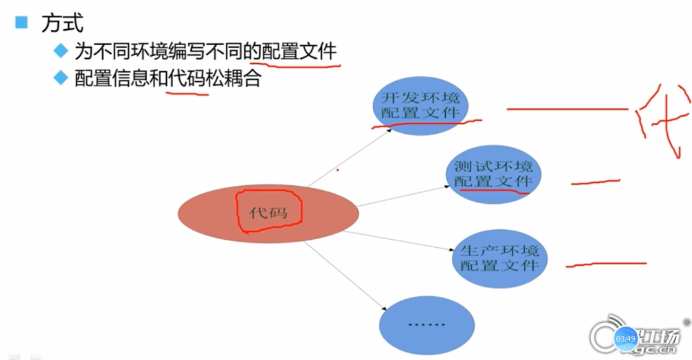

### properties

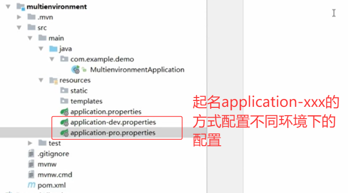

最后在application.properties中通过`spring.profiles.active=xxx`来确定具体的配置

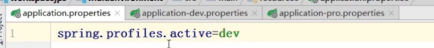

### yml

~~~yml
#spring
spring:
  datasource:
    driver-class-name: com.mysql.cj.jdbc.Driver
    url: jdbc:mysql://localhost:3306/newsmanagerdb?serverTimezone=GMT%2B8&characterEncoding=UTF-8
    username: xyy
    password: 123123
  jackson:
    time-zone: GMT+8
    date-format: yyyy-MM-dd HH:mm:ss

#mybatis
mybatis:
  type-aliases-package: com.xyy.entity
  mapper-locations: classpath:com/xyy/dao/*.xml

~~~

## 自动配置

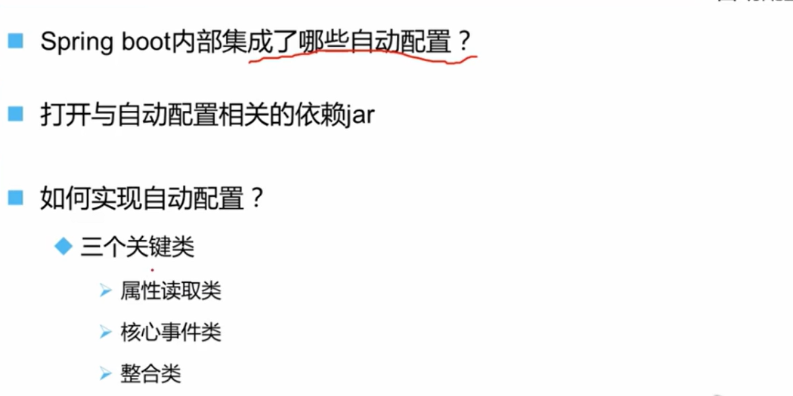

> 1. **`@Configuration(proxyBeanMethods = false)`**:
>
> - 表明这是一个配置类，Spring 容器会处理它来定义 Bean。
> - `proxyBeanMethods = false`是一个性能优化，表示配置类中的 `@Bean`方法不会被 CGLIB 代理。适用于配置类内部不相互调用 `@Bean`方法的情况（这里确实没有相互调用）。
>
> 2. **`@EnableConfigurationProperties({ServerProperties.class})`**:
>
> - 启用对 `ServerProperties`类的配置属性绑定。这意味着 `ServerProperties`的实例将被创建，并且其属性值将从 `application.properties`/`application.yml`文件（或其他配置源）中以 `server.*`为前缀的属性注入进来。
>
> 3. **`@ConditionalOnClass({CharacterEncodingFilter.class})`**:
>
> 条件注解。只有当项目的 classpath 中存在 `CharacterEncodingFilter`类（属于 `spring-web`模块）时，这个自动配置才会生效。这确保了所需的类可用。
>
> 
>
> 4. **`@ConditionalOnProperty(prefix = "server.servlet.encoding", value = {"enabled"}, matchIfMissing = true)`**:
>
> - 条件注解。它检查配置属性 `server.servlet.encoding.enabled`。
> - 如果该属性存在且值为 `true`，则条件满足。
> - 如果该属性不存在（`matchIfMissing = true`），则条件**也满足**（即默认启用）。
> - 只有当该属性明确设置为 `false`时，条件才不满足，整个自动配置会失效。

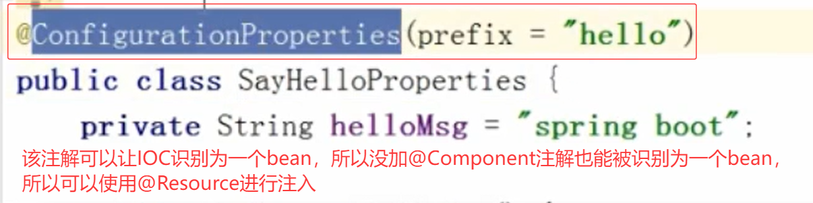

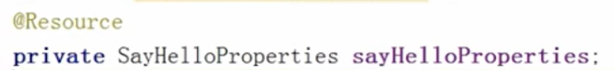

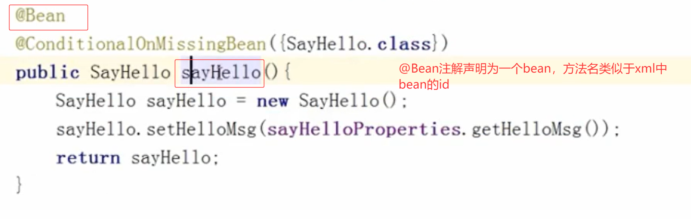

## 关闭自动配置

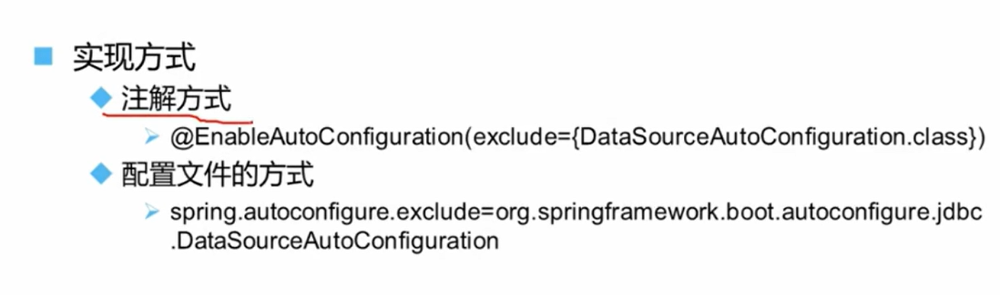

通过exclude，得保证该类能被springboot正确识别为一个自动配置类，所以仿照之前自动配置类创建一个spring.factories文件，将类信息写入。此时就能被正确识别为一个自动配置类。

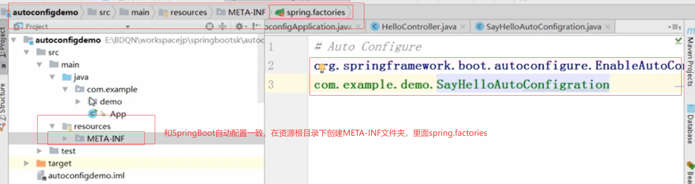

排除后，就无法自动配置，所以sayHello就无法注入

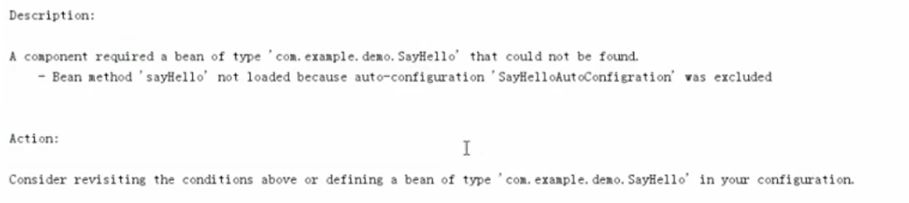

## 接管Spring自动配置

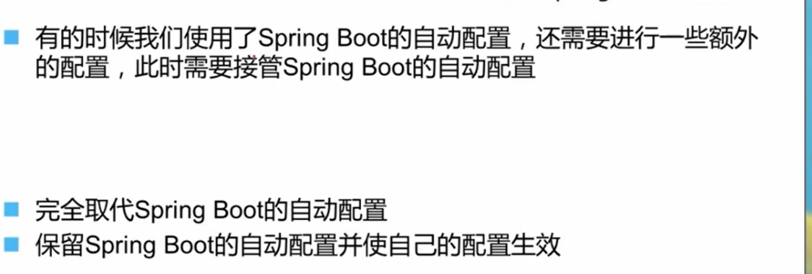

## xml配置

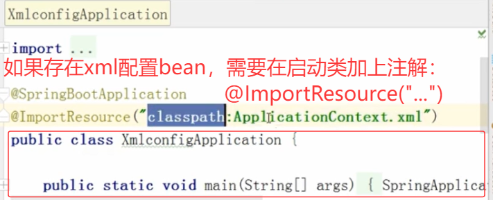

## 小结

