## 爱旅行项目改造

### 爱旅行项目简介

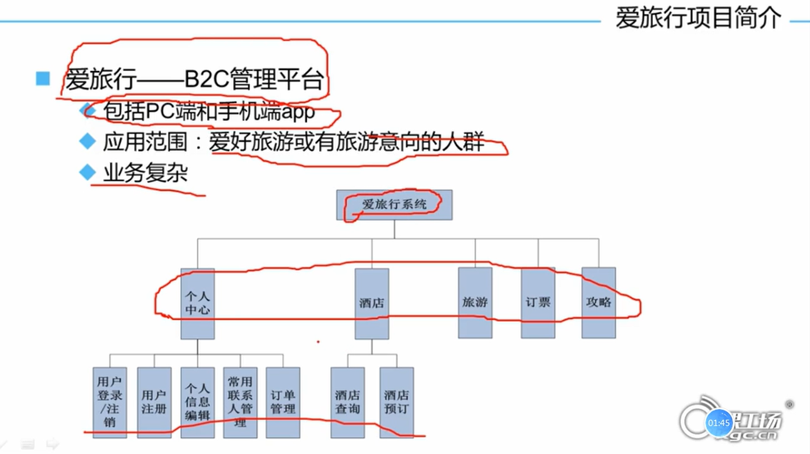

>  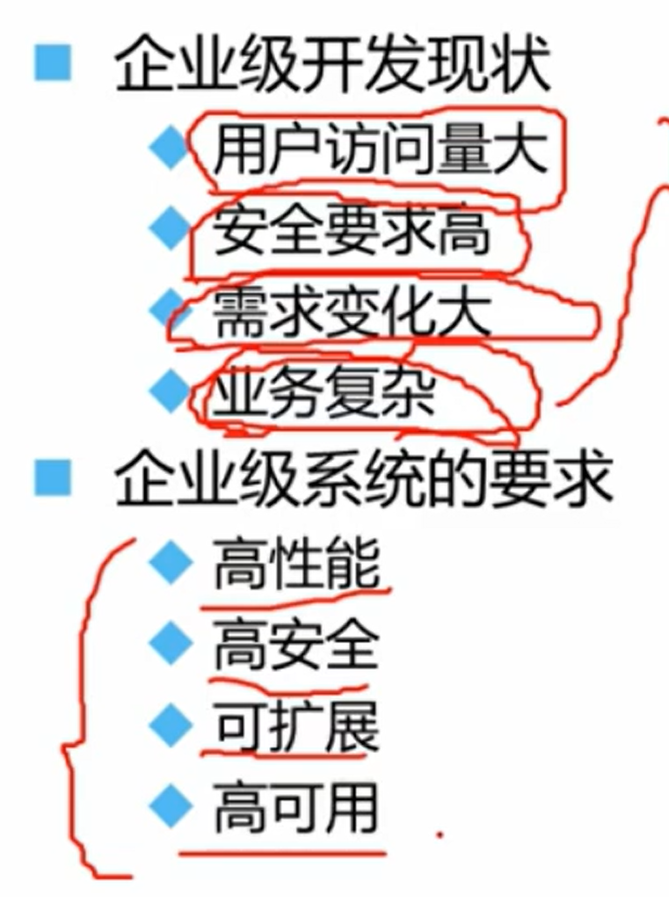
>
> ### 架构分类
>
> 1. **单一架构**
>
>    所有功能都集中在一个应用里，结构简单、易于开发，但扩展性和维护性较差，适合小型项目。
>
> 2. **垂直架构**
>
>    按业务线将系统拆分成多个独立的应用（如商城拆成订单、支付等应用），解决了单一架构的部分扩展问题，但应用之间仍可能存在功能重复。
>
> 3. **分布式架构**
>
>    将系统拆分为多个独立的服务，服务之间通过网络协作。极大地提升了扩展性、灵活性和可维护性，是当前复杂系统的主流选择，但架构复杂度也最高。
>
>    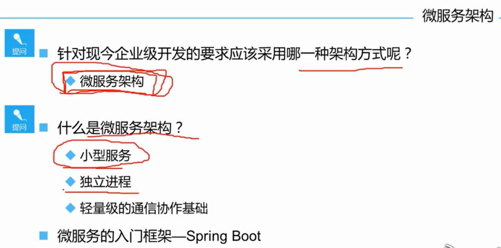
>
>    ### 改造爱旅行项目思路
>
>    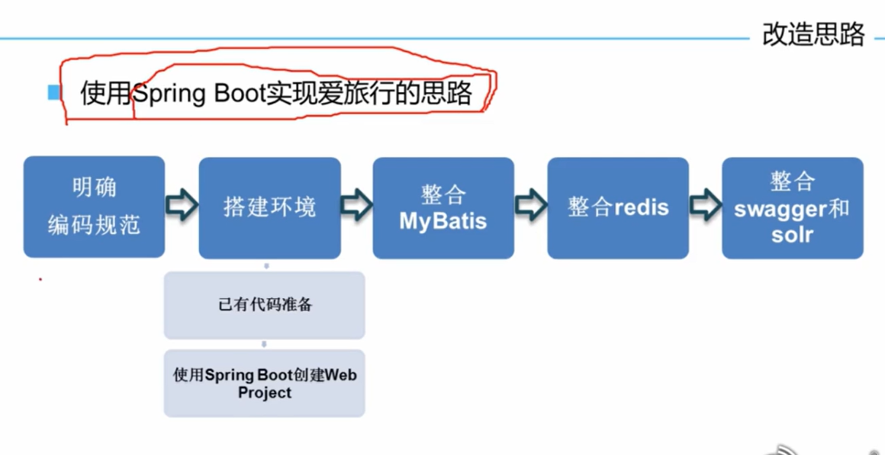

## 项目框架搭建

略

## Java配置

### xml配置方式

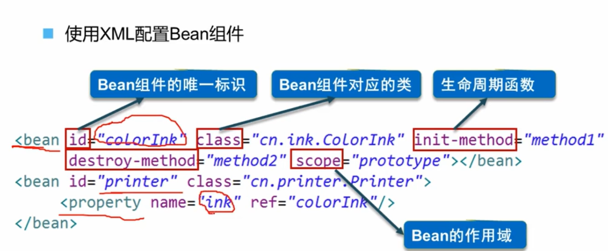

### java配置的方式

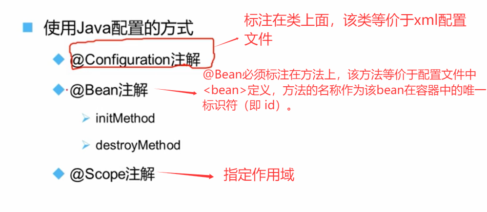

> - **​`initMethod`​**​ 属性：用于指定一个方法名，该方法会在 Bean 的​**​依赖注入完成之后​**​、正式投入使用之前被自动调用。相当于 XML 中的 `init-method`，用于​**​自定义初始化逻辑​**​（如建立连接、加载数据）。
> - **`destroyMethod`** 属性：用于指定一个方法名，该方法会在 Spring 容器**关闭或销毁该 Bean 之前**被自动调用。相当于 XML 中的 `destroy-method`，用于**执行资源清理工作**（如关闭连接、释放资源）。

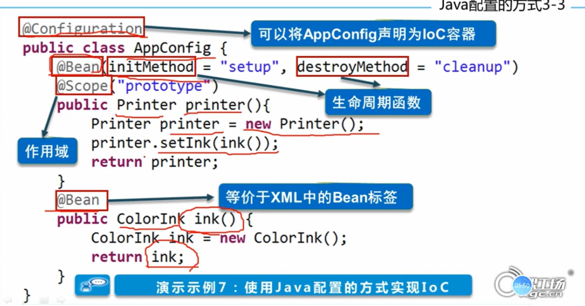

> ## @Scope("prototype")时不会执行销毁方法
>
> Spring容器对不同作用域的Bean的生命周期管理方式完全不同：
>
> | 作用域                | 管理责任                       | 创建时机                               | 销毁时机                                               |
> | :-------------------- | :----------------------------- | :------------------------------------- | :----------------------------------------------------- |
> | **Singleton（单例）** | **Spring容器全权负责**         | 容器启动时（或首次请求时）创建**一次** | 容器关闭时，负责销毁**这一个**实例                     |
> | **Prototype（原型）** | **Spring容器与调用方共同负责** | 每次请求时都创建**一个新的**实例       | **Spring容器不负责销毁**，由获取该Bean的客户端代码负责 |
>
> ## bean中属性注入
>
> 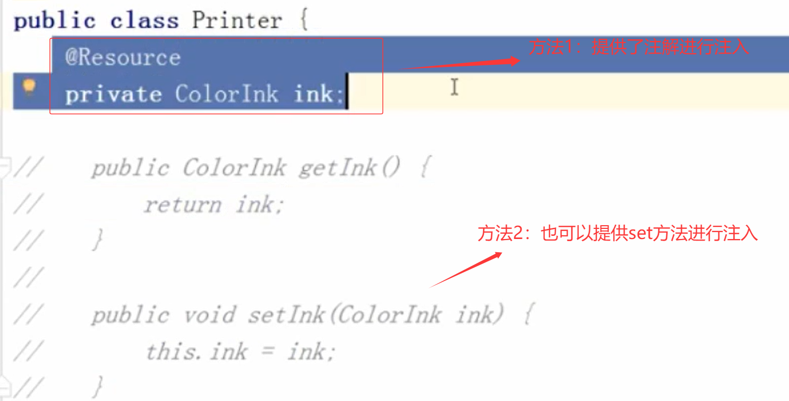

## SpringBoot整合Mybatis

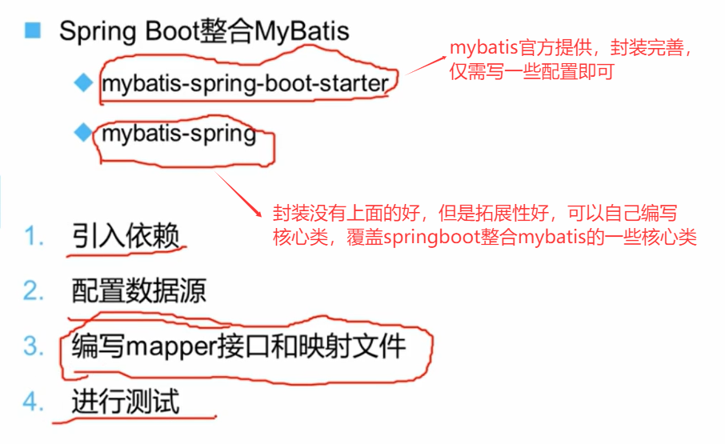

### mybatis-spring-boot-starer方式

#### 引入mybatis相关依赖

1. 最好将mybatis相关依赖放在dao模块中，而不是root模块下。
   1. 所有模块项目都会使用该依赖
   2. 若某个某块不需要引入mybaits依赖。但是因为放在root模块下，导致引入该依赖。又因为springboot自动配置，会创建相关类，可能这些配置类又会去找配置信息，若这些需要的配置信息不存在，则会报错

#### 配置属性yml

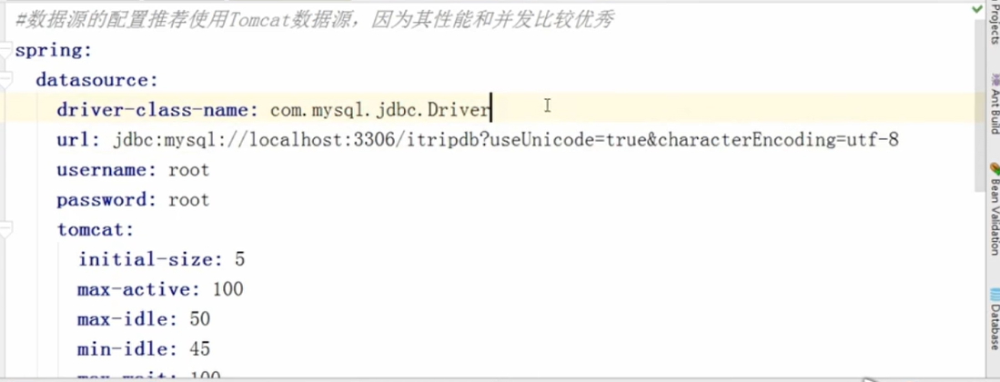

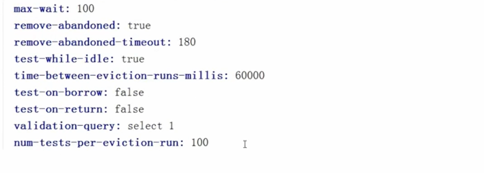

#### 配置Mapper接口&映射文件

1. MyBatis 的 XML 映射文件（Mapper XML）默认必须放在 `resources`资源目录下才会被自动识别和加载。直接放在 `java`源码目录下是不被识别的

   ### 原因与机制

   1. 1.**构建结果差异**：
      - `src/main/java`目录下的 `.java`文件在项目编译后，会生成 `.class`字节码文件，并打包到最终的 `classes`目录下。
      - `src/main/resources`目录下的所有文件（如 `.xml`, `.properties`）在项目编译时，会**原封不动地**复制到最终的 `classes`目录下。
   2. 2.**MyBatis 的默认扫描规则**：
      - `mybatis-spring-boot-starter`这个自动化配置组件（您图片中红圈标注的依赖）默认会从 **classpath**（即编译后的 `classes`目录）下扫描 `**/*.xml`文件来匹配映射文件。
      - 由于放在 `java`目录下的 `.xml`文件**不会被复制**到 `classes`目录，所以 MyBatis 无法找到它们，从而导致 `Invalid bound statement (not found)`异常。

##### 指定mapper映射文件

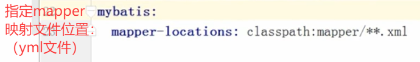

##### 指定mapper接口

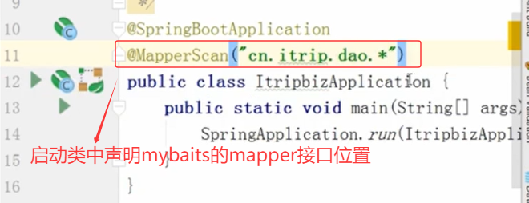

### mybatis-spring方式

略

## 事务支持

略

## 日志输出

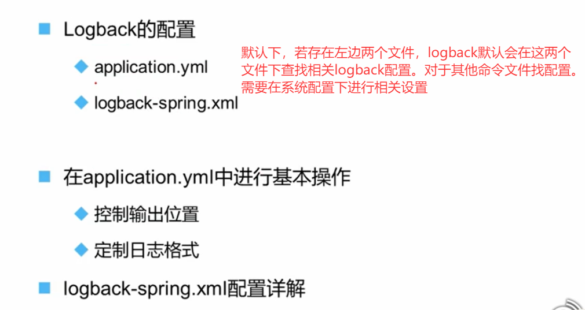

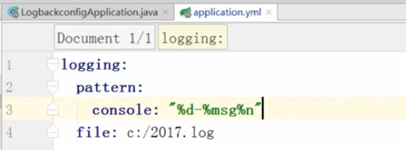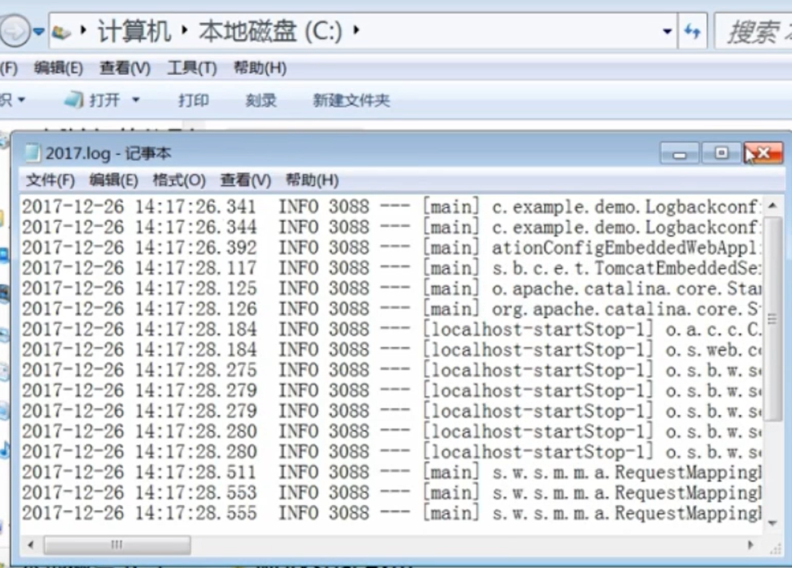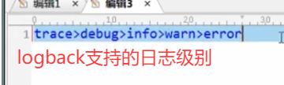

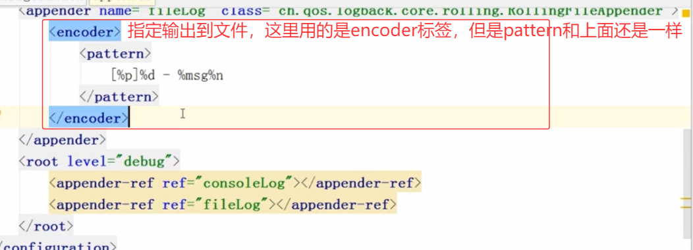

指定文件输出位置

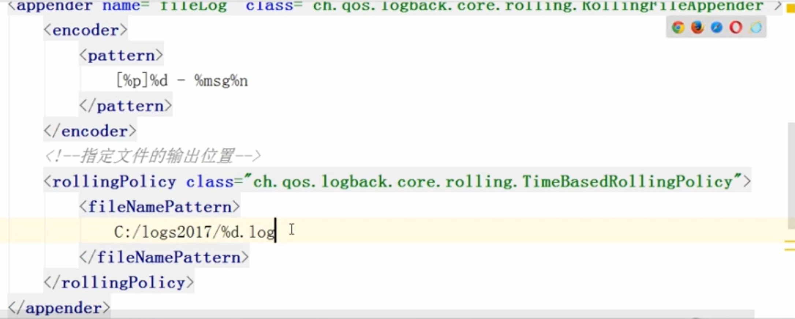

过滤操作

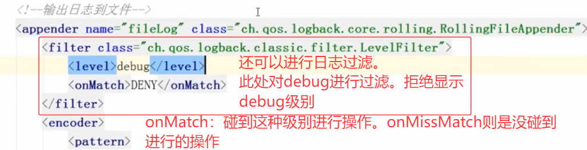