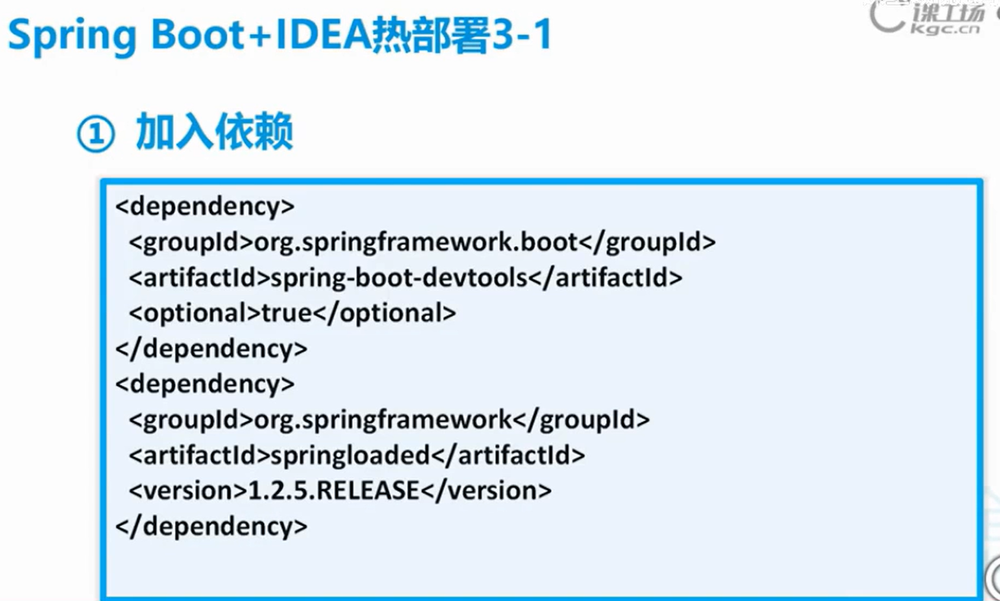
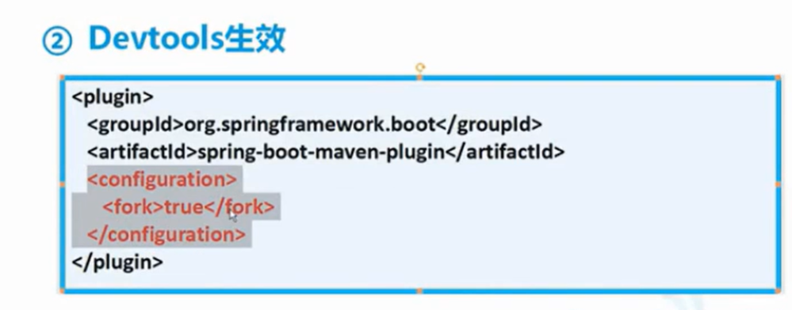
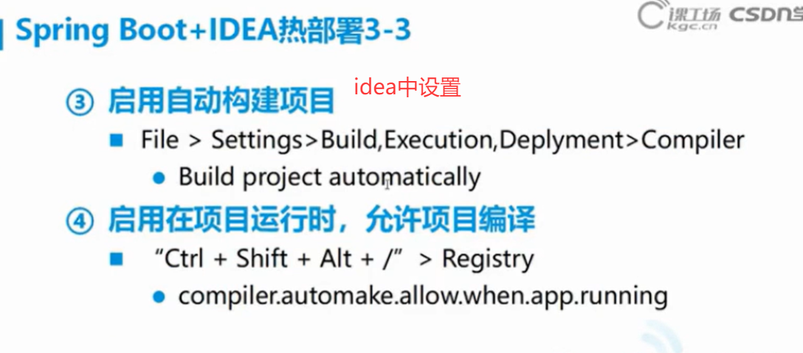

## 微服务相关概念

### 1. Provider (提供者) 和 Consumer (消费者)

这是服务调用中最基本的角色模型，广泛应用于分布式系统和微服务架构中。

- •**Provider (提供者)**： **服务的提供方**。它将自己拥有的某些功能或资源（如用户数据查询、订单处理接口）封装成服务，并暴露出来供其他系统调用。例如，一个“用户服务”就是一个Provider，它提供了获取用户信息的接口。
- •**Consumer (消费者)**： **服务的调用方**。它需要某个特定的功能或数据时，会去调用Provider暴露出来的服务。例如，一个“订单服务”在生成订单时需要用户信息，它就会作为Consumer去调用“用户服务”。

**关系**： 这是一种抽象的调用关系，一个服务既可以作为某些功能的Provider，也可以作为其他功能的Consumer。

------

### 2. RPC 和 RESTful

这是两种最主流的服务间通信协议或风格，是Provider和Consumer之间“对话”的规则。

- •**RPC (Remote Procedure Call - 远程过程调用)**•**核心思想**： 让调用远程服务像调用本地函数/方法一样简单自然。开发者无需关心底层的网络传输细节。•**特点**： 通常性能较高，传输效率好（常用二进制协议，如gRPC使用的Protocol Buffers）。强调**动作和行为**（例如，`getUserInfo`, `createOrder`）。•**典型框架**： gRPC, Apache Thrift, Dubbo等。
- •**RESTful (Representational State Transfer - 表述性状态转移)**•**核心思想**： 一种架构风格，将一切视为资源（Resource），通过标准的HTTP方法（GET, POST, PUT, DELETE）来操作资源。•**特点**： 更通用、更简单，利用HTTP协议本身的特性（如缓存、状态码）。强调**资源**（例如，`/users/123`），通过不同的HTTP方法来表达要对该资源做什么（GET获取，POST创建，PUT更新）。•**典型实现**： 基于HTTP API的设计，是目前互联网API最常见的形式。

**对比**： RPC框架通常用于**系统内部**的服务调用，追求高性能；而RESTful API更常用于**对外暴露接口**，因为其标准、通用，更适合多语言、多平台协作。

------

### 3. 分布式 (Distributed) 

PPT用红色下划线标注了此概念，说明它是所有其他概念的基础和核心上下文。

- •**核心思想**： **一个硬件或软件组件分布在不同的网络计算机上，彼此之间通过消息传递进行通信和协调。**
- •**为什么要分布式？**•**解耦与扩展**： 将单体应用拆分成多个独立的服务（即微服务），每个服务可以独立开发、部署和扩展。•**提升性能与容量**： 通过添加更多的机器，突破单机性能瓶颈，处理更大的负载和数据量。•**提高可用性**： 部分节点的故障不会导致整个系统完全瘫痪。

**与上图的关系**： Provider和Consumer之所以存在，就是因为系统是分布式的，它们不在同一台机器上。RPC和RESTful则是解决分布式环境下服务间通信问题的具体技术方案。

------

### 4. 集群 (Cluster)

- •**核心思想**： **将多台计算机（服务器）组合起来，作为一个整体向外界提供服务。** 这些计算机协同工作，共同承担负载。
- •**目的**：•**高可用性 (High Availability)**： 当集群中的某台服务器宕机时，其他服务器可以立即接管它的工作，保证服务不中断。•**高并发 (High Concurrency)**： 通过多台服务器分流用户请求，共同处理高并发流量，提升系统的整体处理能力。•**负载均衡**： 流量会通过负载均衡器均匀地分发给集群中的各个节点，避免单一节点压力过大。

**与“分布式”的关系**： 这两个概念经常一起出现，但侧重点不同。

- •**分布式** 更强调**系统的架构方式**，指功能或组件在物理上的**分离**。
- •**集群** 更强调**机器的组织方式**，指多台机器提供**相同功能**形成的集合，旨在提高可用性和性能。
- •一个典型的分布式系统，通常由多个**集群**组成（例如，用户服务是一个集群，订单服务是另一个集群）。

### 总结

这张PPT描绘了一个现代系统架构的核心脉络：

为了应对复杂的业务和高并发挑战，我们采用**分布式**架构，将系统拆分为多个独立的服务。这些服务遵循 **Provider/Consumer** 模型进行交互。它们之间通过 **RPC** 或 **RESTful** 等协议进行通信。为了保证每个服务的高可用和高性能，每个服务通常又是由多台服务器组成的**集群**来对外提供。

## 常见架构

- **Dubbo/Dubbox**Dubbo 是阿里巴巴开源的一款高性能、轻量级的 Java RPC 框架，后由当当网在此基础上维护并扩展了 Dubbox。它主要用于构建高性能的分布式微服务架构，提供服务治理、服务调用、负载均衡等功能。•官方网站：http://dubbo.io/•GitHub 仓库：https://github.com/dangdangdotcom/dubbox
- •**Spring Cloud**Spring Cloud 是一套完整的微服务解决方案，它基于 Spring Boot 提供了构建分布式系统中常见模式（如配置管理、服务发现、断路器、智能路由等）的工具。•官方网站：http://projects.spring.io/spring-cloud/

这两个框架都是企业开发微服务架构时的重要技术选型。Dubbo 更侧重于高性能的 RPC 调用，而 Spring Cloud 提供了一站式的微服务生态体系。

## dubbox框架

### dubbox简介

    Provider：暴露服务的服务提供方。
    
    Consumer：调用远程服务的服务消费方。
    
    Registry：服务注册与发现的注册中心。
    
    Monitor：统计服务的调用次调和调用时间的监控中心。
    
    Container： 服务运行容器。
    
    0. 服务容器负责启动，加载，运行服务提供者。
    
    1. 服务提供者在启动时，向注册中心注册自己提供的服务。
    
    2. 服务消费者在启动时，向注册中心订阅自己所需的服务。
    
    3. 注册中心返回服务提供者地址列表给消费者，如果有变更，注册中心将基于长连接推送变更数据给消费者。
    
    4. 服务消费者，从提供者地址列表中，基于软负载均衡算法，选一台提供者进行调用，如果调用失败，再选另一台调用。
    
    5. 服务消费者和提供者，在内存中累计调用次数和调用时间，定时每分钟发送一次统计数据到监控中心。

### 注册中心 Zookeeper

#### Linux安装

#### 服务启动

#### Dubbox本地Jar包部署与安装

## SpringBoot热部署

### 热部署依赖

### devtools生效

### idea相关设置

## 拓展

### 注册中心类型

| 注册中心类型  | 适用场景         | 优点                       | 缺点                             | 推荐指数             |
| :------------ | :--------------- | :------------------------- | :------------------------------- | :------------------- |
| **Zookeeper** | **生产环境首选** | 强一致性、高可用、实时通知 | 需额外部署维护                   | ⭐⭐⭐⭐⭐ (**强烈推荐**) |
| **Redis**     | 生产环境（次选） | 可利用现有Redis设施        | 可靠性、实时性稍弱，官方支持减弱 | ⭐⭐⭐                  |
| **Multicast** | **本地开发测试** | 无需部署，开箱即用         | 不可靠，仅限局域网               | ⭐ (仅用于测试)       |
| **Simple**    | **本地开发测试** | 内置，无需配置             | 无法用于生产                     | ⭐ (仅用于测试)       |

### 手动将jar包安装的我本地仓库

这个命令是 **Maven**（一个强大的Java项目管理和构建工具）的一个标准命令，其核心作用是：

**将一份本地的、不在任何公共仓库中的JAR包文件，手动安装到您电脑的Maven本地仓库中。**

- `-Dfile=d:\setup\dubbo-2.8.4.jar`: 指定要安装的JAR包文件在您电脑上的具体位置。
- •`-DgroupId=com.alibaba`: 指定这个JAR包的“组织名”（坐标的一部分）。
- •`-DartifactId=dubbo`: 指定这个JAR包的“项目名”（坐标的另一部分）。
- •`-Dversion=2.8.4`: 指定这个JAR包的版本号。
- •`-Dpackaging=jar`: 指定打包类型，这里当然是jar。

