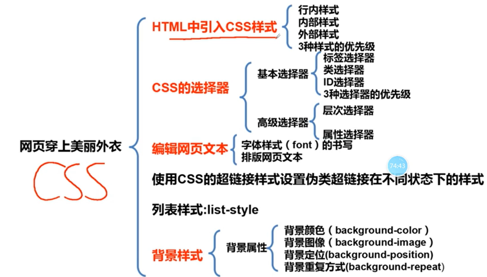
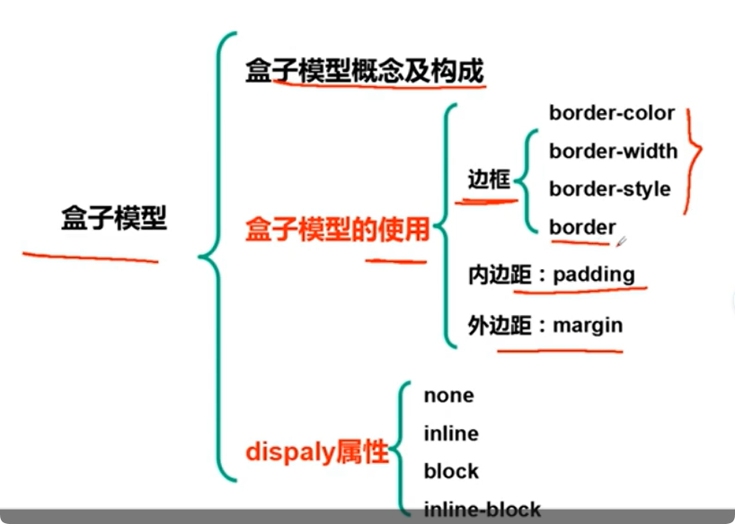
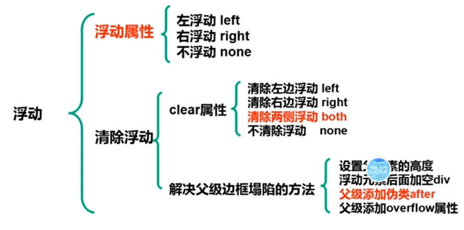
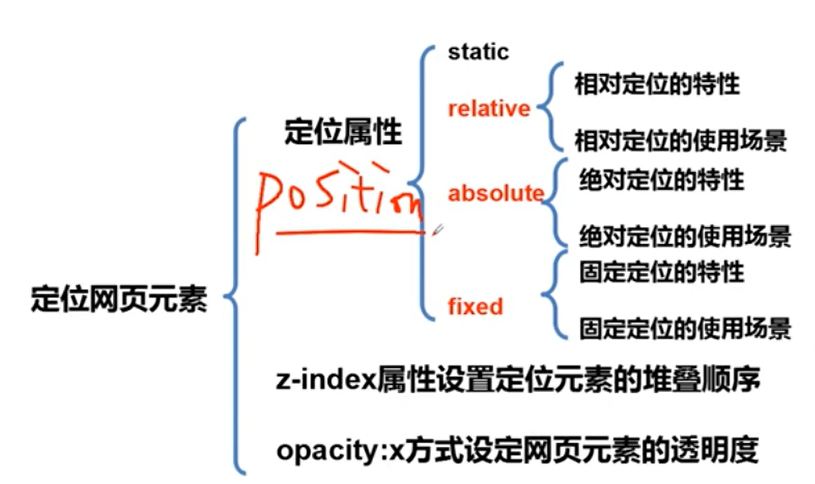

# CSS

## CSS基本语法

### `css的概念`

1. ==C==ascding ==S==tyle ==S==heet 级联样式表
2. ==表现==HTML文件==样式==的计算机语言
   1. 样式定义如何显示HTML元素
   2. 包括对字体、颜色、边距、高度、宽度、背景图片、网页定位等设定

### `选择器`

### `css注释`

1. **css注释以"/*"开始，以"\*/"结束**

---

## < span>和< div>

### 行内元素

==\==就是行内元素，常见的还有：a、strong、em...

### 块级元素

==\
==就是块级元素，常见的还有：p、h1、ul、ol、li、hr...

### (行内、块级)区别

1. **行内元素**如果内容没有撑满，则可以和后面其他行内元素一起占一行。但是**块内元素**不会，即使内容没有撑满，也会==独占一行==。
2. **行内元素**修改==宽高样式==是==无效==的，而**块内元素**不会。
3. 在**盒子模型**中相关属性有些应用于**块级元素**没问题，但部分应用于**行级元素**无效的。

### 转换

1. ==行内元素 <--> 块级元素==

   > 通过CSS的实现，操作==display==属性来实现转换
   >
   > ***display***效果有：
   >
   > 1. **控制元素的显示和隐藏**
   > 2. **块级元素与行内元素的转变**
   >
   > | display值    |      |      | 说明                                         |      |
   > | :----------- | :--- | ---- | :------------------------------------------- | :--- |
   > | none         |      |      | 设置元素不会被显示（将不占空间，相当于删除） |      |
   > | inline       |      |      | 元素会被显示为内联（行内）元素               |      |
   > | block        |      |      | 元素会被显示为块级元素                       |      |
   > | inline-block |      |      | 行内块元素                                   |      |
   >
   > 
   >
   > 
   >
   > 
   >
   > 

---

## 在HTML中使用CSS

### 方式一

1. ==内部样式表==：css代码写在\<head>的\

### 方式二

2. ==行内样式表==：使用style属性引入css样式

   > \<h1 style="color:red;">

### 方式三

3. ==外部样式表==：css代码保存在拓展名为.css的样式表
   1. ==链接式==：`<link href="style.css" rel="stylesheet" type="text/css">`，其中href后面跟.css文件路径，后面rel和type是固定的，type可省略。
   2. ==导入式==：`@import url("style.css");`，url后的内容和href后的内容一致，都是url路径
   3. `link`he`import`在导入多个外部css文件，link需要写多个，而一个import可以导入多个css文件。

### 优先级

1. ==就近原则==：`行内样式 > 内部样式 > 外部样式`。对于每种样式中出现**相同的属性**，通过**就近原则**进行**覆盖**。**不同的则继承继续使用**。

---

## CSS选择器

### 基本选择器

1. ==标签选择器==
   HTML标签作为标签选择器名称，如h1...h6、p、img等

2. ==类选择器==

   `.class{font-size:16px}`
   class是**类名称**，==.类名称==就是**类选择器**。**调用**该选择器通过将标签的**class属性赋值‘类名称’**。即：声明时要加点，调用时不用加。

   > ~~~css
   > /*声明：*/
   > .blue {
   >    color: blue;
   > }
   > /*调用：*/
   > 
一个div

   > ~~~
   >

3. ==ID选择器==
   `#id{font-size:16px;}`
   id是**ID名称**，==#id==就是**ID选择器**。**调用**该选择器通过将标签的**id属性赋值‘ID名称’**

**总结：**

1. 对于想要相同的标签使用相同的样式，可以采用**标签选择器**
2. 对于想要不同的标签使用相同的样式，可以采用**类选择器**
3. 标签中id属性值是唯一的，不能出现重复。
4. 当一个标签同时存在类属性和id属性，优先级不遵循就近原则，==id选择器优先级高于 类选择器 高于 标签选择器（基本选择器中优先级不遵循就近原则）==

### 层次选择器

| 形式  | 类型           | 语法                                                         |
| ----- | -------------- | ------------------------------------------------------------ |
| E   F | 后代选择器     | body p{ background: red;}    // 中间是空格，上面是body标签下的，所有p标签 |
| E > F | 子选择器       | body>p{background:pink;}  // 和body有直接父子关系的p标签     |
| E + F | 相邻兄弟选择器 | .active+p {background:green;}   //距离类名为active标签同级的 （相邻，active后面的第一个p标签，因为程序是向下运行的，所以不会是上面的） |
| E ~ F | 通用兄弟选择器 | .active~p{background:yellow;}   //距离类名为active标签同级的 （active后面的所有p标签，因为程序是向下运行的，所以不会是上面的） |

### 属性选择器

| 语法       | 说明                                                      |
| ---------- | --------------------------------------------------------- |
| a[id]      | 带有id属性的a标签                                         |
| a[id=val]  | id属性为val的a标签                                        |
| a[id^val]  | id属性以val打头的a标签, 类似于正则表达式中的^，以什么打头 |
| a[id$=val] | id属性且以其值以val结尾的a标签                            |
| a[id*=val] | id属性值包含val的a标签 / 模糊查询 /                       |

---

## CSS字体样式

### font-family

1. **示例**：
   p{font-family: Verdana, "楷体";}
   body{font-family: Times, "Times New Roman", "楷体";}
2. **说明**:
   1. font-family后面可以跟**多个字体名称**，使用的流程依次从前往后进行挑选，如果系统没有当前字体，则往后挑选。
   2. 对于**多个英文单词中间有空格**、**字体名称为中文**都需要用“”包裹起来

### font-size

1. **单位**：常用**em、px(像素)**
2. **示例**：
   h1{font-size:24px;}
   h2{font-size:16px;}

### font-style

1. **取值：**
   1. normal：文本正常显示
   2. italic：文本倾斜显示
   3. oblique：文本倾斜显示（倾斜与斜体非常相似，但支持较少）

### font-weight

| 值                                            | 说明                                                 |
| --------------------------------------------- | ---------------------------------------------------- |
| normal                                        | 默认值，定义标准的字体                               |
| bold                                          | 粗体字体                                             |
| bolder                                        | 更粗的字体                                           |
| lighter                                       | 更细的字体                                           |
| 100、200、400、500 500、600、700、800、900 | 定义由细到粗的字体 400等同于normal，700等同于bold |

### font属性

1. **顺序**：字体风格 -> 字体粗细 -> 字体大小 -> 字体类型
2. **示例**：p span{font: oblique bold 12px "楷体"}，==属性间用空格隔开==

### color属性

1. 颜色名称
2. 十六进制
3. RGB(r, g, b): 正整数的取值为0~255
4. RGBA(r, g, b, a)：在RGB基础上增加了控制alpha透明度的参数，允许设定一个颜色的透明度。其中透明度通道为0~1，a表示透明度：0=透明；1=不透明
5. opacity属性也可以设置颜色透明度

   | 属性       | 说明                   | 举例          |
   | ---------- | ---------------------- | ------------- |
   | opacity：x | x值为0~1，值越小越透明 | opacity: 0.4; |

### 水平对齐方式

1. ==text-align属性==

   | 值      | 说明                 |
   | ------- | -------------------- |
   | left    | 把文本排列到左边     |
   | right   | 把文本排列到右边     |
   | center  | 把文本排类到中间     |
   | justify | 实现两端对齐文本效果 |

### 首行缩进

1. ==text-indent属性==：em或px

### 行高

1. ==line-height属性==：px

### 文本装饰

1. ==text-decoration属性==

   | 值           | 说明                   |
   | ------------ | ---------------------- |
   | none         | 默认值，定义的标准文本 |
   | underline    | 设置文本的下划线       |
   | overline     | 设置文本的上划线       |
   | line-through | 设置文本的删除线       |

---

## 超链接伪类样式

### 伪类样式

1. **语法：** 标签名:伪类名{声明;}

2. **举例：** 

   a:hover{
   	color:yellow;
   	text-decoration:underline;
   }

3. **样式：**

   | 伪类名称    | 含义                               | 示例                   |
   | ----------- | ---------------------------------- | ---------------------- |
   | a:link      | 未单击访问时超链接样式             | a:link{color:black}    |
   | a:visited   | 单击访问后超链接样式               | a:visited{color:}      |
   | ==a:hover== | 鼠标悬浮其上的超链接样式（用的多） | a:hover{color:#ff7300} |
   | a:active    | 鼠标单击未释放的超链接样式         | a:active{color:#999}   |

   **先后顺序记忆：** 先==爱==后==恨==：==l==o==v==e + ==h====a==te

---

## 列表样式

### list-style-type

| 值       |                      |
| -------- | -------------------- |
| ==none== | 无标记符号（使用多） |
| disc     | 实心圆，默认类型     |
| circle   | 空心圆               |
| square   | 实心正方形           |
| decimal  | 数字                 |

### list-style-image

1. 将列表前的标志用图像来代替，通过url指定
   url(xxx.gif);

### list-style-position

1. 允许**标志出现的位置**在内容里面还是外面
   1. inside：列表的标记放在**文本以内**
   2. outside：列表的标记放在**文本以外**，文本**左侧**

### list-style

1. li{list-style: none}

---

## 背景样式

### background-color

### background-image

1. background-image: url(图片路径);

### background-repeat

1. repeat：沿水平和垂直两个方向平铺
2. no-repeat：不平铺，即只显示一次。**图像默认会显示在容器的左上角**
3. repeat-x：只沿着水平方向平铺
4. repeat-y：只沿着垂直方向平铺

### background-position

| 值             | 含义                                                         |
| -------------- | ------------------------------------------------------------ |
| ==Xpos  Ypos== | 单位：px； Xpos表示水平位置，Ypos表示垂直位置             |
| X%    Y%       | 使用百分比表示背景的位置                                     |
| X、Y方向关键字 | 水平方向关键字：left、center、right 垂直方向的关键字：top、center、bottom |

### background

1. **用法**：**background：背景颜色、背景图像、背景定位、背景不重复显示**(空格隔开)
2. **举例：**ul li{background: red url(...) 10px 10px no-repeat}

---

## 盒子模型

1. 从外到内：**外边距Margin、边框Border、填充Padding、实际内容Content**

### border边框

1. 对于边框，可以对整体进行渲染，即四个边同时进行修改。也可以差分每一条边进行对应的修改。

2. **border-color**

   | 属性                | 说明                                                         | 示例                                                         |
   | ------------------- | ------------------------------------------------------------ | ------------------------------------------------------------ |
   | border-top-color    | 上边框颜色                                                   | border-top-color:#396;                                       |
   | border-right-color  | 右边框颜色                                                   | border-right-color:#396;                                     |
   | border-bottom-color | 下边框颜色                                                   | border-bottom-color:#396;                                    |
   | border-left-color   | 左边框颜色                                                   | border-left-color:#396;                                      |
   | border-color        | 1. 四个边框为同一颜色，后面跟一个值 2. 上、下边框颜色：red;左、右边框颜色：blue 3.上边框：red；左右边框：yellow；下边框：black； 4.四个值分别对应上、右、下、左顺时针方向 | 1. border-color:#396; 2. border-color:red blue; 3.border-color:red yellow black 4.border-color: c1 c2 c3 c4 |

3. **border-width**

   1. thin
   2. medium
   3. thick
   4. ==像素值==

   同样可以参考border-color的表格

4. **border-style**

   1. none
   2. dotted点线
   3. ==dashed虚线==
   4. ==solid实线==
   5. double连个边框

1. **boder**

   **同时设置边框的颜色、粗细和样式**

   1. border: 1px solid #3a6587
   2. boder: 1px dashed red;

### margin外边距

其中**margin可以参考border对应的属性值**：**一个、两个、三个、四个**时对应的方位

1. margin-top
2. margin-right
3. margin-bottom
4. margin-left
5. margin

#### margin水平居中对齐

**使用：** ==margin: 0px auto==

**条件：** 

1. **块元素**
2. **固定宽度**

### padding内边距

参考margin

---

## 浮动布局

### 浮动-float

`float` 属性可以设置以下值之一：

- left - 元素浮动到其容器的左侧
- right - 元素浮动在其容器的右侧
- none - 元素不会浮动（将显示在文本中刚出现的位置）。默认值。
- inherit - 元素继承其父级的 float 值

### 清除浮动-clear

因为浮动会造成元素脱离标准文档流从而会对后面的非浮动元素造成影响，比如报纸中文字包裹图片的效果。可以通过clear来设置方位不能出现浮动元素。

`clear` 属性可设置以下值之一：

- none - 允许两侧都有浮动元素。默认值
- left - 左侧不允许浮动元素
- right- 右侧不允许浮动元素
- both - 左侧或右侧均不允许浮动元素
- inherit - 元素继承其父级的 clear 值

### 父级边框塌陷问题

1. **原因：**父容器中所有的元素都浮动，都脱离了标准文档流。导致父容器中相当没有元素，所以出现塌陷问题。

2. **解决：**

   1. 给父容器**设置高度**（局限：高度出现限制）

   2. 浮动元素后加上一个**空白div**（局限：造成冗余）

   3. **父级**添加==伪元素after==
      假设父容器类名为father
      .father::after{
         content:''; 相当于在父容器中所有元素后面加上' ' 
        display: block; 前面两行相当于加上了一个空白div
        clear:both;
      }

      可以参考[CSS ::after 伪元素 (w3school.com.cn)](https://www.w3school.com.cn/cssref/selector_after.asp)

   4. **父级**添加==overflow属性==

      在父容器中css中加入==overflow: hidden==

### overflow属性

| 属性值  | 说明                                                   |
| ------- | ------------------------------------------------------ |
| visible | 默认值。内容不会被修剪，会呈现在盒子之外               |
| hidden  | 内容会被修剪，并且其余内容是不可见的                   |
| scroll  | 内容会被修剪，但是浏览器会显示滚动条以便查看其余内容   |
| auto    | 如果内容被修剪，则浏览器会显示滚动条以便查看其余的内容 |

---

## 定位布局

### position属性

1. **static: 默认值，没有定位**
2. **relative: 相对定位**
3. **absolute: 绝对定位**
4. **fixed :固定定位**

### 相对定位relative

**特点：**

1. 相对==自身原来位置==进行偏移

2. **偏移设置**：top、left、right、bottom

   ~~~css
   #test {
     position: relative;
     left: 20px;
     top: 30px;
   }
   ~~~

   

**相对定位的特性：**

1. 相对开**自己的初始位置**来**定位**
2. 元素位置发生偏移后，它**原来的位置会被保留**下来
3. 层级提高，可以**把标准文档流中的元素及浮动元素盖在下边**

**相对定位的使用场景：**

1. 相对定位一般情况下很少自己单独使用，都是合绝对定位使
   用，为绝对定位创造
2. 定位父级而又不设置偏移量

### 绝对定位absolute

**特点：**

1. **偏移设置**： left、right、top、bottom

**绝对定位的特性：**

1. 绝对定位是相对于它的**定位父级**的位置来定位，如果没有设置定位父级，则相对浏览器窗口来定位（这里就对应了relative的使用场景，父级长使用relative来搭配子级的absolute，使得能够按照父级定位）
2. 元素位置发生偏移后，**原来的位置不会被保留**
3. **层级提高**，可以把标准文档流中的元素及浮动元素**盖在下边**
4. 设置绝对定位的元素**脱离文档流**

**绝对定位的使用场景：**

1. 一般情况下，绝对定位用在下拉菜单、焦点图轮播、弹出数字气泡、特别花边等场景

### 固定定位fixed

**特点：**

1. 偏移设置：left、right、top、bottom

**固定定位的特性：** 

1. **相对浏览器窗口来定位**
2. 偏移量**不会随滚动条的移动而移动**

**固定定位的使用场景：**

1. 一般在网页中被用在窗口左右两边的**固定广告**、**返回顶部图标**、**吸顶导航栏**等

### z-index

**网页中的元素都含有两个堆叠层级：**

1. 未设置绝对定位时所处的环境，**z-index是0**
2. 设置==绝对定位==时所处的堆叠环境，此时层的位置由z-index的值确
   定

**改变设置绝对定位和没有设置绝对定位的层的上下堆叠顺序，只**
**需调整绝对定位层的z-index值即可**

---

##  总结

浮动定位会脱离标准文档流，但是不会对标准文档流中的元素进行覆盖，而是标准文档流中元素重新排列；但是定位中对于如果进行了偏移则会对标准文档流中元素覆盖。
