# CSS3

## 边框

### border-radius

**作用**：用于创建**圆角**

**使用**：

1. `border-radius: 20px 10px 50px 30px`四个值分别对应角
2. `border-radius: 50% 50% 50% 50%` 用百分数即表示该角圆弧采用该元素width的50%和height的50%分别作为该圆的水平半径和垂直半径
3. ==**画圆**==：`border-radius: 50%`

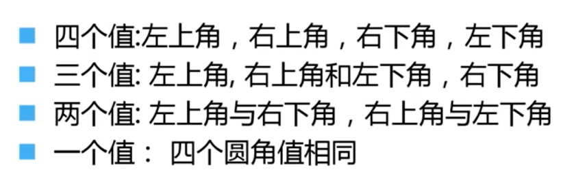

### box-shadow

**作用**：用来添加**阴影**

1. `h-shadow:` 为**正值**表示阴影出现在元素的**右**边，**负值**则表示出现在元素的**左**边
2. `v-shadow:` 为**正值**表示阴影出现在元素的**下**边，**负值**则表示出现在元素的**上**边
3. `blur:` 阴影**模糊程度**，只能取正值，为0表示阴影没有模糊效果，越大则阴影越朦胧模糊
4. `spread:` 阴影的**大小**，只能取正值，越大表示阴影越大。
5. `color:` 阴影颜色
6. `inset:` 阴影在内部还是外部，默认外阴影，内阴影需要取值为inset

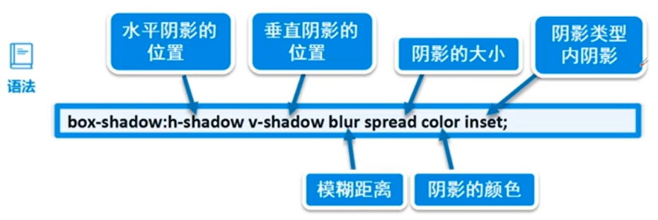

### border-image

**作用**：使用图像创建一个边框

**语法**：参考[CSS 边框图像 (w3school.com.cn)](https://www.w3school.com.cn/css/css3_border_images.asp)

## 背景

### background-size

1. `length`: 使用**像素**
2. `precentage`:使用百分比，这里百分比是对使用该属性的**容器的宽高**

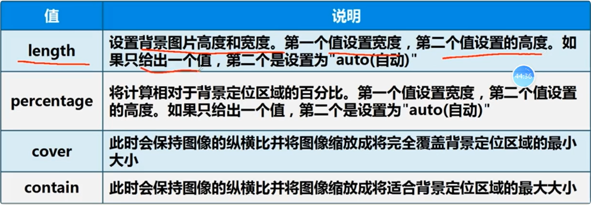

### background-origin

1. **作用:** 控制背景图的定位。默认值content-box，即与内容并排

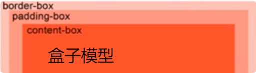

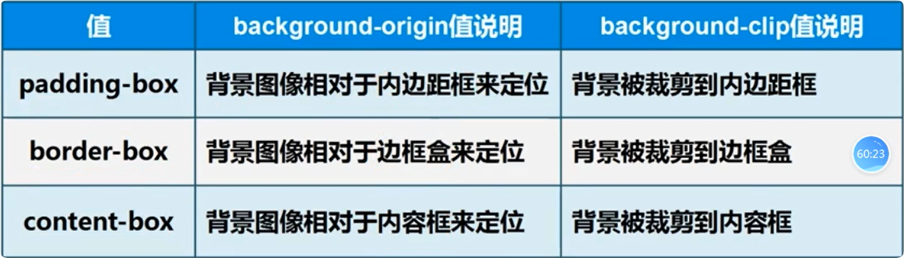

### background-clip

1. 背景裁剪属性是从**指定位置**开始绘制，这里的指定位置可以参考background-origin的三个属性值。

## 渐变

### 线性渐变

1. ==语法==：`linear-gradient(position, color1, color2, ...)`	
   1. position: 渐变方向，从左到右、从右到左，从上到下，对角方向等。
   2. colors: 渐变的颜色，要创建线性渐变，必须至少定义两个颜色。
2. ==案例==：
   1. #box1{background-image: linear-gradient(red, yellow)} **默认position**从**上到下**的线性渐变
   2. #box1{background-image: linear-gradient(to right, red, yellow)} **to right** 从**左到右**的线性渐变
   3. #box1{background-image: linear-gradient(to bottom right, red, yellow)} **to bottom right** 从**左上角到右下角**的线性渐变
   4. linear可以写在**background-image**或者**background**后面

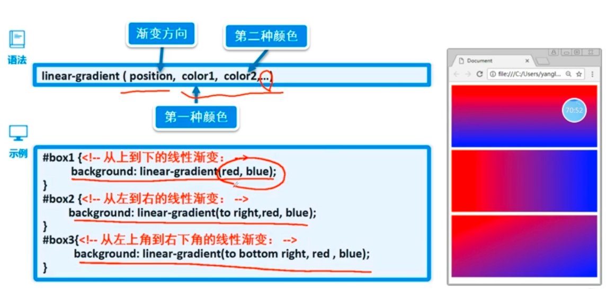

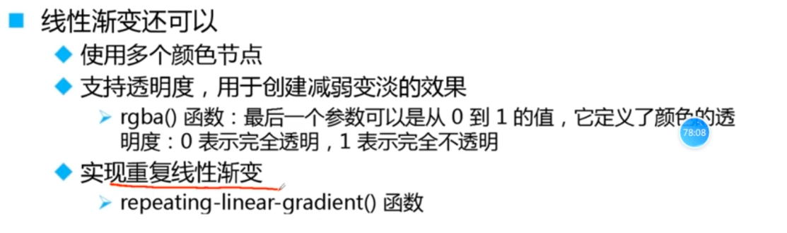

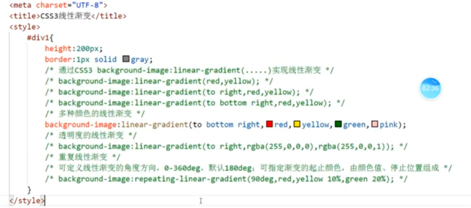

### 径向渐变

1. ==语法==：`radial-gradient(center, shape size, start-color, ... , last-color);`

2. 

   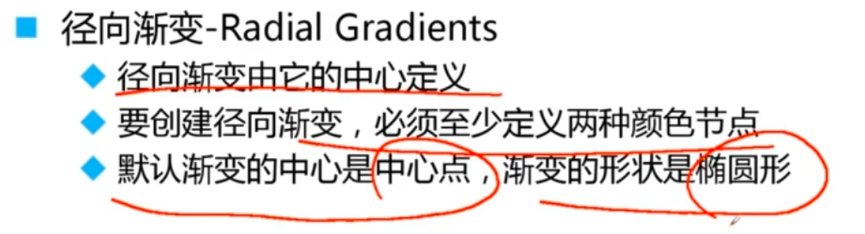

   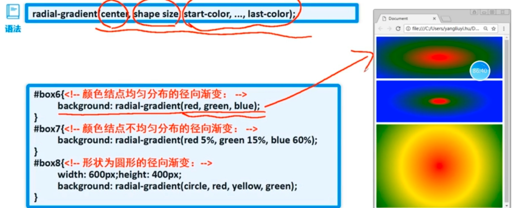

   

## 文本效果

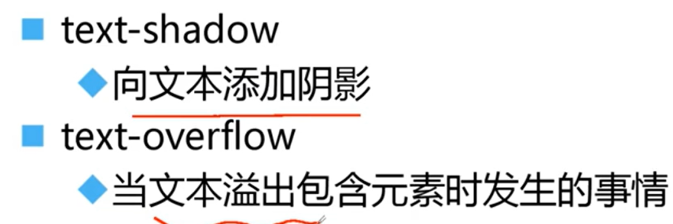

### text-shadow

1. ==属性==：

   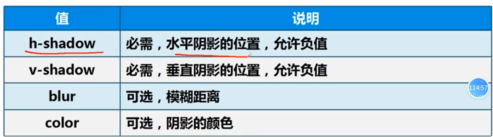

### text-overflow

1. ==属性==：

   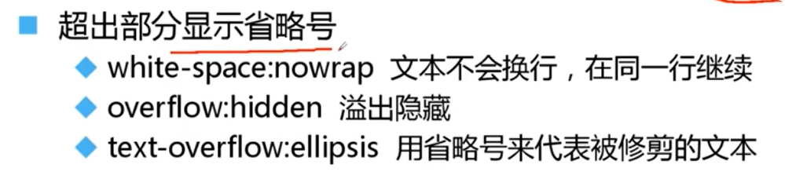

## 字体

1. **个性化字体**使用

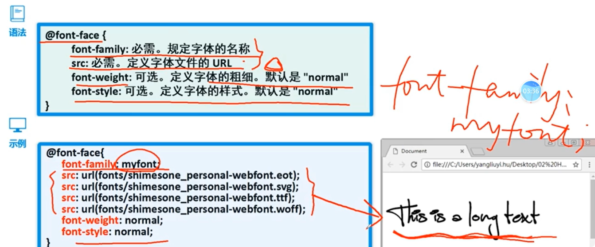

## 2D转换

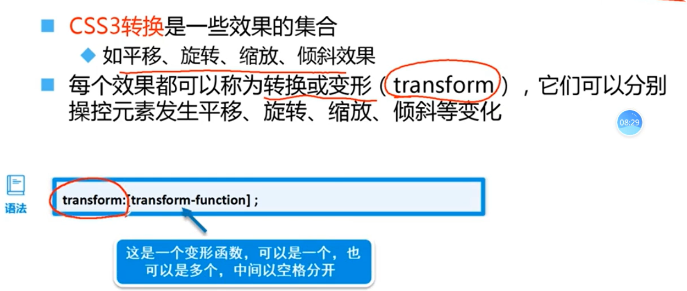

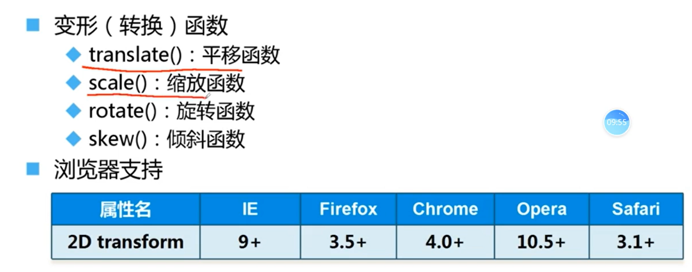

### translate(tx, ty)

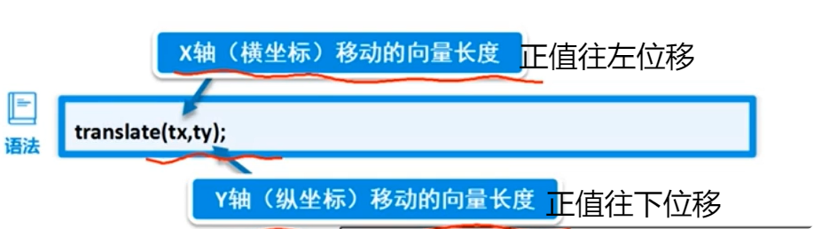

## 网页动画