# JavaScript

## 一、在网页中使用JavaScript的方式

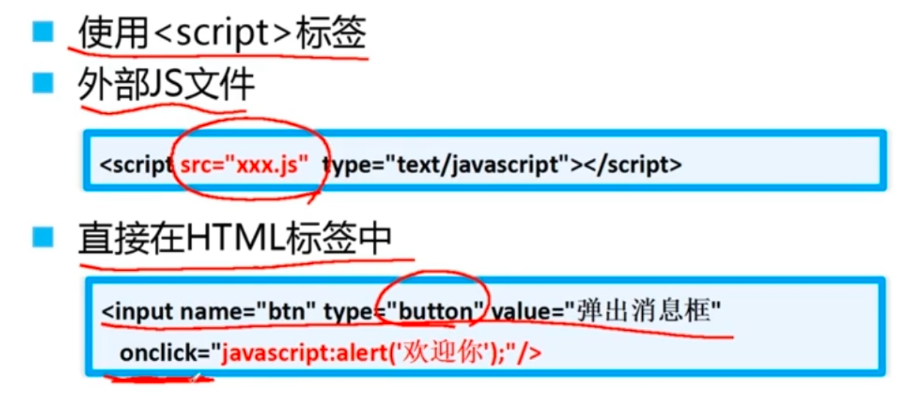

## 二、JavaScript执行原理

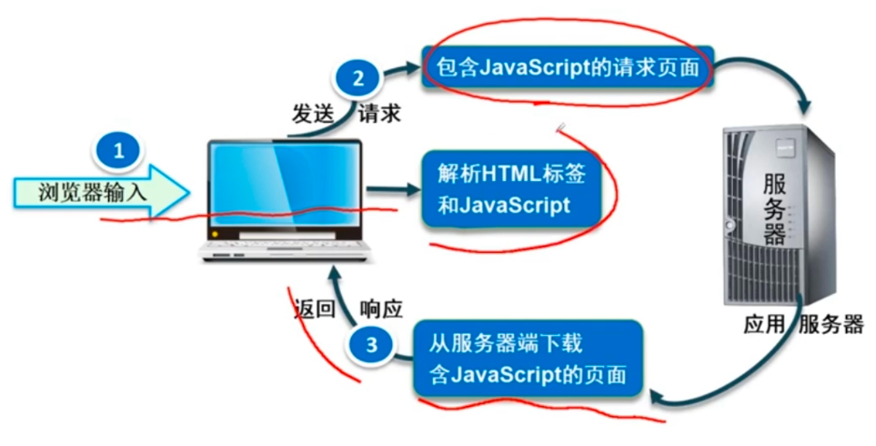

## 三、JavaScript核心语法

### 3.1 变量               

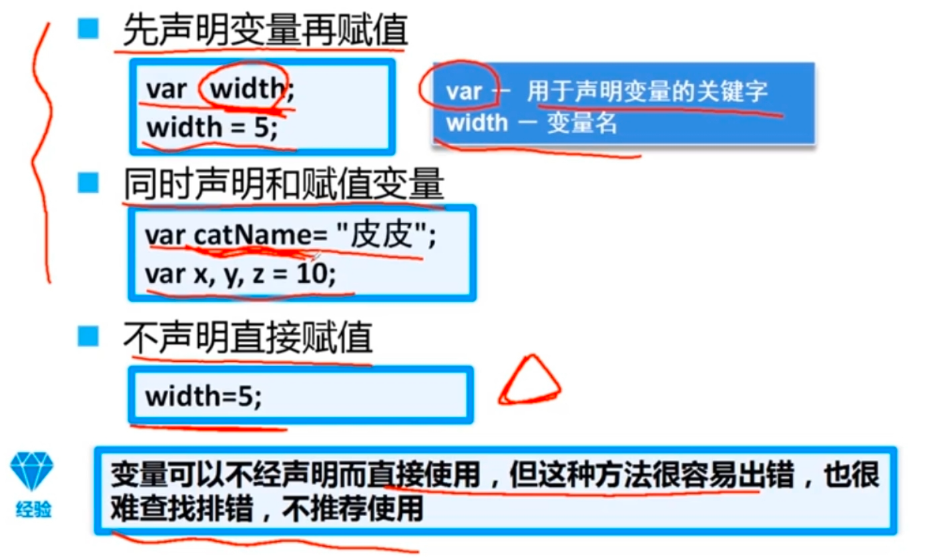

### 3.2数据类型

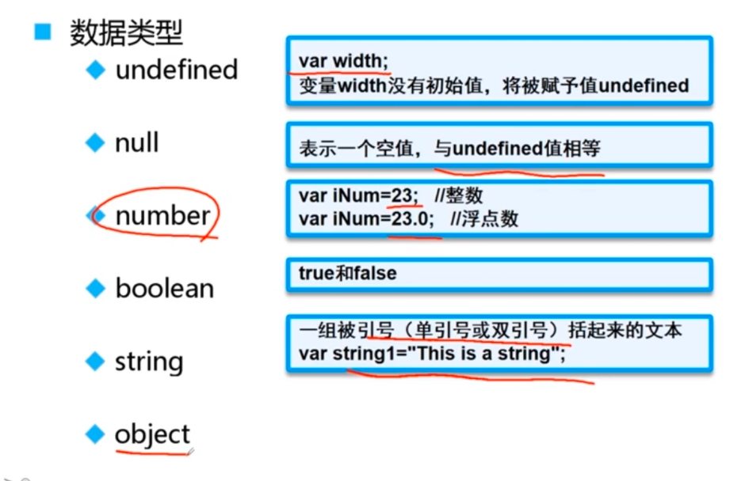

### 3.3检测类型

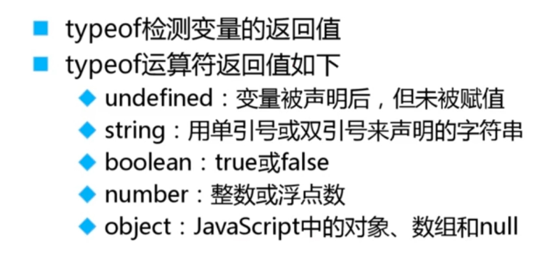

### 3.4注释

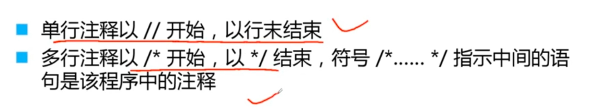

### 3.5运算符

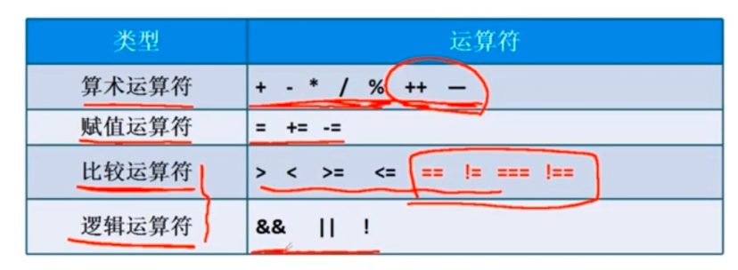

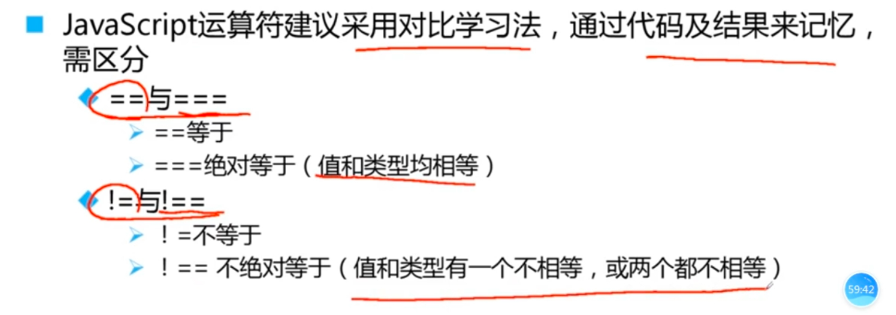

### 3.6数组（数组对象）

1. JavaScript中的数组与Java中数组的区别：
   1. JS数组可以存放不同类型的变量
   2. JS数组类似于java的ArrayList，是动态数组。

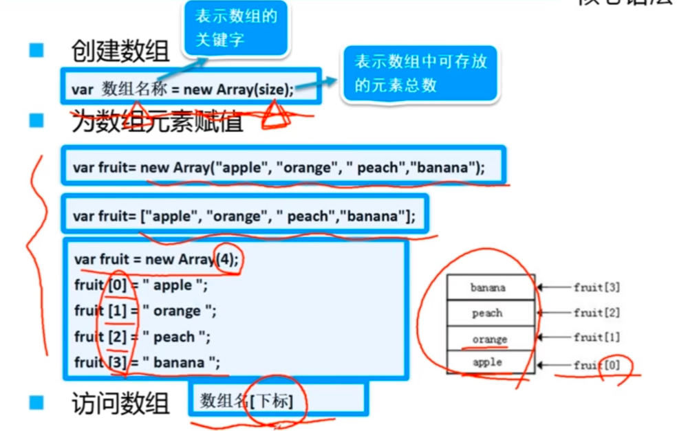

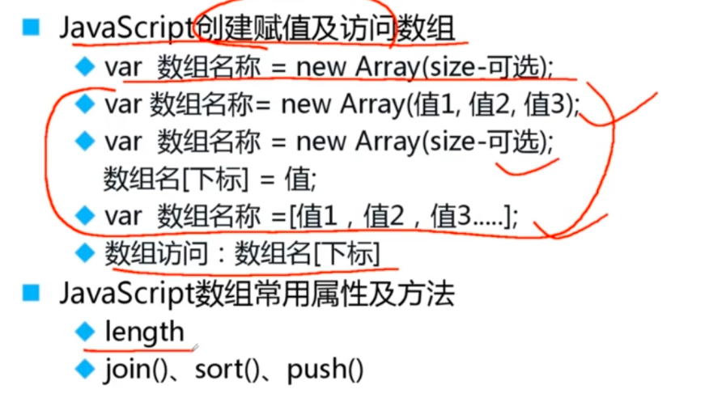

### 3.7字符串

1. 声明字符串有两种方式：
   1. ==原始值==，直接通过引号引起来的字符串赋值给变量
   2. ==String对象==，将字符串传入new String('')中

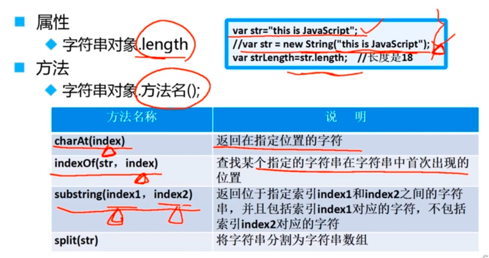

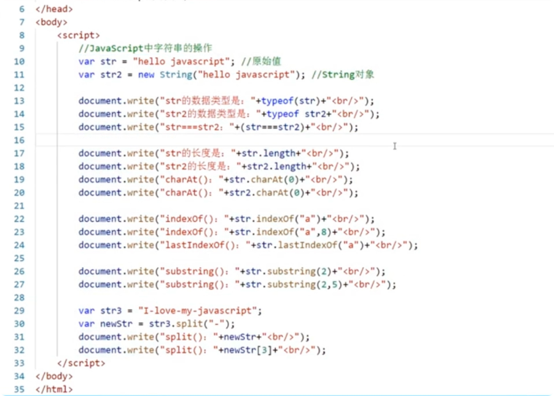

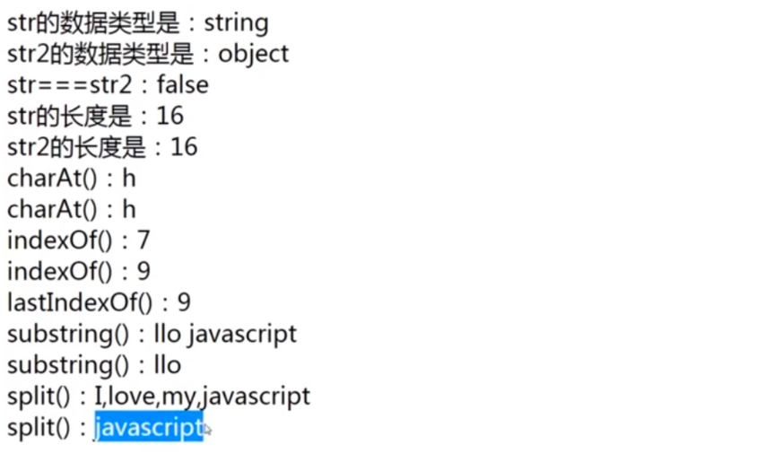

### 3.8逻辑控制

1. 注意：
   1. js中的**for in循环**类似于java的增强for循环，但是其**i对应的**并不是数组下标对应的元素值，而**是下标**，所以要访问数组元素需要通过**数组名+下标形式**

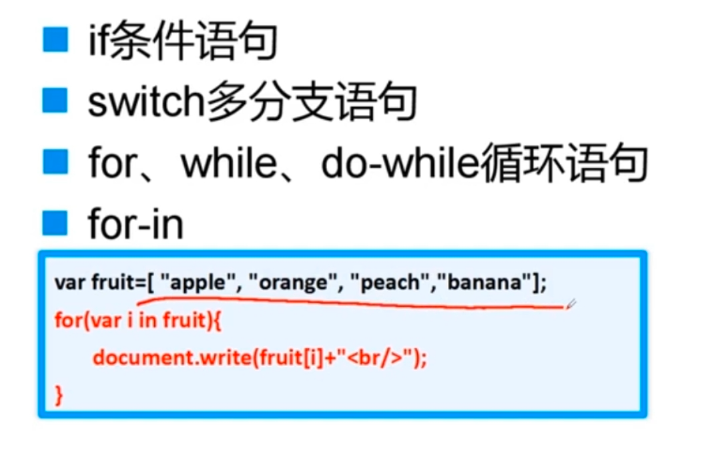

### 3.9输入输出

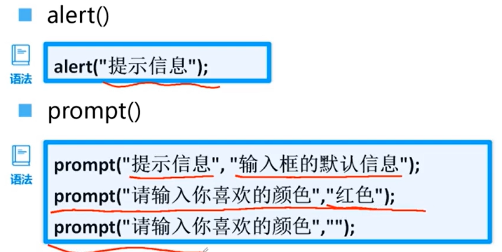

document对象调用write('...')，如果html文档已经加载完成后，调用write方法，会覆盖之前的内容

### 3.10常用全局函数

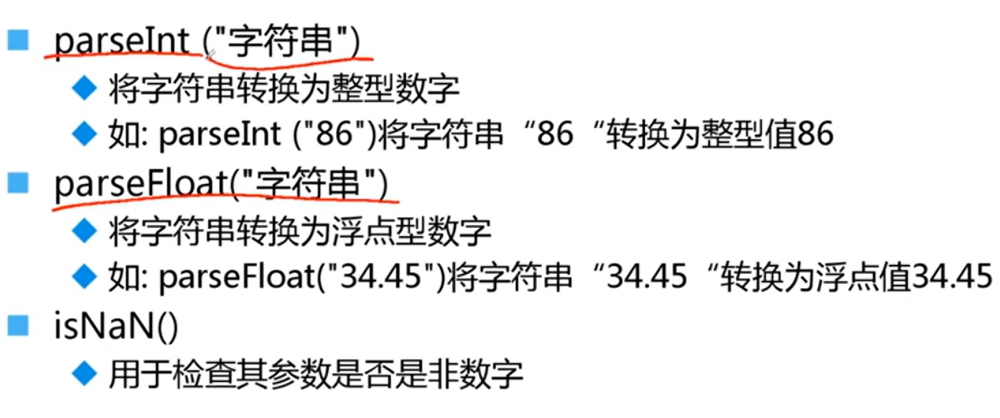

### 3.10定义函数

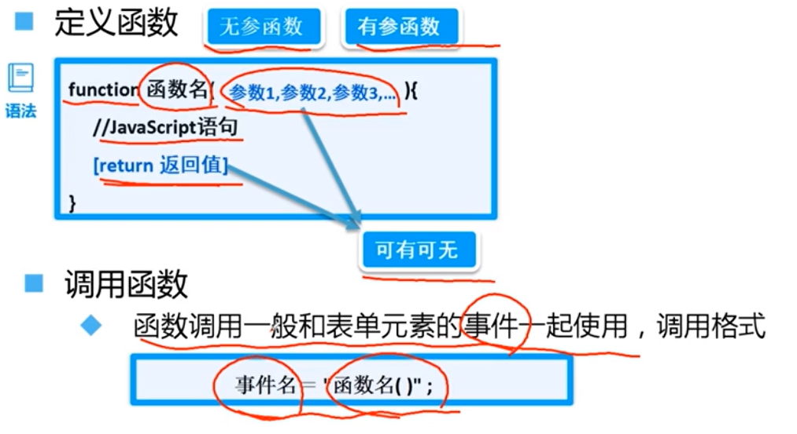

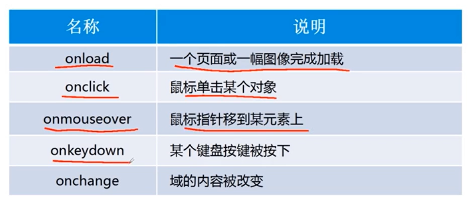

​                                                                                                                    