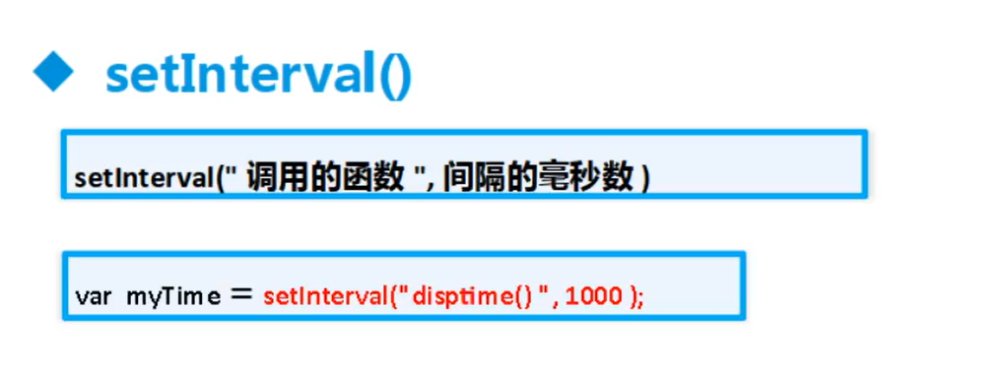
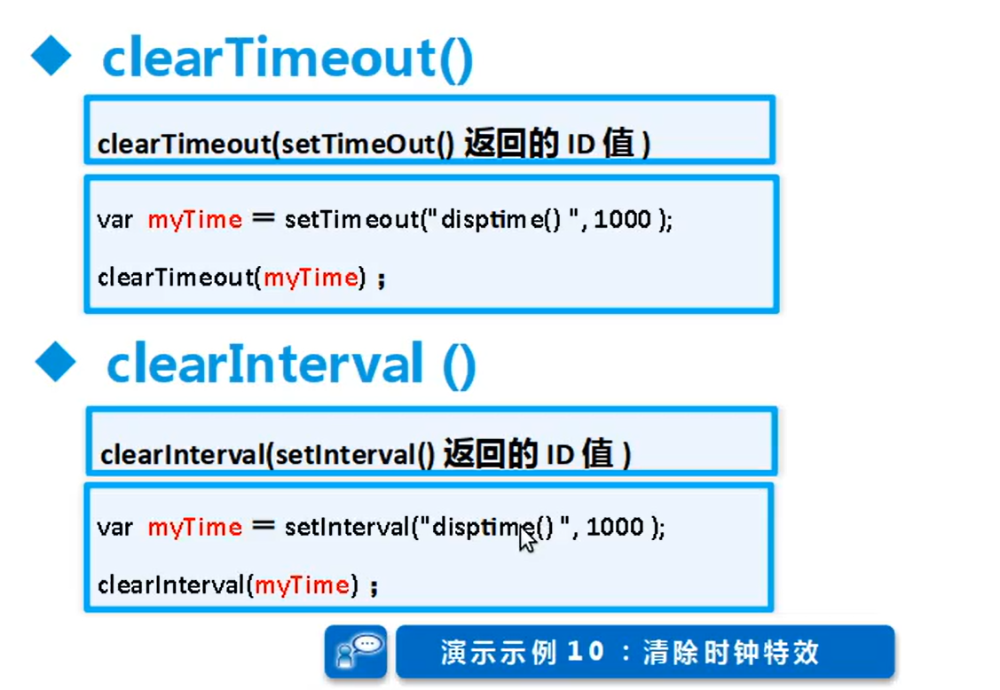
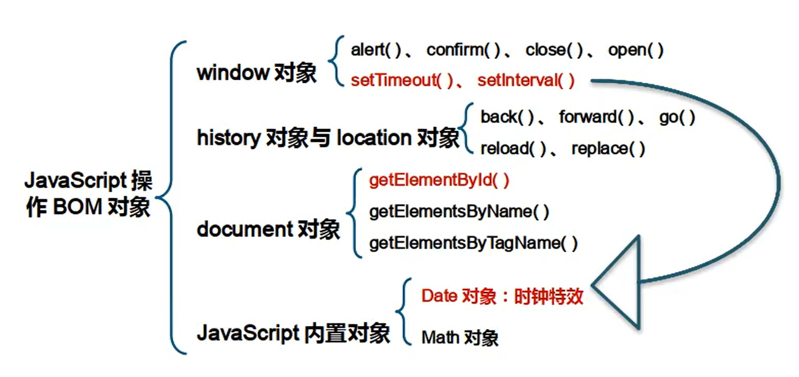

## javascript内置对象

### Math对象

1. ==random()的范围是(0, 1); 不包括0和1。==

2. **toFixed()**方法也可以进行舍入，但是采取的是类似于**四舍六入五留双**[^银行家算法]，不是传统上的四舍五入，对于**精确四舍五入还**是需要通过 【乘 10^保留小数位数^】.round() ，再除10^保留小数位数^即可。

### Date对象

### 定时函数

1. 

2. 

## 停止定时执行函数

## 总结

## 脚注

1. [^银行家算法]:**1.四舍**：保留位数的后一位数字 **≤4** 时，直接舍去。**2. 六入**：保留位数的后一位数字 **≥6** 时，进位。**3. 五留双（关键规则）**： 当保留位数的后一位是 **5** 时，根据前一位数字的奇偶性决定：**前一位为奇数**：进位。**前一位为偶数**：直接舍去。**好处：减少累积误差**：传统“五入”会偏向高估，而银行家算法通过“五留双”使舍入概率均等，避免系统性偏差。
