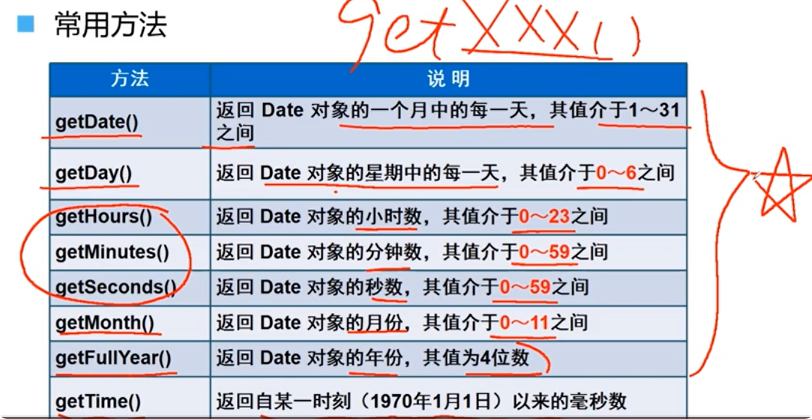

## javascript内置对象

### Math对象

1. ==random()的范围是(0, 1); 不包括0和1。==

### Date对象

### 定时函数

## js引入方式（js代码和html的结合方式）

- **内部脚本**：将JS代码定义在HTML页面中
  - javaScript代码必须位于< script > < /script > 标签之间
  - 在html文档中，可以在任意地方，放置任意数量的< script >
  - 一般会把脚本置于< body >元素的底部，可以改善速度
- **外部脚本**：将JS代码定义在外部js文件中，然后引入到HTML（< script src="..."> < /script >）
  - 外部js文件中，只包含js代码，不包含< script >标签
  - < script >标签不能闭合（不能写成这种形式：< script src="...">， 即没有< /script >)

## js基础语法

### 书写语法

- 区分大小写：与java一样，变量名、函数名以及其他一切东西都是区分大小写的
- 每行结尾分号可有可无
- 注释：单行和多行和c、java都一样
- 大括号表示代码块

### 输出语句

- 使用==window.alert()==写入浏览器弹出的警告框
- 使用==document.write()==写入HTML输出，在浏览器展示
- 使用==console.log()==写入浏览器控制台

### 变量

- javascript中用==var==关键字(varialbe的缩写)来声明变量
  - 作用域比较大，全局变量
  - 可以重复定义的！！！（重复定义，后面定义的会将前面定义的变量值给覆盖掉）
- javascript是一门弱类型语言，变量可以==存放不同类型的值==
- 变量名需要遵循（java变量命名规则，建议使用驼峰命名）
  - 数字不能开头
  - 组成字符可以是任何字母、0~9、_或$
- let、const（ECMAscript6新增了let关键字来定义变量和const关键字，==let类似java局部变量，const类似java常量==）
  - let用法类似于var，但是作用范围只在let关键字躲在的代码块内有效，且不允许重复声明
  - const用来声明一个只读的常量。一旦声明，常量值就不能改变。

### 数据类型

> javaScript中分为：原始类型和引用类型
>
> 5种原始类型：
>
> - number ：数字（整数、小数、NaN(Not a Number)）
>
> - string ：字符、字符串， 单双引皆可
>
> - boolean ：布尔。true，false
>
> - null ： 对象为空
>
> - undefined ： 当声明的变量未初始化时，该变量的默认值是undefined
>
>   ==使用typeof运算符可以获取数据类型==
>
>   alert(typeof age);

### 运算符

> 运算符== 与 [===]之间的区别
>
> ==：（类似于>=, !=, <=这些都是类似的）
>
> 1、判断类型是否一样，如果不一样，则进行类型转换
>
> 2、再去比较其值
>
> ===：（全等于）
>
> 1、判断类型是否一样，如果不一样，直接返回false
>
> 2、再去比较其值 

### 类型转换

1、其他类型转化为number：

> 1、string： 按照字符串的字面值，转为数字，如果字面值不是数字，则转为NaN。一般使用parseInt（类似于java）
>
> 2、boolean：true 转为1， false转为0

2、其他类型转为boolean：

> 1、number：0和NaN转为false，其他的数字转为true
>
> 2、string：空字符串转为false，其他的字符转为true
>
> 3、null：false
>
> 4、undefined：false

引入类型转换的目的：

> 在一些操作中可以起到简化作用：
>
> 例如在健壮性判断时，对于java中判断一个字符串：
>
> if(str != null && str.length > 0) {}
>
> 但是对于javascript中类型转换可以直接
>
> if(str){}  //if(str == null 或者str为空字符串，转化为boolean均为false)
>
> 这样就省去一些代码

### 流程控制语句

> 1、if判断
>
> if() {}
>
> 2、switch语句
>
> switch(op) {
>
> ​	case op1: {
> ​		...
> ​		break;
> ​	}
>
> ​	....
>
> ​	default: {
> ​		...
> ​	}
>
> }
>
> 3、for循环
> let sum = 0;
>
> for(let i = 1; i <= 100; i++) {sum += i}
>
> alert(sum); 
>
> 4、while循环
> let sum = 0;
> while(i <= 100) {
> 	sum += i;
> }
> alert(sum);
>
> 5、do-while循环
> let sum = 0, i = 1;
> do {
> 	sum += i;
> 	i++;
> }while(i <= 100);
>
> ==这些流程控制语句和java中是一模一样的==

### 函数

​	函数是被设计为执行特定任务的代码块

- 定义方式一：javascript函数通过==function==关键词进行定义，语法为：

  ~~~javascript
  function functionName(参数1, 参数2,...) {
  	要执行的代码
  }
  
  function add(a, b) {
  	return a + b;
  }
  
  //调用：函数名(实际参数列表);
  let result = add(1, 2);
  ~~~

  ==注意==

  1、形参不需要类型。因为javascript是弱类型语言

  2、返回值也不需要定义类型，可以在函数内部直接使用return返回即可

  

- 定义方式二：

  ~~~javascript
  var functionName = function(参数列表) {
  	要执行的代码
  }
  var add = function(a, b) {
      return a + b;
  }
  //调用：JS中，函数调用可以传递任意个数的参数
  let result = add(1, 2, 3); //多出来的参数不影响结果，不会进行接收
  retult = add(1); //NaN，因为第二个参数没有值，就是NaN，NaN + 1还是NaN。
  ~~~

  ==注意==

  1、在JS函数调用中，只关注函数名，而不关注参数，任意参数都能调用，只不过结果可能不同

  

### Array对象：

~~~javascript
//定义、属性长度可变，元素类型可变，类似于java中集合，元素默认值undifined
var arr = new Array(元素列表); // 方式一
var arr = [元素列表]; // 方式二，注意与java不同，java数组简写是大括号
//JS数组类似于java集合，长度、类型都可变
//访问
arr[索引] = 值;
arr[0] = 1;
arr.length;
//方法
arr.push(4); //数组末尾添加一个或多个元素,返回新长度
arr.pop(); //删除数组最后一个元素，并返回该值，若arr为空，则返回undifined
arr.splice(index,length); //从数组删除元素，传递下标和删除个数
//...
//遍历
arr.forEach(function(e){ //forEach:遍历数组中有值的元素
   console.log(e) 
});
arr.forEach(e=>{ //ES6 箭头函数()=>{...} 简化函数定义
    console.log(e)
});

~~~

### String:

~~~JavaScript
//两种创建方式
var s1 = new String("..."); // 1
var s2 = "..." // 2
s1 === s2 //false，typeof s1:object, typeof s2:string,===只有类型和值都相等才行，像"20"==20是true，比较值，会进行转换
//属性：length
var s = "..."; 
var len = s.length;
//常用方法：和java中用法相似，自行记忆
charAt()
indexOf()
trim()
substring()

~~~

### JSON：

~~~javascript
//JSON : JavaScript Object Notation, JavaScript对象标记法
//JSON是通过JavaScript对象标记法书写的文本
//与对象十分类似，但是对于key需要用双引号引起来
//是一个文本，多用于做数据载体
//定义： 用一个字符串外层用‘’引起来
	var jsontext = '{"key1":10, "key2":"20", "key3":["北金", "商海"]}'
    window.alert(jsontext.key1); // undifined,因为目前jsontext不是对象
//JSON方法：1、将json格式字符串转化为js中的对象 、2、将js对象转化为json格式字符串
//1
     var obj = JSON.parse(jsontext); 
     window.alert(obj.key1); // 10
//2
     alert(JSON.stringify(obj));
~~~

### 浏览器对象模型BOM

- ==window==

  ~~~javascript
  //浏览器窗口对象
  //获取：直接使用window，其中window.可以省略。
  /*属性：
  -history：对History对象的只读引用
  -location:用于窗口或框架的Location对象
  -navigator：对Navigator对象的只读引用
  */
  /*方法：
  alert(): 
  confirm(): 显示带有一段消息+确认按钮+取消按钮的对话框
  setInterval(): 按照指定周期（以毫秒计）来调用函数或计算表达式。
  setTimeout(): 在指定的毫秒数后调用函数或计算
  */
  ~~~

- ==Location==

  ~~~
  //地址栏对象
  //获取：使用window.location获取，window.可以省略
  //属性：
  -href:设置或返回完整的URL。
  location.href = "https://www.itheima.com"
  ~~~

  

### 文档对象类型DOM

- ==Core DOM==

  

- ==XML DOM==：XML文档的标准模型

- ==HTML DOM==: HTML文档的标准模型

  - Image: < img >
  - Button: < input  type='button' >

### 对象的显示：

> 对于一个person对象，如果直接输出window.alert(person), 会弹出如下[object Object]
>
> 有两种方式便捷方式来输出person对象：
>
> 1、Object.values();
>
> ~~~ 
> let arr = Object.values(person);
> window.alert(arr); //调用Object.values()方法，将person对象转化为数组，JavaScript数组是可以显示的
> ~~~
>
> 2、JSON.stringify();
>
> ~~~
> window.alert(JSON.stringify(person)); //将person对象转化为JSON格式的字符串
> ~~~
>
> 

### js事件监听（！！！）

​	

​		！！！：对于onblur="blur()" 和onfocus="focus()"，是无法进行识别的，所以函数名字不能去blur或者focus，亲身体验。

### 表单验证

1、当输入框失去焦点时，验证输入内容是否符合要求

2、当点击注册按钮时，判断所有输入框的内容是否都符合要求，如果不符合则组织表单提交

