## DOM中的结点

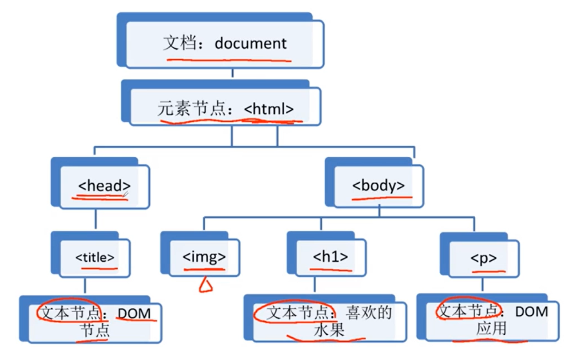

### **结点之间的属性**

> 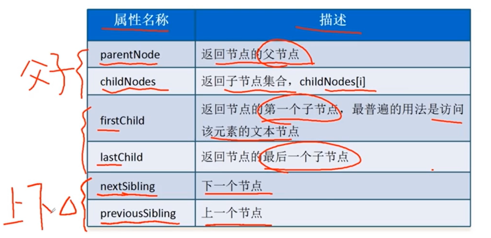
>
> 对于==childNodes属性==，对于我们写HTML会有加上==Tab==缩进的习惯，比如：
>
> ~~~html
> <ul id = 'ul'>
>     <li>一</li>
>     <li>二</li>
>     <li>三</li>
> </ul>    
> ~~~
>
> ~~~js
> let ul = document.getElementById('ul');
> alert(ul.childNodes); //7
> /*因为我们缩进的缘故，每个li结点的后面或者前面都会有相应的空格或者tab缩进，这写也回被当成是子节点Text
> */
> ~~~
>
> →那么如果想直接跳过这些text节点来直接获取元素节点，可以通过如下属性：
>
> 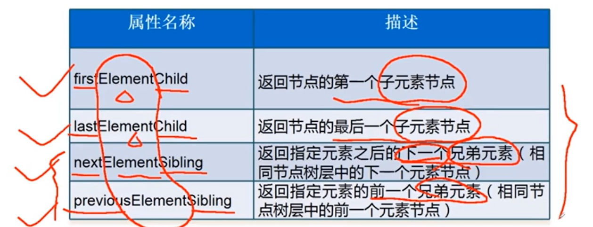
>
> 

### 获取节点信息

> 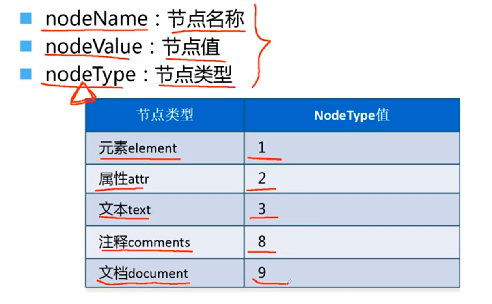
>
> 其中：
>
> 1. #### nodeName:
>
> ​	**document节点**、
>
> ​	**文本节点**、
>
> ​	**注释节点**、
>
> ​		的==nodeName值==都是以'# + 节点对应的标签名'，例如： '#document', '#text', '#comment'分别document、text、comment节点的nodeName
>
> ​	**元素节点**、
>
> ​	**属性节点**、
>
> ​		的==nodeName值==则是以 '结点对应的标签名'， 例如： 'SECTION', 'HEADER', 'id', 'href', 'value'
>
> 2. #### nodeValue
>
> ​	**document节点**、
>
> ​	**元素节点**、
>
> ​		的==nodeValue==属性都是null，
>
> ​	**文本节点**、
>
> ​	**注释节点**、
>
> ​	**属性节点**、
>
> ​		的==nodeValue==属性分别是：**文本节点的文本内容、注释内容、属性取值**
>
> 3. #### nodeType
>
> ​	**如上图**

### 操作节点属性

> 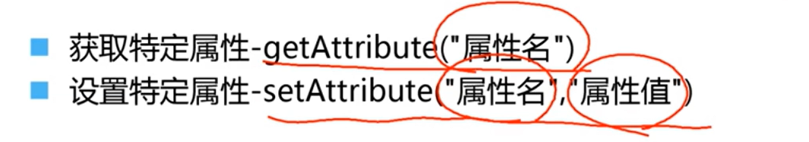
>
> 

### 创建、插入、复制 节点

> 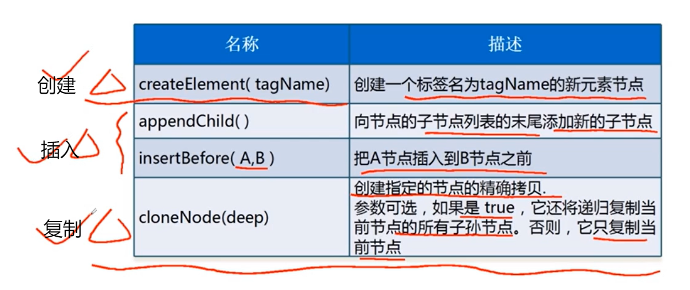
>

​	

### 删除、替换节点

> 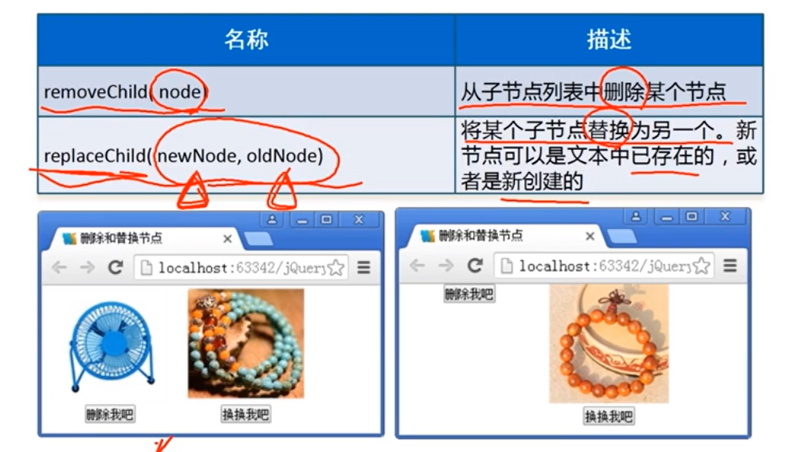
>
> removeChild()方法是由父节点进行调用，即想要删除img结点，需要：
>
> ​	img.parentNode.removeChild(img);
>
> replaceChild()方法也是需要由父节点进行调用

### 操作节点样式

> 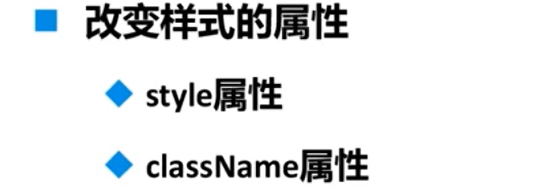
>
> 1. ==style属性==操作节点样式
>
>    ​	因为实在JS中操作样式，但是在JS中的元素样式属性与css中不同，**css中通过'-'来隔开多个单词**，而**JS**则是采用**驼峰命名法**来表示**元素样式属性**
>
>    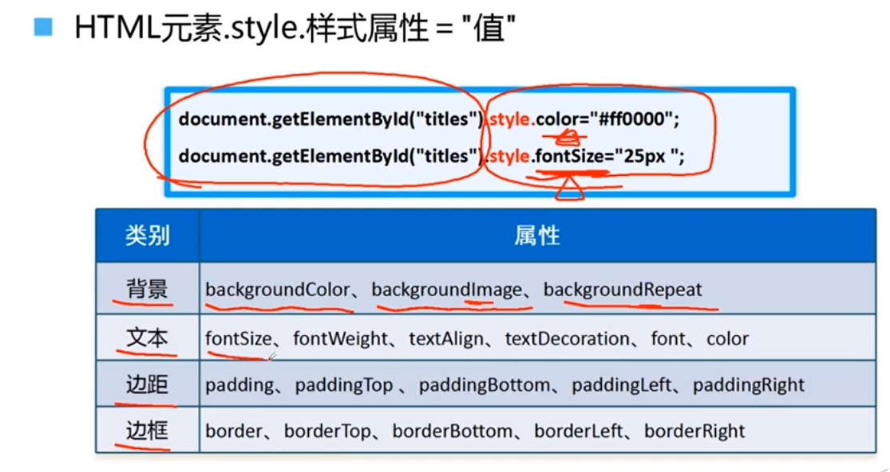
>
>    样式的修改通常会搭配一些事件进行
>
>    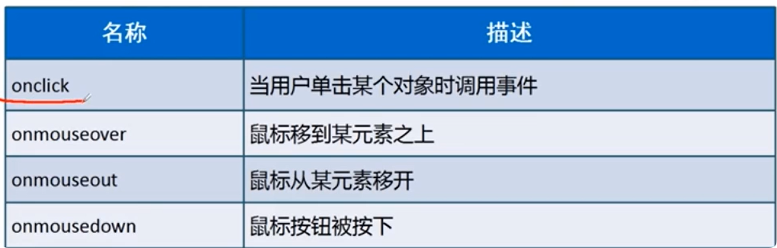
>
> 2. ==className属性==操作节点样式
>
>    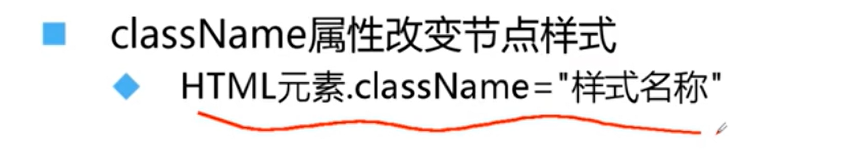
>
>    下面图面存在些许错误，即background-color后面的颜色不需要用双引号引起来。
>
>    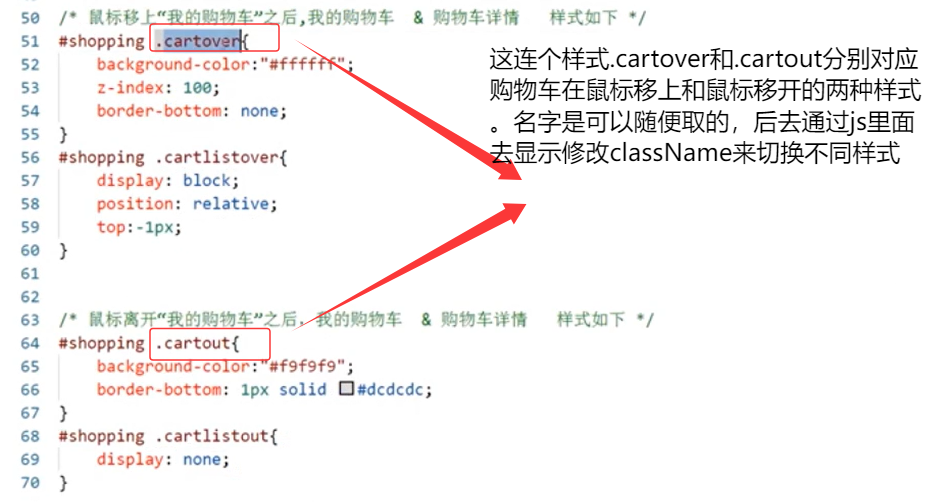
>
>    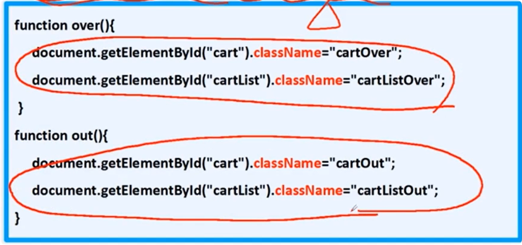
>
>    

### 获取元素样式

> 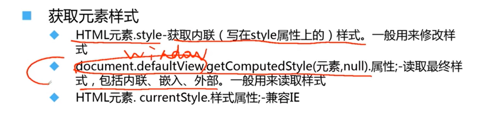
>
> 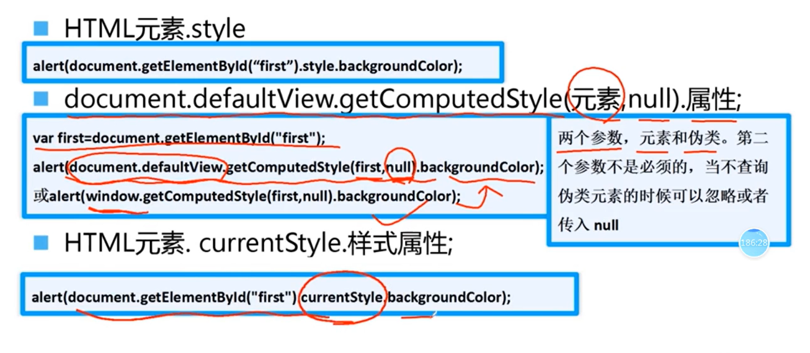
>
> 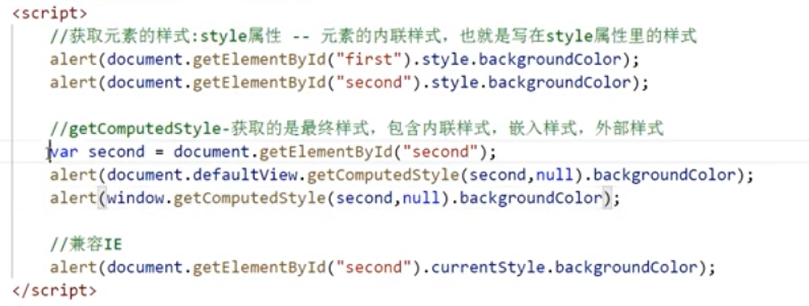

### 获取元素位置

> 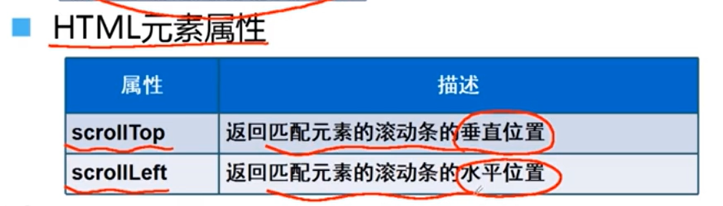
>
> 不同浏览器兼容写法通过||连接起来
>
> 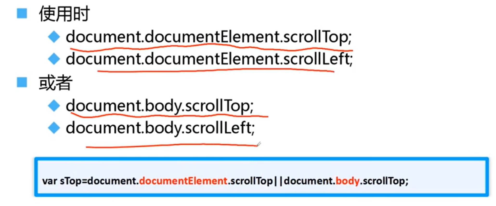
>
> **实现广告图固定不动**（即广告会随着滑轮的上下移动而同步移动）
>
> 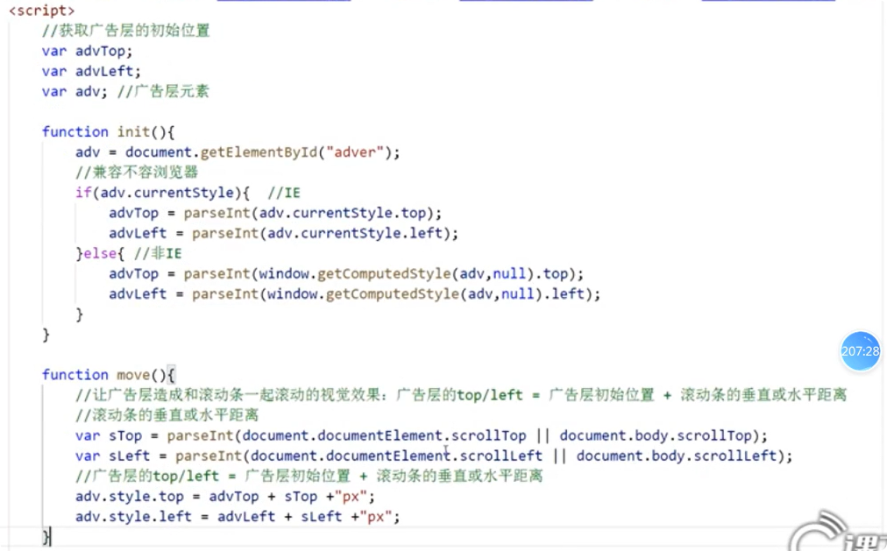
>
> 实现关闭图片的效果，可以先采用定位将×图片定位到广告右上角，在将×和广告一样对其top进行设置，同时设置一个点击事件，当点击时隐藏广告和×（display: none;)

### 总结

> 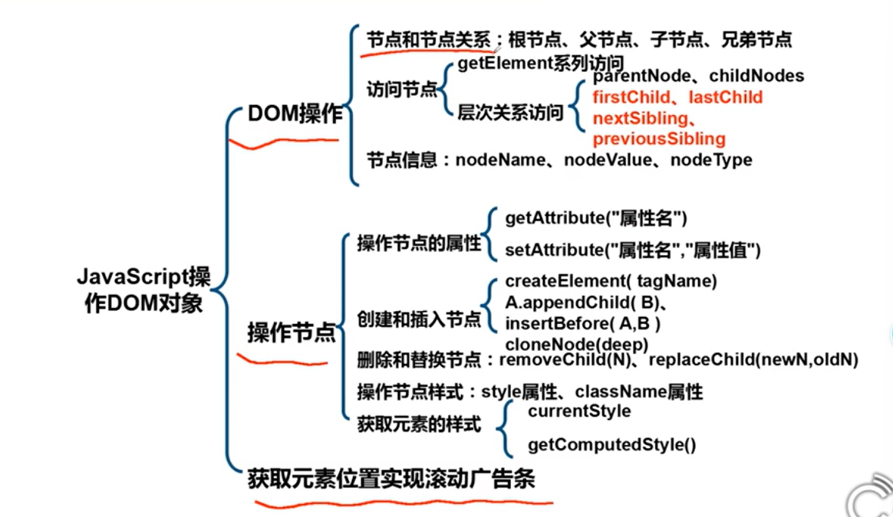
>
> 

### this值

> 在JavaScript中的this与java中的this类似，java中的this指代当前对象，JavaScript中的this也是差不多，比如：
>
> ~~~html
> <ul>
> 	<li>...</li>
>     <li>

>         <input type='buttom' onclick='del(this)' value='删除'>
>         
</li>
> </ul>
> ~~~
>
> 
