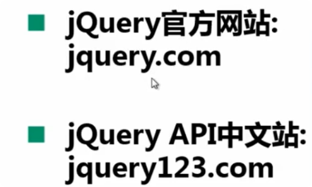
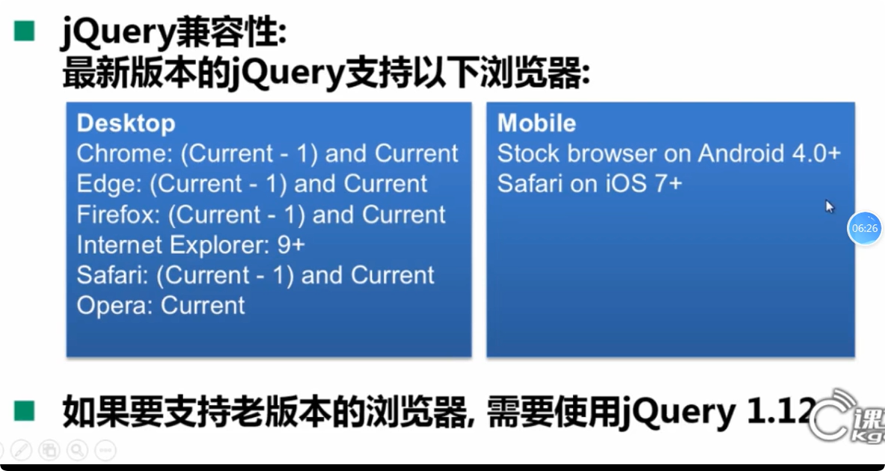
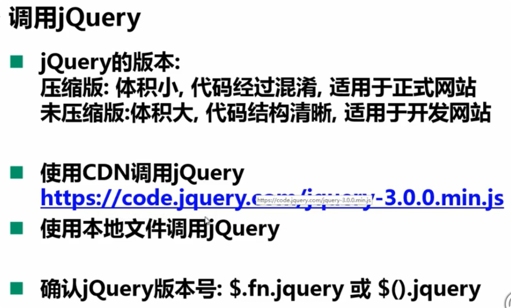
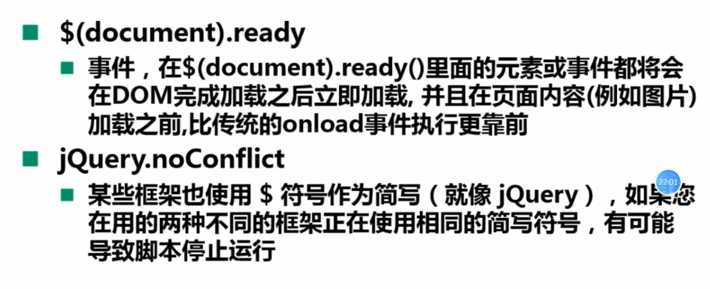
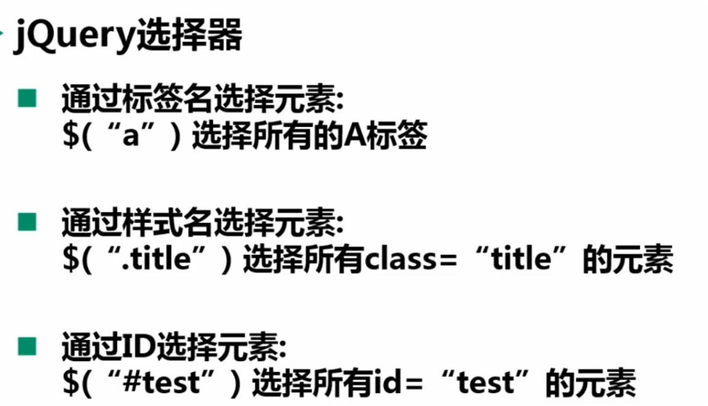
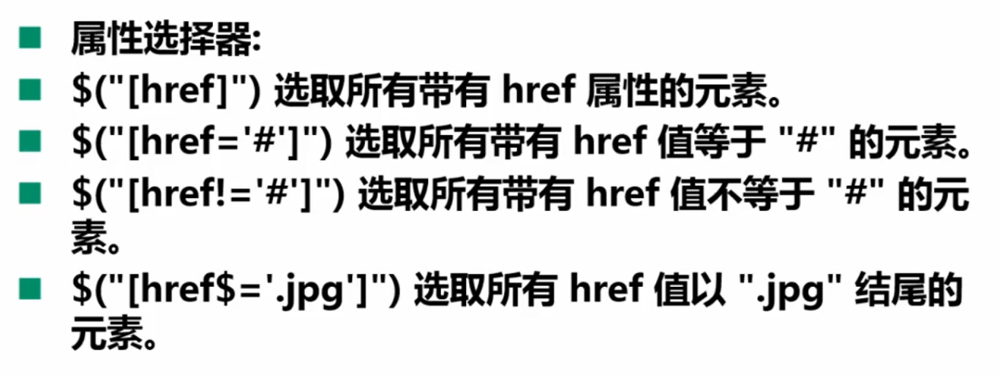
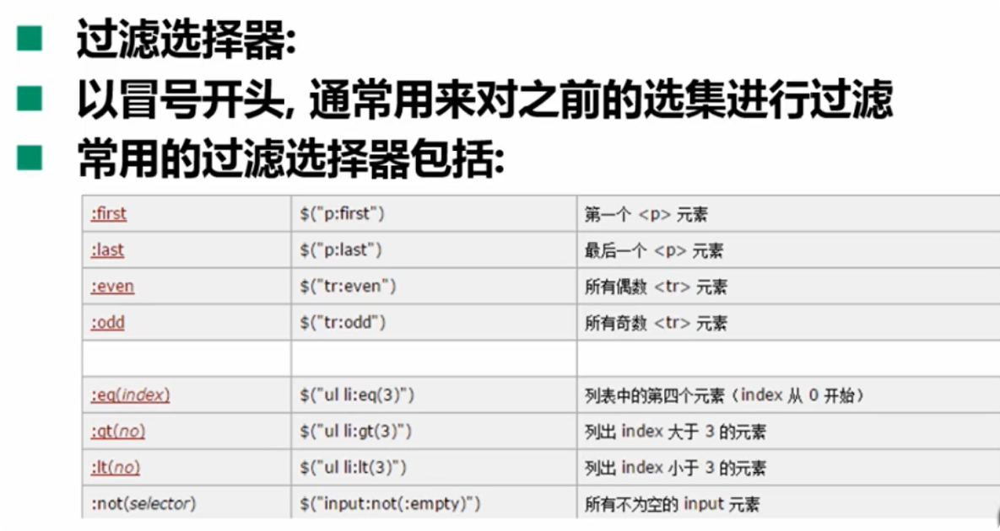
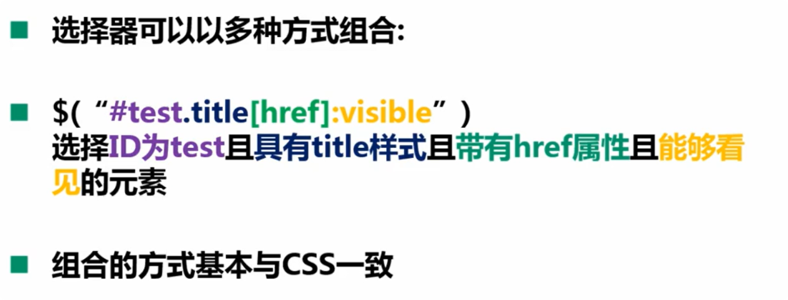
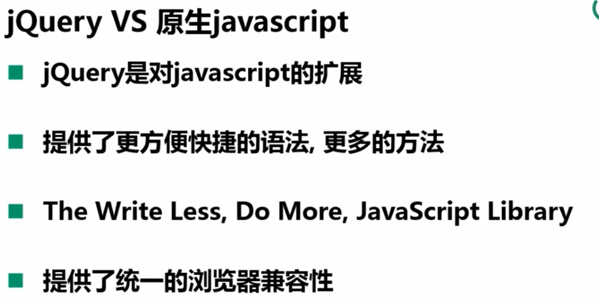

## jQuery官网

> 
>
> **版本兼容**
>
> ****

## 调用jQuery

> **jQuery是一个工具库，所以里面大部分都是方法**
>
> 
>
> 1. 下载jQuery/或者使用cdn
> 1. 在html中应用
>    1. 和之前在HTML中引入js文件一样引入jQuery库 ``
> 1. 验证是否安装成功
>    1. 确认jQuery版本号：调用`$.fn.jquery` 或者 `$().jquery`
>
> 
>
> > 1. \$(document).ready(...)事件里面传入的不是参数，而是方法，因为其是一个事件。其简写方式为：$(...)
> >
> > 2. \$在jquery中相当于jQuery的简写，比如之前的$(document).ready(...)相当于jQuery(document).ready(...)。当存在多个js库都采用\$作为简写的话，就会产生冲突。在jQuery中可通过==jQuery.noConflict==来释放对\$的简写，后续对\$的使用就会报错。
> >
> >    1. 解决冲突方式一：
> >
> >       `var jQ = jQuery.noConflict()这样来自定义（jQuery）的简写，后续ready就可以写成：`
> >
> >       jQ(function() { 
> >       	console.log( jQ("p") ); 
> >       })
> >
> >    2. 方式二（限定\$生效范围）：
> >
> >       `在项目最外面使用jQuery，将$作为参数传入，此时在项目范围内$就会指向jQuery，如下：`
> >
> >       jQuery(funtion(\$) {
> >       	console.log( $("p") );
> >       })
>
> 

## jQuery选择器

> 1. ==常见选择器==
>
> 
>
> 
>
> 
>
> 2. ==组合选择器==
>
> 

## js与jQuery对比

> 

