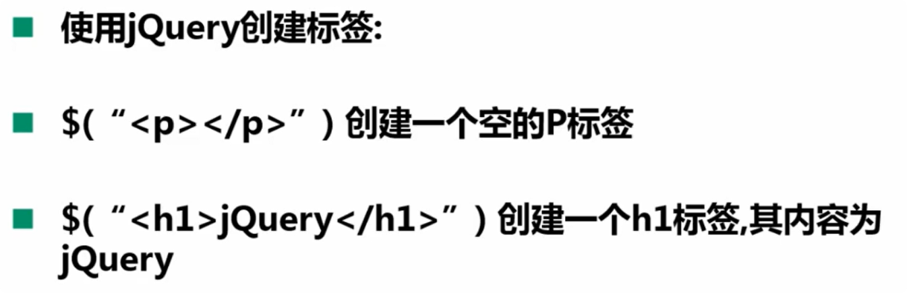
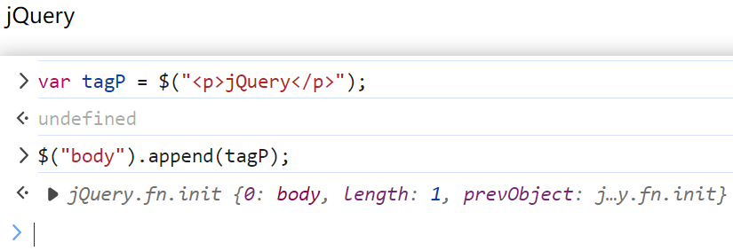

## jQuery操作DOM方法

> 1. 首先，要确保js文件在dom加载后才加载，否则js加载好了，dao还未加载。
>    1. 可以通过将==<script>标签写在</body>标签前==
>    2. 使用jQuery方法：$(function() {}) 扩住一个方法

### 1.创建标签

在浏览器控制台测试：

**创建一个标签一开始是不会在浏览器中进行展示的，需要给他==加入到标签中==去**

 