## web2.0

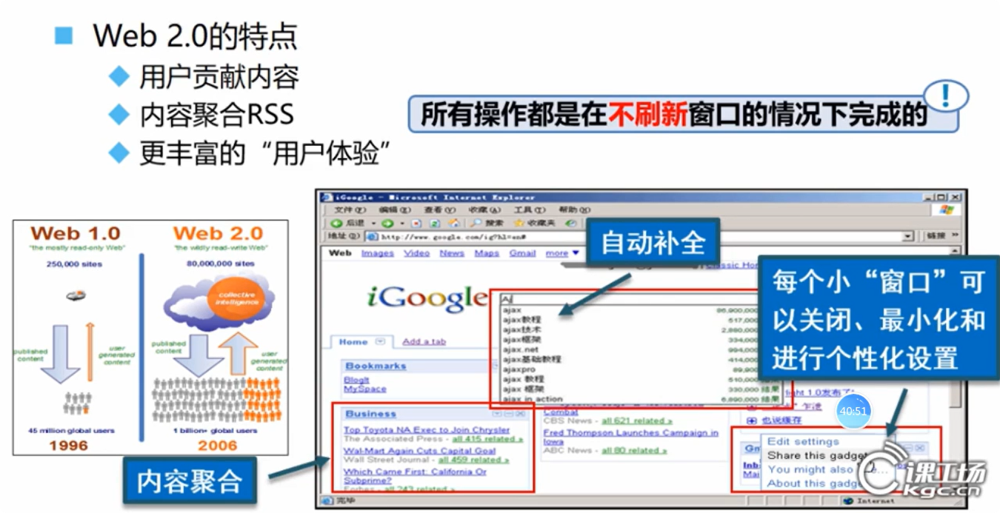

<span style="color:red;font-size:1.5rem">传统Web与Ajax的差异</span>

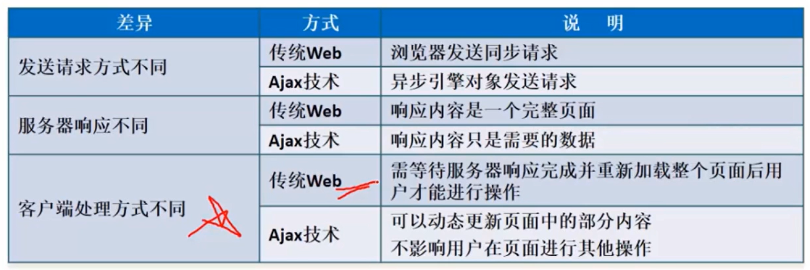

## Ajax

<span style="font-size:1.5rem"><strong>A</strong>synchronous <strong>J</strong>avaScript <strong>A</strong>nd <strong>X</strong>ml</span>

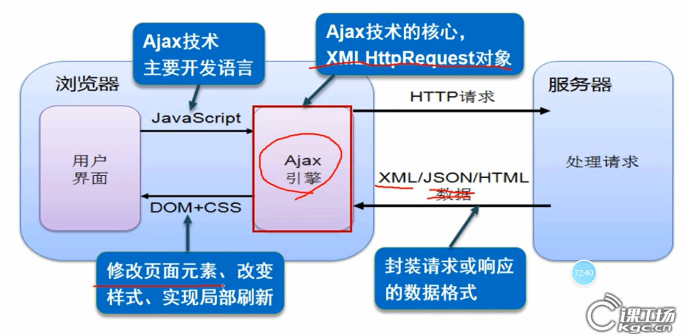

<span style="font-weight:bold; font-size: 1.5rem">步骤</span>

> //1. 创建核心对象(可能需要考虑浏览器兼容性)
>  const xhttp = new XMLHttpRequest();
>  //2. 发送请求
>  xhttp.open("GET", "http://localhost:8081/ajax_demo_war/ajaxServlet");
>  xhttp.send();
>  //3. 获取响应
>  xhttp.onreadystatechange = function() {
>      if (this.readyState == 4 && this.status == 200) {
>              alert(this.responseText);
>      }
>  };
>
> //参考网址：[AJAX - XMLHttpRequest 对象 (w3school.com.cn)](https://www.w3school.com.cn/js/js_ajax_http.asp)
>
> 
>
> <span style="font-size:1.5rem;font-weight:bold">GET请求和POST请求的区别</span>
>
> 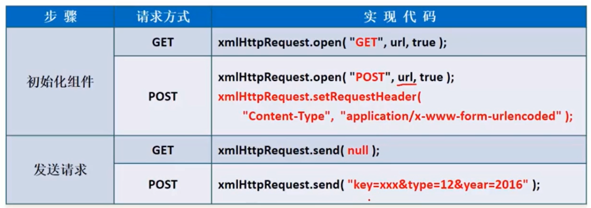

<span style="font-size:1.5rem;font-weight:bold">原生ajax中XMLHttpRequest常用方法</span>

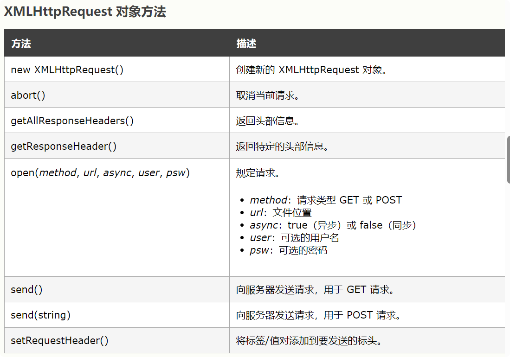

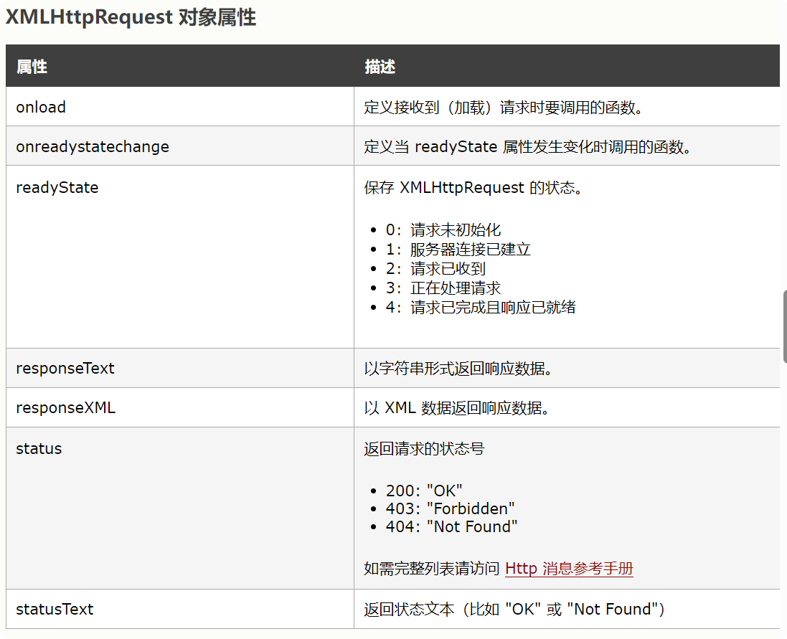

<span style="font-size:1.5rem;font-weight:bold">readyState属性</span>

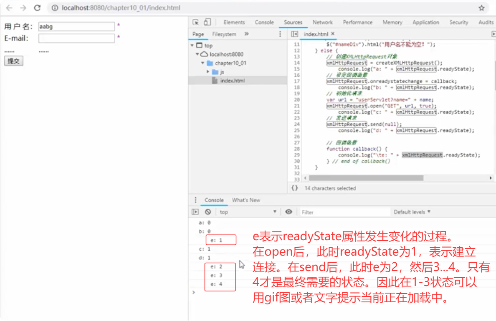

<span style="font-size:1.5rem;font-weight:bold">status属性</span>

==HTTP的状态码：就绪状态是4且状态码是200，表示正确完成==

> <span style="font-size:1.5rem;font-weight:bold">原生JavaScript的ajax异步请求思路：</span>
>
> 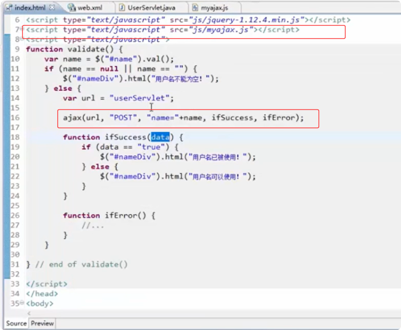
>
> 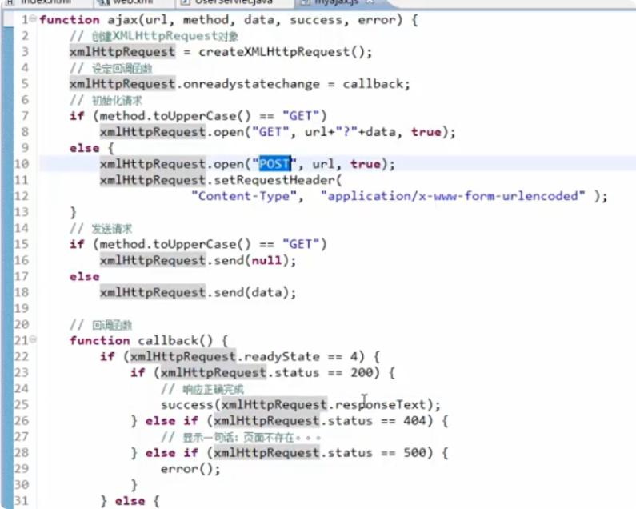


## $.ajax

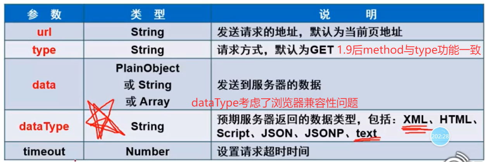

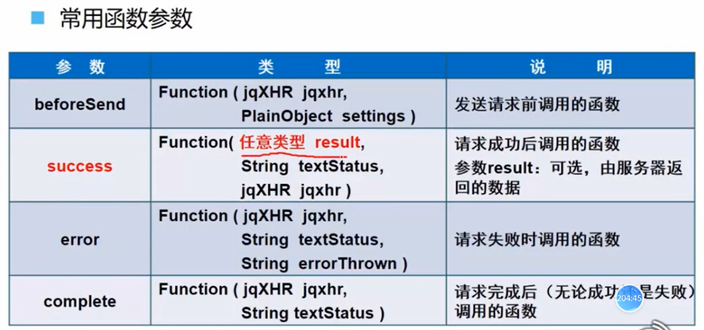

```javascript
$.ajax({
    url: '请求地址',
    type: '请求方法', // GET/POST/PUT/DELETE等
    data: {参数对象}, // 或参数字符串
    dataType: '预期返回数据类型', // json/xml/text等
    success: function(response) {
        // 请求成功回调
    },
    error: function(xhr, status, error) {
        // 请求失败回调
    }
});
```

1. `$.get()`

```
$.get('url', {参数}, function(response){
    // 成功回调
}, '预期数据类型');
```

1. `$.post()`

```
$.post('url', {参数}, function(response){
    // 成功回调
}, '预期数据类型');
```

1. `$.getJSON()`

```
$.getJSON('url', {参数}, function(json){
    // 自动解析JSON
});
```
