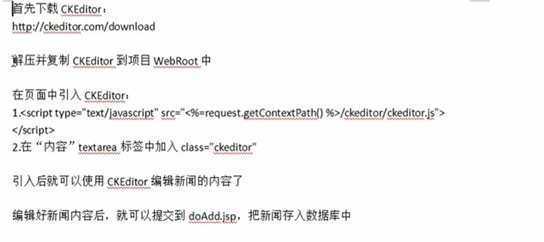
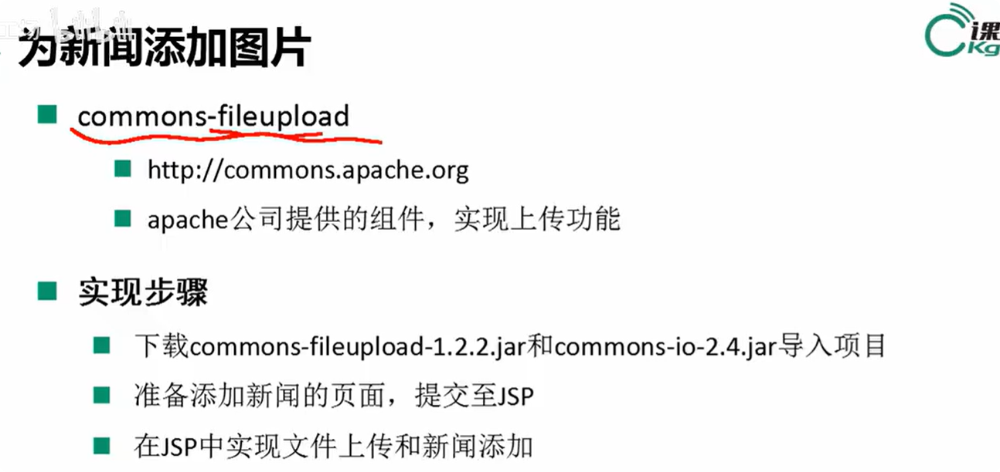
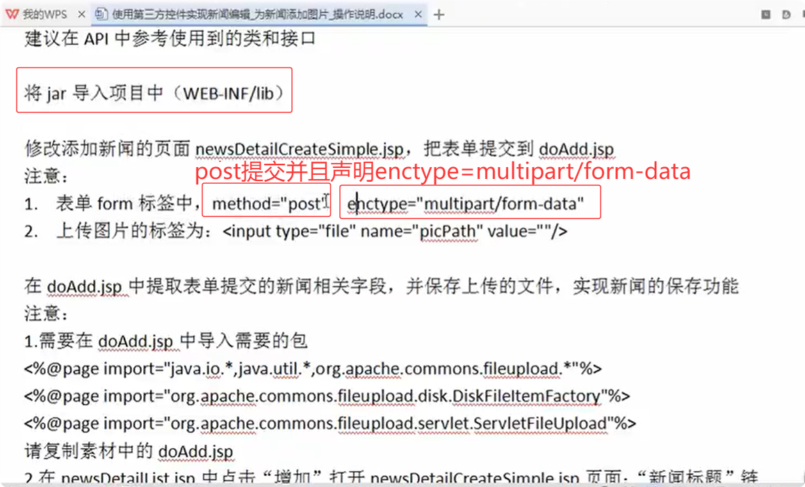
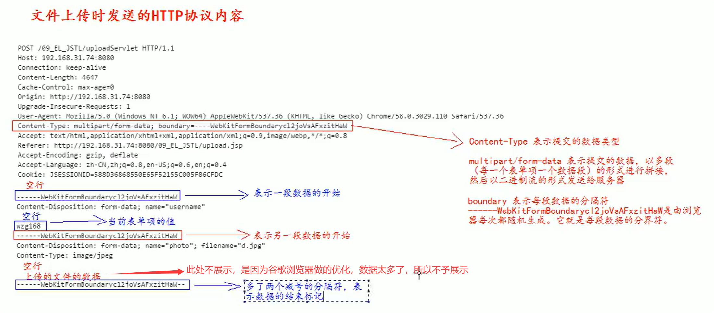
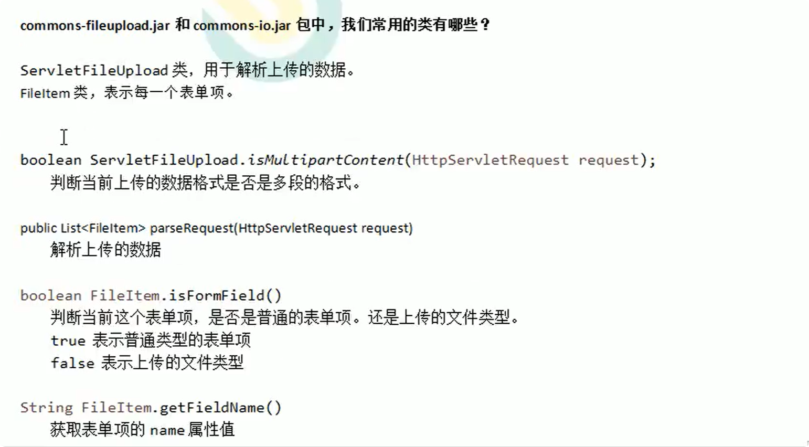
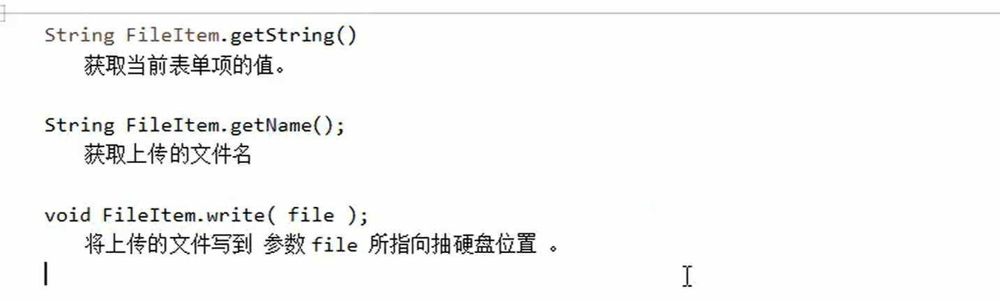

#  第三方控件

## 编辑器控件

> **使用步骤**
>
> 
>
> 下载[CKEditor Ecosystem](https://ckeditor.com/download)

## 文件上传

> 
>
> ------
>
> **`multipart/form-data`** 是 HTTP 表单提交的一种编码类型，主要用于支持**文件上传**功能。其核心特性如下：
>
> 1. **多部分数据分隔**
>    表单数据被拆分为多个独立部分（parts），每个部分通过随机生成的边界符（boundary）分隔，确保数据在传输中不会混淆。
> 2. **混合数据类型处理**
>    - **普通表单字段**（如文本、数字等）会被编码为独立的文本部分。
>    - **文件字段** 会以二进制形式单独传输，并附带文件名、MIME类型等元信息。
> 3. **与传统表单的区别**
>    不同于 `application/x-www-form-urlencoded`（所有数据URL编码后拼接为单一字符串），`multipart/form-data` 能高效处理二进制文件，且无需对文件内容进行字符转义。
>
> 
>
> 

~~~java
boolean isMultipart = ServletFileUpload.isMultipartContent(request);
    if(!isMultipart) {
        session.setAttribute("msg", "非文件格式上传！");
        response.sendRedirect("add.jsp");
        return;
    }
    FileItemFactory factory = new DiskFileItemFactory();
    ServletFileUpload upload = new ServletFileUpload(factory);
    List<FileItem> items = upload.parseRequest(request);
    News news = new News();
    for(FileItem item : items) {
        if(item.isFormField()) {
            String name = item.getFieldName();
            String value = item.getString("utf8");
            switch(name) {
                case "tid":
                    news.setTid(Integer.parseInt(value));
                    break;
                case "title":
                    news.setTitle(value);
                    break;
                case "author":
                    news.setAuthor(value);
                    break;
                case "content":
                    news.setContent(value);
                    break;
                case "summary":
                    news.setSummary(value);
                    break;
            }
        }else {
            //文件名
            String fileName = item.getName();
            if("".equals(fileName)) {
                continue;
            }
            long size = item.getSize();
            if(size > 1024 * 1024 * 2) {
                session.setAttribute("addMsg", "文件大小不能超过2M");
                response.sendRedirect("add.jsp");
                return;
            }
            //文件后缀名
            String endName = FilenameUtils.getExtension(fileName);
            String[] needs = {"png", "jpg", "gif"};
            boolean flag = false;
            for(String need : needs) {
                if(need.equals(endName)) {
                    flag = true;
                    break;
                }
            }
            if(!flag) {
                session.setAttribute("addMsg", "无法上传该类型文件！");
                response.sendRedirect("add.jsp");
                return;
            }
            //修改文件名，防止重复覆盖
            String newFileName = UUID.randomUUID() + "." + endName;
            //确定文件路径
            String temp = session.getServletContext().getRealPath("imgs");
            File path = new File(temp);
            if(!path.exists()) {
                path.mkdir();
            }
            //将文件上传到指定路径
            item.write(new File(path, newFileName));
            news.setPicPath(newFileName);

        }
    }
    if (newsService.addNews(news)) {
        session.setAttribute("addMsg", "添加成功！");
    } else {
        session.setAttribute("addMsg", "添加失败！");
    }
    response.sendRedirect("index.jsp");
~~~

