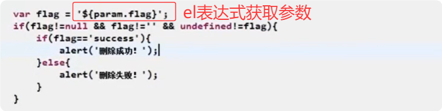

## EL表达式

> **EL功能**
>
> 1. 使用前需要保证该值在作用域中
> 2. `${a}/${b}`这种写法是`错误的`
> 3. ${username}这种如果在作用域中不存在，不会像request.getAttribute("username")找不到为null，而是如果没有则不显示

> **EL访问作用域**
>
> 1. 对于${news}使用，等同于request.getAttribute("new")。因此news必须先存在于`request`域中，即request.setAttribute("news", news); 
> 2. 而如果request域中没有news对应的值。则会从`其他作用域`中进行查找。查找顺序：从小到大进行查找 `pageContext -> request -> session -> application`。但是如果`指定了作用域`，比如：`${requestScope.news}`这样指定了在request作用域中进行查找。对于\${news}则会按照从小到大的作用域中进行查找

El表达式常见示例

> 1. 字段值：==<%=news.getTitle()%>==替换成==${news.title}==
> 2. url参数（http://...xxx/xxx?id=xxx）获取id: ==<%request.getParameter("id")%>==替换成==${param.id}==。！！！对于==获取参数==写法固定：==param.参数名==
>
> 
>
> 

## JSTL

### JSTL引用

> 

> 
>
> 这两个指令表示引用的标签库，**prefix=“c“表示以c打头的标签，fmt是用来处理格式化日期的标签**

### 常用标签

**通过c:import进行引入页面：**

