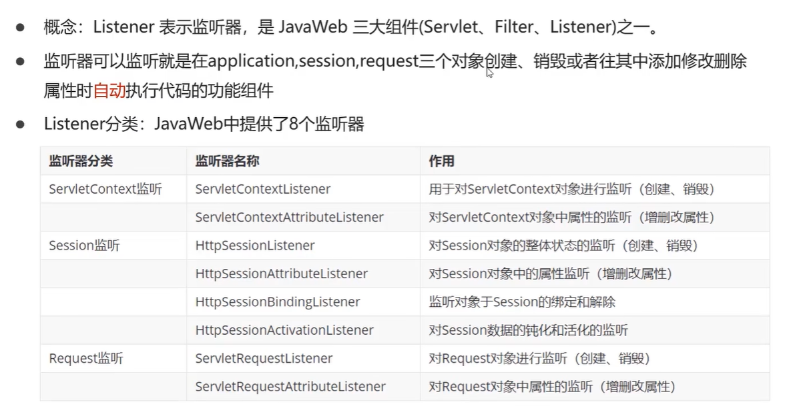
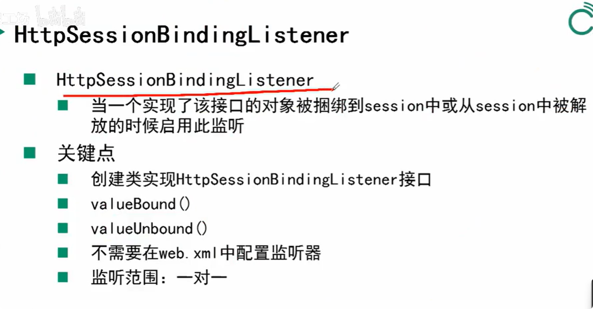
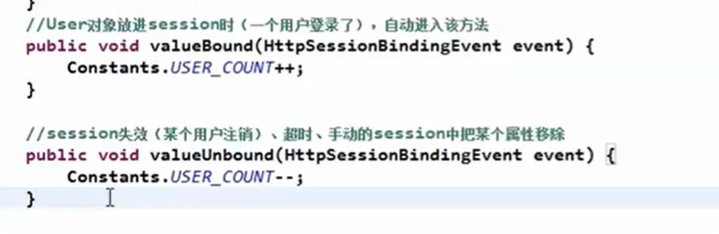
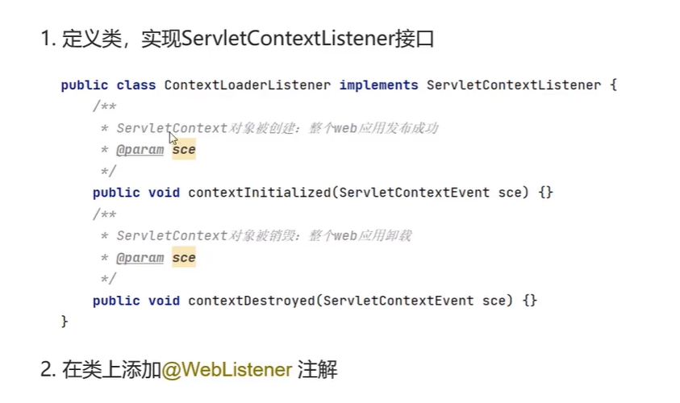
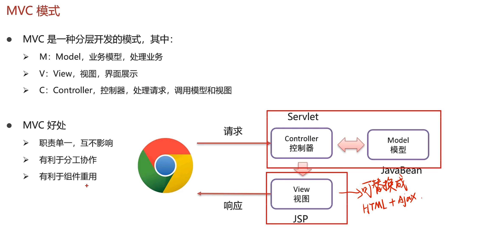
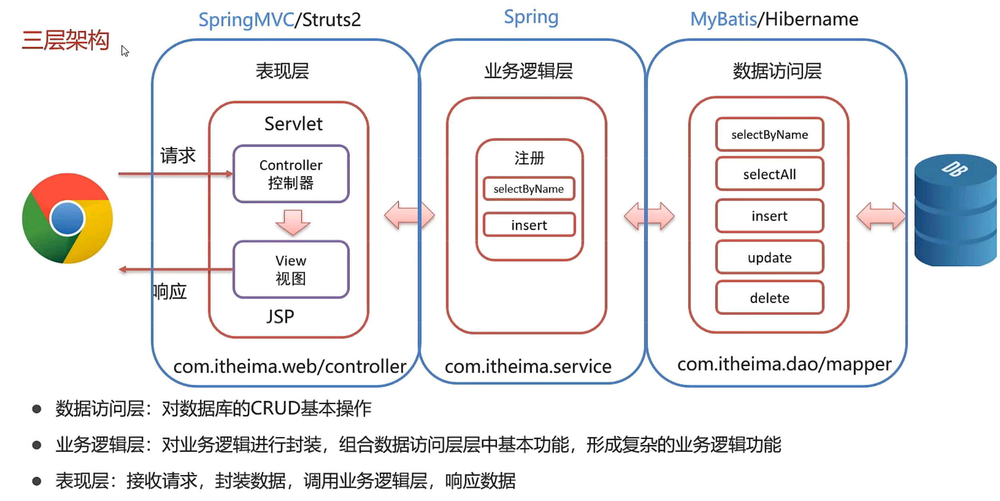
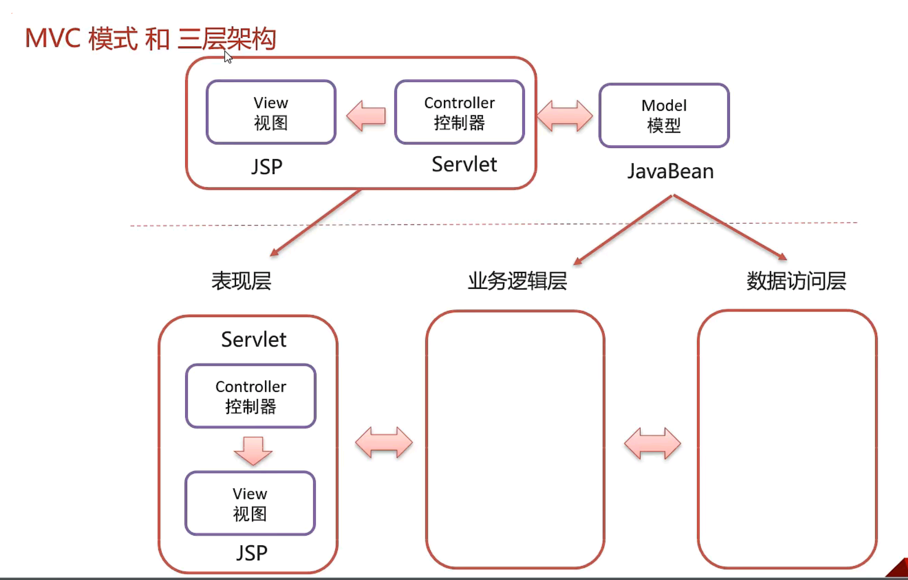

## Listener

> 
>
> ### HttpSessionBindingListener监听器
>
> 
>
> > `使用场景`: 可以用来实时监听==在线用户数量==，创建一个用户类，实现该接口，实现==valueBound==和==valueUnbound==方法。
> >
> > 
>
> 

## 基本使用

> 1. 定义一个接口，实现了上面8个监听器之一，如下为实现了ServletContextListener接口
> 2. 然后覆写相关方法
> 3. 使其生效，需要加上==@WebListener==注解
>
> 

## MVC模式

## 三层架构

## MVC模式和三层架构区别

> 