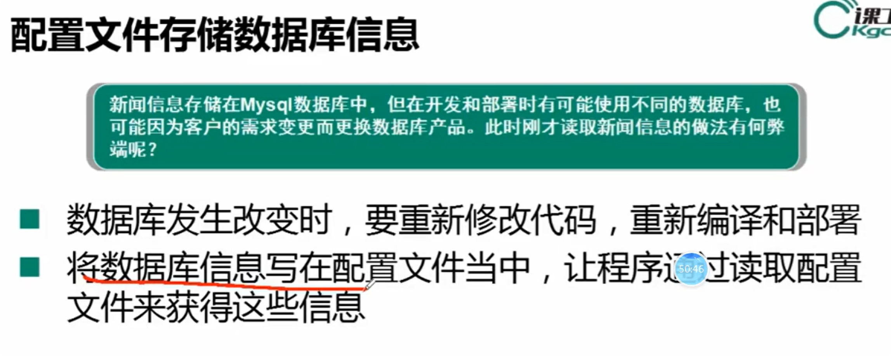

## dao模式

> 该基类可以写四个方法，分别是
>
> 1. 获取数据库连接
> 2. 增删改操作
> 3. 查询操作
> 4. 释放资源操作

### 一、获取数据库连接

### 二、增删改

### 三、查询

### 四、释放资源

### 上面整体如下

## 获取连接问题

> 对于不同数据库，连接信息肯定要变，比如连接驱动，账号密码等。
>
> 为了解决这个问题，可以通过==配置文件存储数据库信息==，即.properties文件
>
> 
>
> 然后，使用一个配置类来管理该配置文件，如下：==ConfigManager==
>
> **但是因为配置文件的读取涉及到流的操作，是一个非常耗时的操作，所以我们限制该对象只被创建一次，多次使用**， 所以引入了==单例模式==

## 单例模式

==步骤==：

1. 把构造方法私有
2. 程序提供给别人唯一对象

> Properties类是java提供的一个工具类，可以用它读.properties文件，通过流来读取
>
> 
>
> 但是这种方式不可取，用户可以多次创建，如下是单例模式写法
>
> 

> **单例模式**有**两种实现方式**：==懒汉式(线程不安全)和饿汉式==
>
> 1. **解决懒汉式线程不安全的方法**：
>
>    ​	将对外获取唯一对象的方法加锁（同步）
>
>    ~~~java
>    public static synchronized COnfigManager getInstance() {
>        if(configManager == null) {
>            configManager = new ConfigManager();
>        }
>    }
>    ~~~
>
>    

