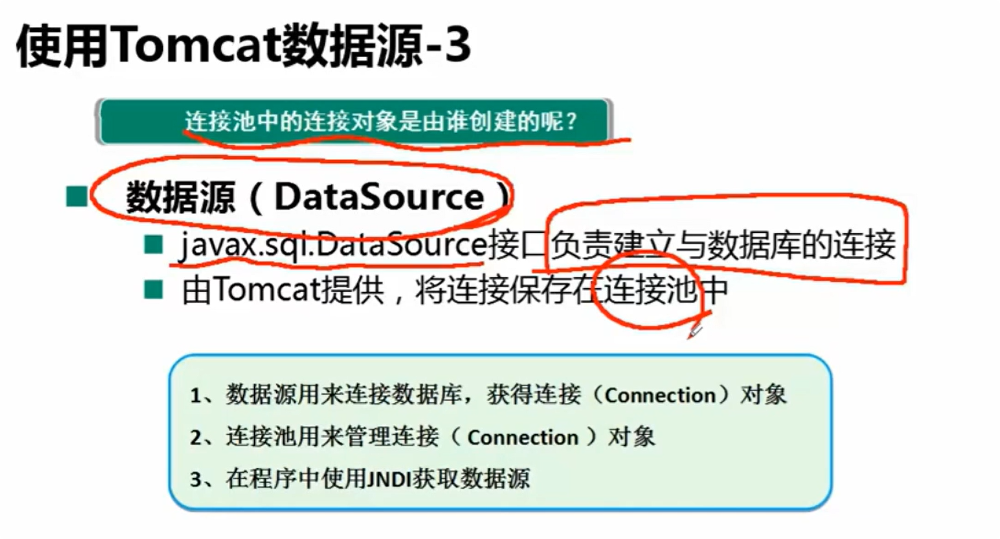
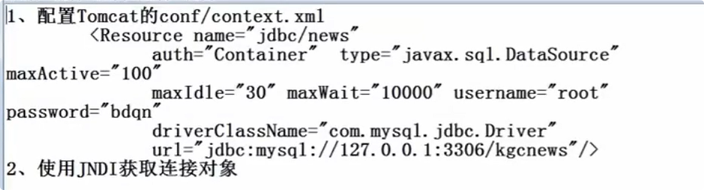
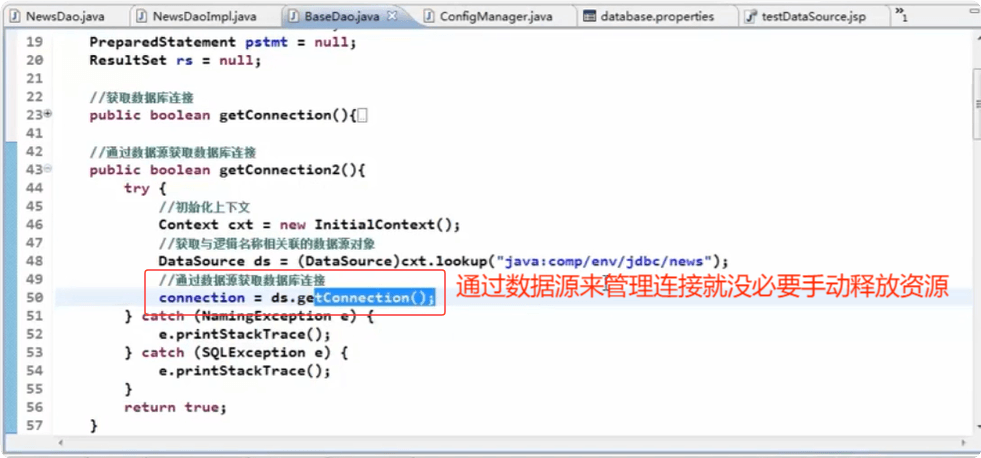
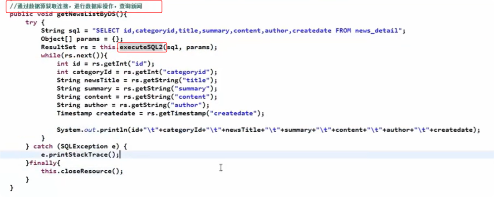
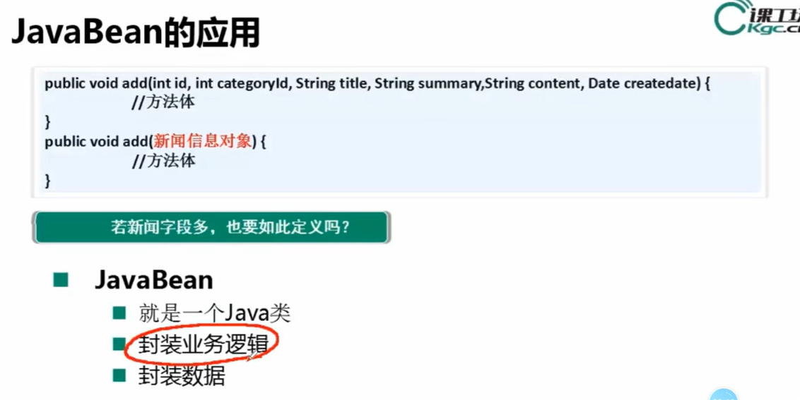
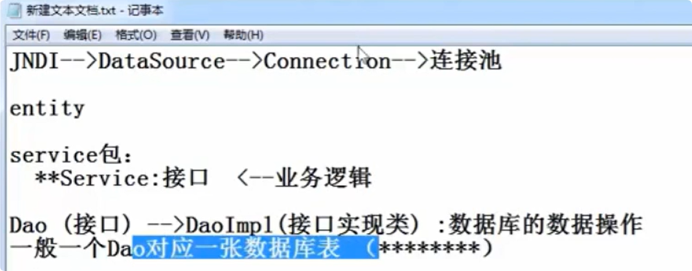
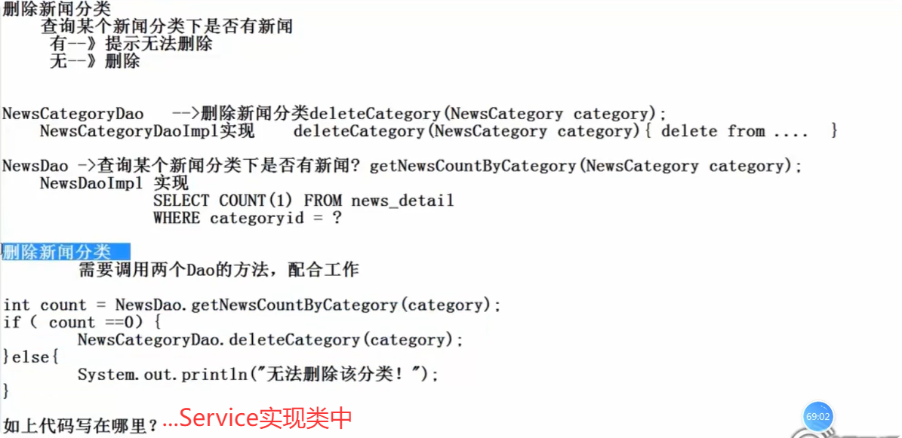
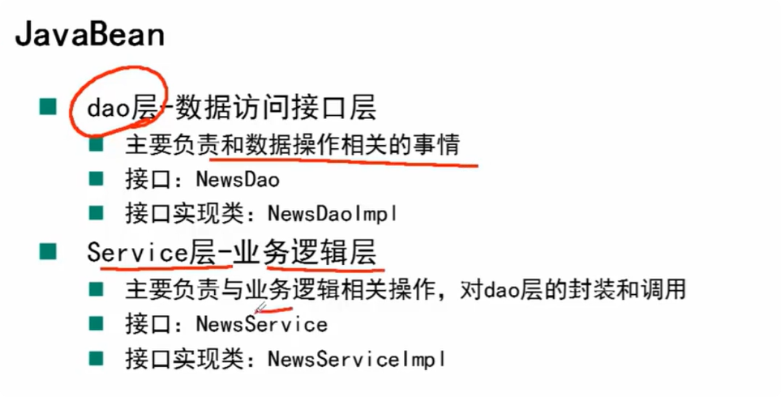

## 数据源



## Tomcat配置数据源步骤



> name: 后面加载数据源时会用到
>
> type: 数据源
>
> 
>
> 应为该方式是修改了tomcat配置，所以需要启动tomcat

## javaBean









## 数据源知识点

> `javax.sql.DataSource` 是一个 **接口**，它是 Java JDBC 标准（`javax.sql` 包）中定义的核心接口之一，用于管理与数据库的连接（Connection）。它提供了比传统 `DriverManager` 更高效、更灵活的数据库连接管理方式，支持连接池、分布式事务等特性。
>
> ------
>
> ### **Tomcat 实现的数据源**
>
> Tomcat 作为 Servlet 容器，内置了对 `DataSource` 接口的实现，主要通过以下方式提供数据源支持：
>
> 1. **默认实现**
>    Tomcat 使用 `org.apache.tomcat.jdbc.pool` 作为其内置的连接池实现（取代了旧的 `commons-dbcp`）。
>
>    - 当你在 Tomcat 的 `context.xml` 或应用代码中配置数据源时，Tomcat 会基于 `DataSource` 接口创建一个连接池实例。
>
>    - 示例配置（context.xml）：
>
>      ```
>      <Resource name="jdbc/myDB" 
>                type="javax.sql.DataSource"
>                factory="org.apache.tomcat.jdbc.pool.DataSourceFactory"
>                driverClassName="com.mysql.jdbc.Driver"
>                url="jdbc:mysql://localhost:3306/mydb"
>                username="user"
>                password="pass"
>                maxActive="100"
>                maxIdle="30"/>
>      ```
>
> 2. **依赖的库**
>    Tomcat 的数据源实现需要 JDBC 驱动（如 MySQL、PostgreSQL 等），但连接池本身由 Tomcat 管理，无需额外引入 DBCP 或 HikariCP 等第三方库（除非显式配置）。
>
> 3. **JNDI 绑定**
>    Tomcat 将数据源绑定到 JNDI（Java Naming and Directory Interface），应用可以通过 `java:comp/env/jdbc/myDB` 查找数据源：
>
>    ```
>    Context ctx = new InitialContext();
>    DataSource ds = (DataSource) ctx.lookup("java:comp/env/jdbc/myDB");
>    ```
>
> ------
>
> ### **与其他实现的对比**
>
> - **第三方连接池**（如 HikariCP、DBCP2）
>   这些库也实现了 `javax.sql.DataSource`，但通常性能更高或功能更丰富。例如：
>
>   ```
>   HikariConfig config = new HikariConfig();
>   config.setJdbcUrl("jdbc:mysql://localhost/mydb");
>   DataSource ds = new HikariDataSource(config);
>   ```
>
> - **JavaEE 应用服务器**（如 WildFly、WebLogic）
>   它们也提供自己的 `DataSource` 实现，通常集成更高级的特性（如分布式事务）。
>
> ------
>
> ### **总结**
>
> - `javax.sql.DataSource` 是标准接口，Tomcat 通过 `org.apache.tomcat.jdbc.pool` 实现了它。
> - Tomcat 的数据源适合轻量级应用，若需要更高性能或特性，可替换为 HikariCP 等第三方实现。
> - 配置方式主要通过 JNDI 或直接实例化连接池。
>
> 如果有具体使用场景或问题，可以进一步探讨！