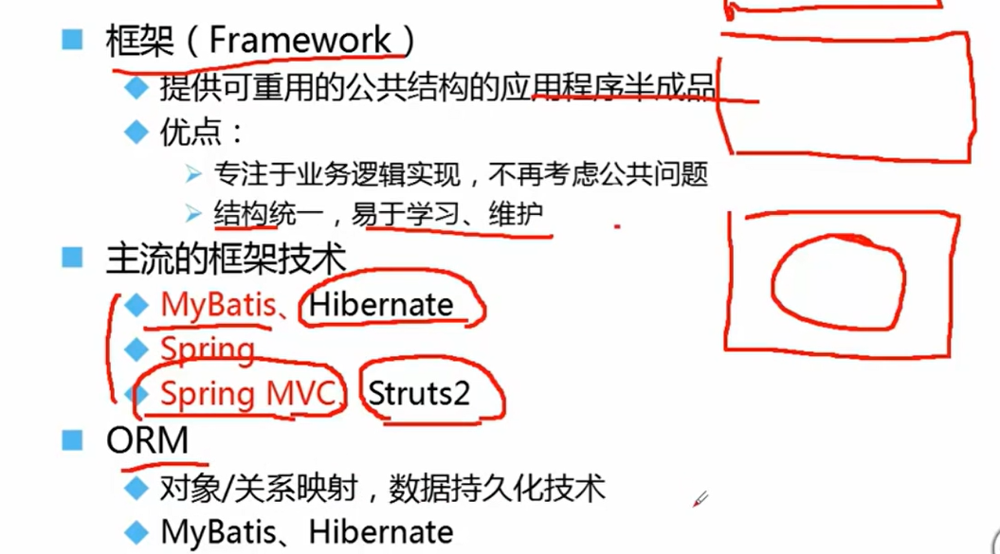
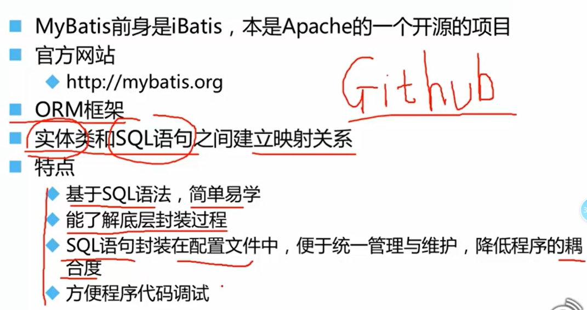
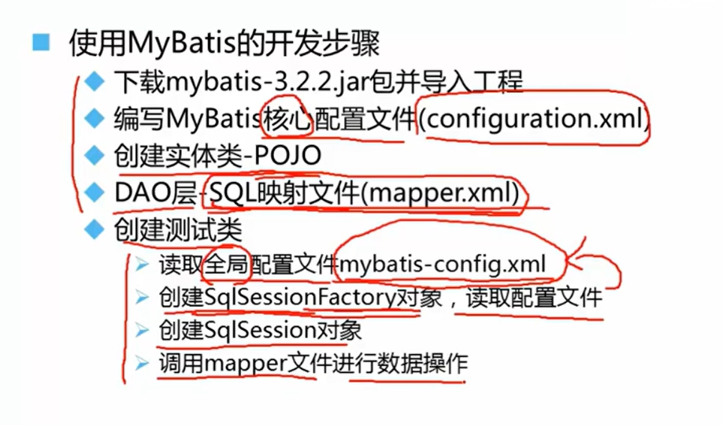
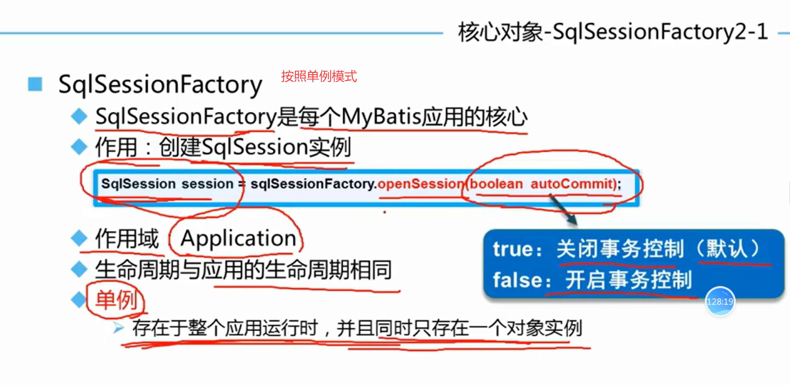
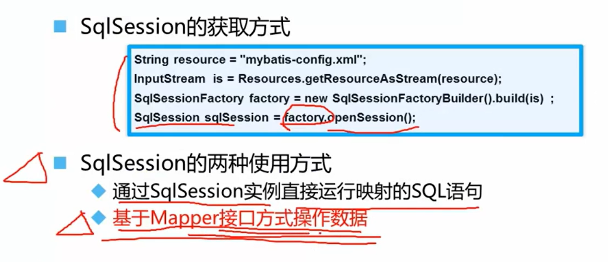

# MyBatis

## 持久化与ORM

持久化是程序数据在瞬时状态和持久状态间转化的过程（内存 -> 数据库）

## Mybatis简介

### Mybatis开发步骤

## Mybatis核心对象

### SqlSessionFactoryBuilder

### SqlSessionFactory

单例模式：这里通过创建一个工具类来将SqlSessionFactory实现为单例模式。后续在学习spring时，可以通过依赖注入中的

### SqlSession

