# maven介绍及构建web项目

## 基本概念

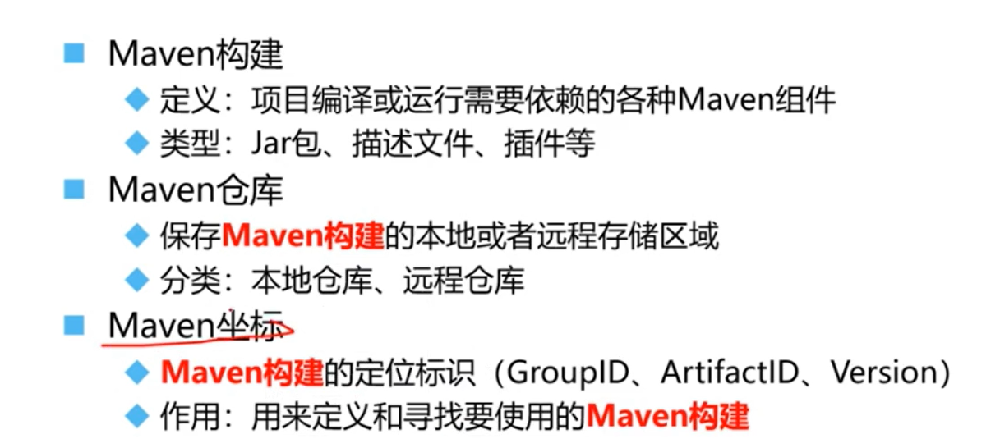

## 快速构建maven项目

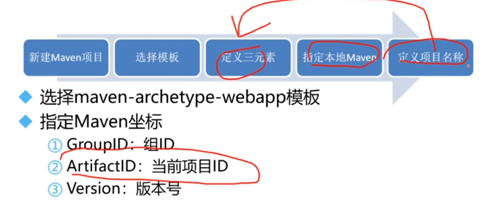

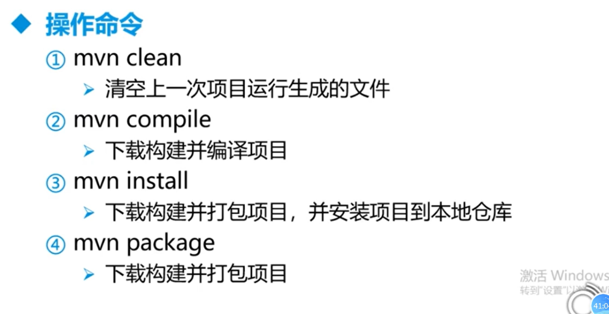

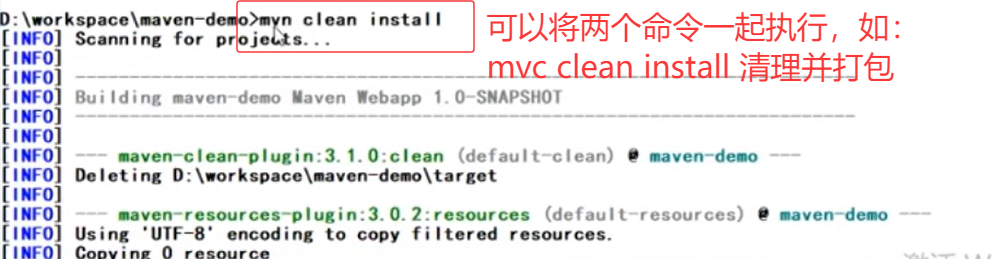

## 依赖管理

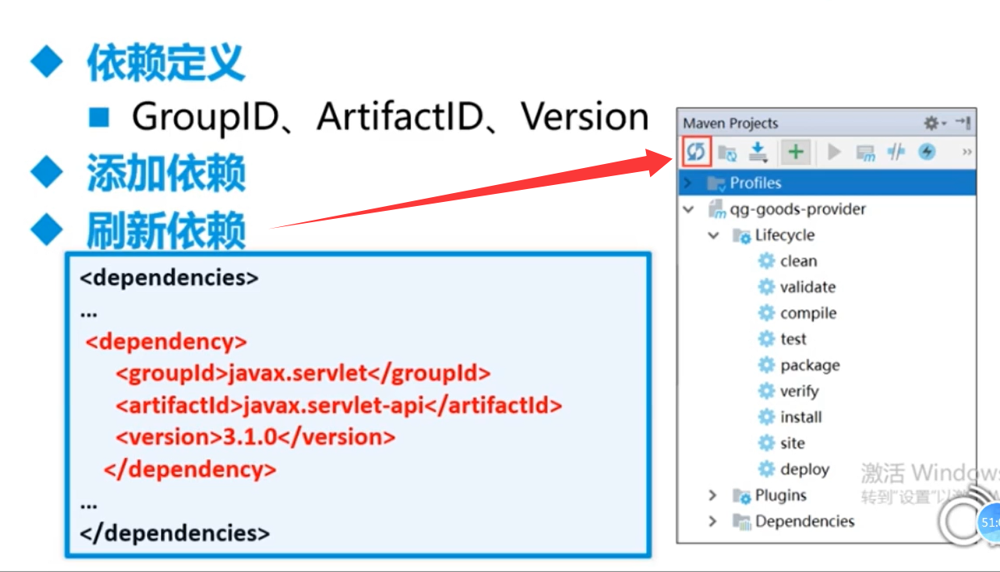

## maven仓库

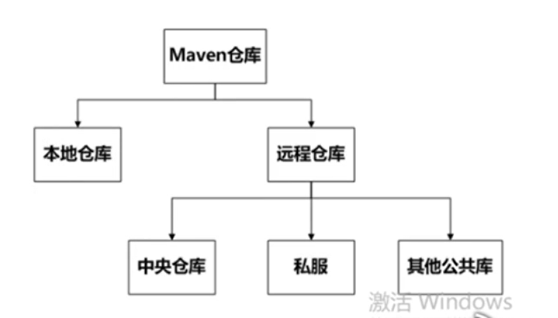

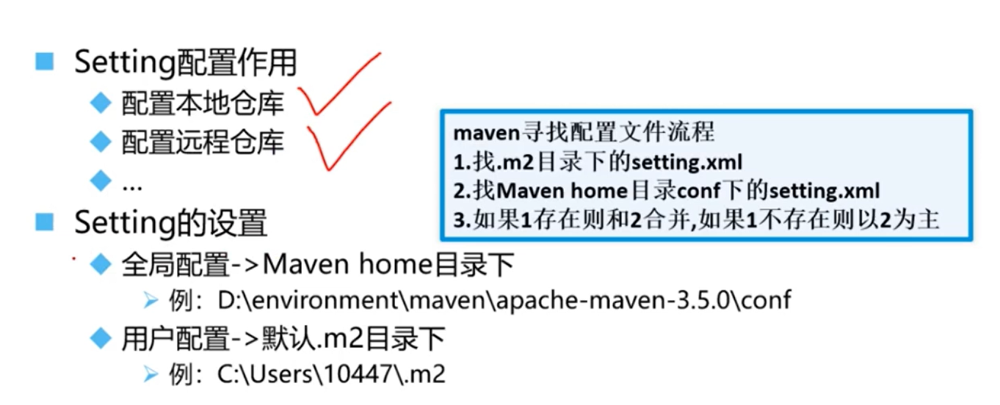

> ==全局配置==setting.xml在maven文件夹下的conf文件夹下，==用户配置==文件在c:\User\...\.m2下，如果没有可以创建==.m2==文件夹，将全局配置的settting.xml复制过去
>
> 默认以用户配置为主，其次全局配置

## 配置仓库

### 配置本地仓库

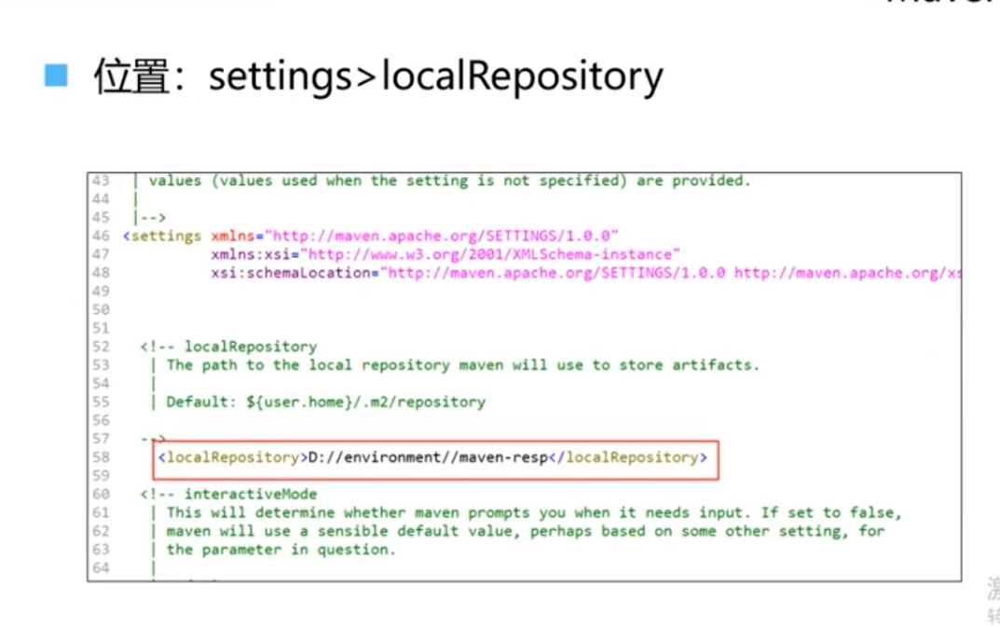

### 配置远程仓库

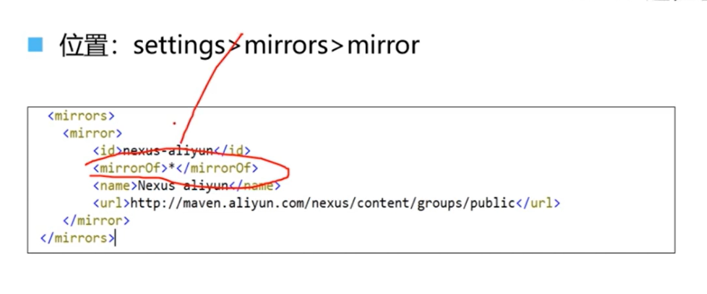

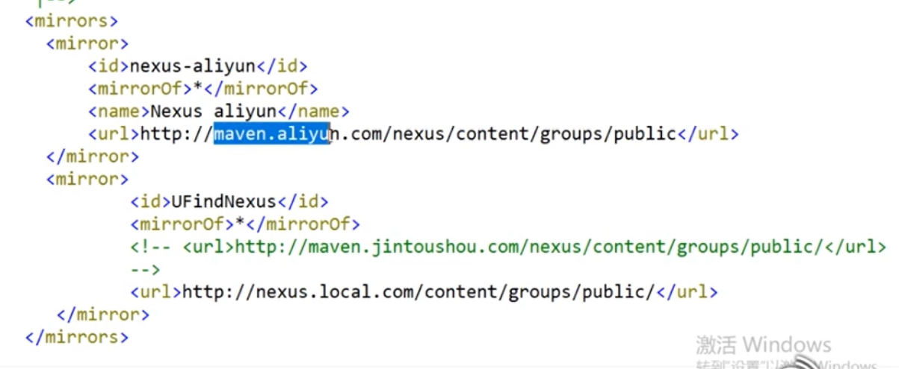

### 构建更新流程

> 对于配置镜像==<mirrors>==，存在多个mirror，根据先后顺序优先级。一般将局域网中的放在前面，公网中的放在后面

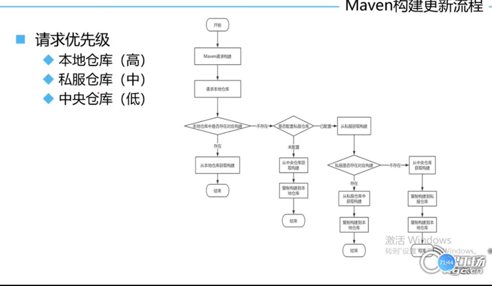

## 总结


> ### 1. **Maven是什么？它有哪些作用？**
>
> Maven是一个基于项目对象模型（POM）的构建自动化工具，主要用于Java项目的构建、依赖管理和项目信息管理。
>
> **主要作用**：
>
> - **项目构建**：自动化编译、测试、打包、部署等生命周期流程。
> - **依赖管理**：通过坐标（groupId、artifactId、version）自动下载和管理第三方库。
> - **项目标准化**：提供统一的项目结构和构建规范，便于团队协作。
> - **信息聚合**：生成项目文档、报告（如测试覆盖率、依赖树）。
>
> **解题思路**：理解Maven的核心是通过POM模型标准化项目，从而提升开发效率和可维护性。
>
> ------
>
> ### 2. **什么是Maven构建？**
>
> Maven构建是指根据POM配置，执行一系列预设生命周期阶段（如编译、测试、打包）的过程。构建生命周期包括：
>
> - **clean**：清理输出目录。
> - **default**（核心阶段）：`compile`（编译）→ `test`（运行测试）→ `package`（打包）→ `install`（安装到本地仓库）。
> - **site**：生成项目站点文档。
>
> **解题思路**：Maven构建是基于生命阶段的自动化流程，每个阶段对应一个或多个插件目标（goal）。
>
> ------
>
> ### 3. **如何在Maven项目中新增依赖？**
>
> 在项目的`pom.xml`文件中，于`<dependencies>`标签内添加依赖坐标：
>
> ```xml
> <dependency>
>     <groupId>组ID（如：org.springframework）</groupId>
>     <artifactId>构件ID（如：spring-core）</artifactId>
>     <version>版本号（如：5.3.10）</version>
> </dependency>
> ```
>
> **步骤**：
>
> 1. 在Maven中央仓库（如mvnrepository.com）搜索所需依赖。
> 2. 复制对应的坐标到`pom.xml`。
> 3. 执行`mvn compile`或`mvn install`，Maven会自动下载依赖到本地仓库。
>
> **解题思路**：依赖通过坐标唯一标识，Maven根据坐标从远程仓库解析并下载资源。
>
> ------
>
> ### 4. **Maven下载构建时，如何在本地仓库及远程仓库间进行选择？**
>
> Maven按以下顺序查找依赖：
>
> 1. **本地仓库**：优先检查本地目录（默认`~/.m2/repository`）是否已缓存该依赖。
> 2. **远程仓库**：若本地不存在，则按配置的远程仓库顺序下载（先中央仓库，后私有仓库）。
>    - 中央仓库（central）：Maven默认的公共仓库。
>    - 私有仓库（如公司Nexus/Artifactory）：需在`pom.xml`或`settings.xml`中配置。
>
> **配置示例**（在`pom.xml`中指定私有仓库）：
>
> ```xml
> <repositories>
>     <repository>
>         <id>company-repo</id>
>         <url>https://repo.example.com/maven2</url>
>     </repository>
> </repositories>
> ```
>
> **解题思路**：Maven的仓库机制遵循“本地优先，远程补充”的原则，以减少重复下载并支持离线构建。


# Maven多模块技术

## 基于多模块实践xxxApp项目

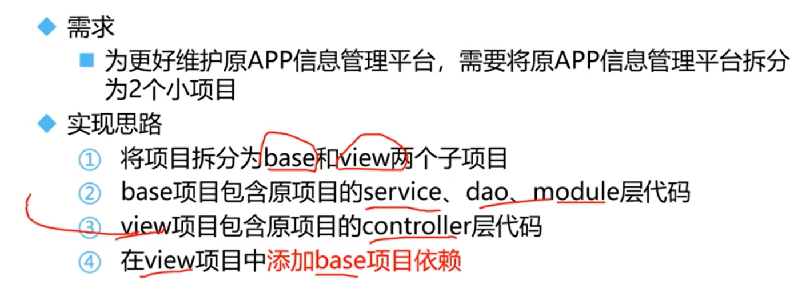

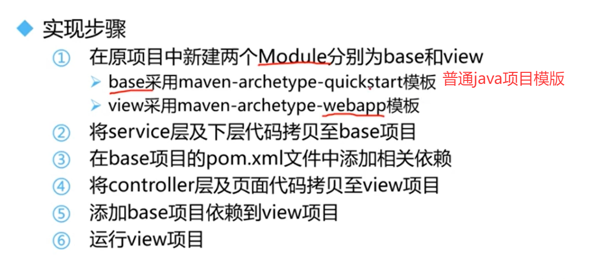

## 总结


> ### 1. 什么是Maven多模块技术？
>
> Maven多模块技术是一种项目组织结构，允许将一个大型项目拆分成多个独立的子模块（submodules），每个模块对应一个特定的功能或组件。这些模块通过一个父POM（Project Object Model）文件进行统一管理，父POM定义了公共的依赖、插件和构建配置，而每个子模块有自己的POM文件。这种结构有助于实现代码的模块化、重用和易于维护。
>
> ### 2. 项目之间如何进行依赖？
>
> 在Maven多模块项目中，模块之间的依赖通过Maven的依赖机制实现。具体步骤：
>
> - 在子模块的POM文件中，使用`<dependencies>`标签声明对其他模块的依赖。
> - 依赖的坐标（groupId、artifactId、version）必须与其他模块的POM定义一致。
> - Maven会自动处理依赖解析，在构建时确保模块按正确顺序编译和打包。例如，如果模块A依赖模块B，模块B必须先构建，然后模块A才能使用其输出。
>
> ### 3. 基于Maven对项目拆分有什么好处？
>
> 基于Maven进行项目拆分的主要好处包括：
>
> - **代码复用和模块化**：每个模块可以独立开发、测试和重用，提高代码质量。
> - **易于维护**：更改一个模块不会直接影响其他模块，简化调试和更新。
> - **构建优化**：Maven可以只构建更改的模块，减少构建时间。
> - **依赖管理集中**：父POM统一管理公共依赖，避免版本冲突。
> - **团队协作**：不同团队可以并行处理不同模块，提高开发效率。

# Maven私服

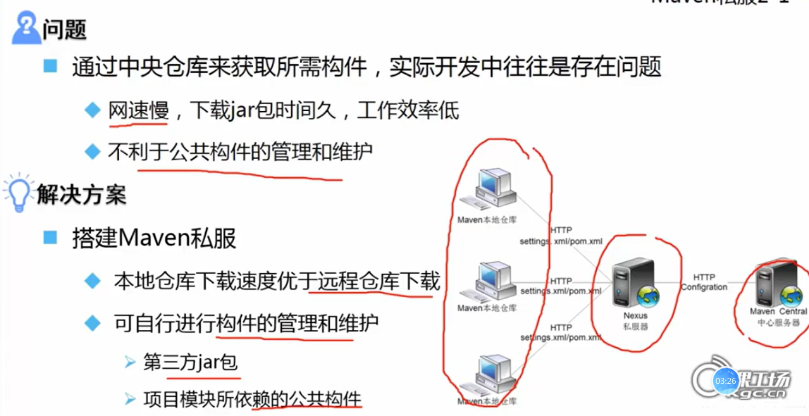

## 搭建私服

### 下载nexus搭建maven私服

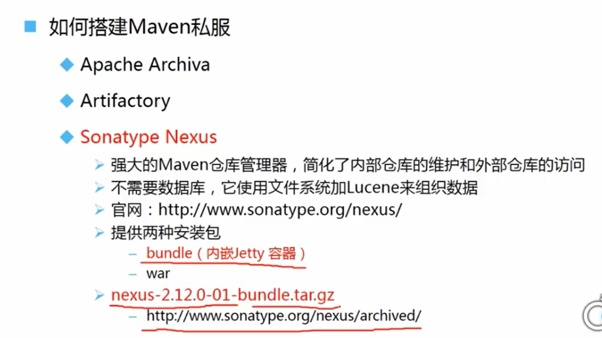

### 环境配置

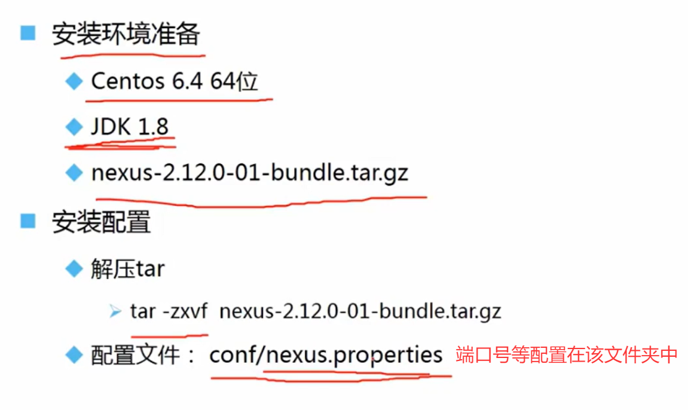

> **解压缩**
>
> 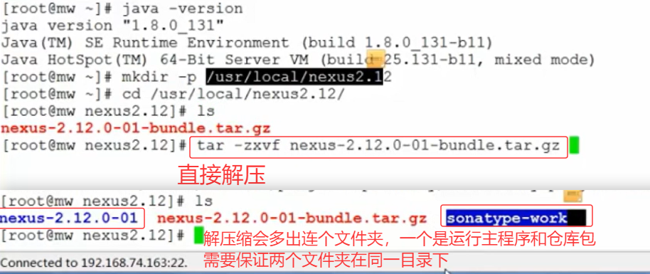
>
> **配置nexus.properties文件**
>
> 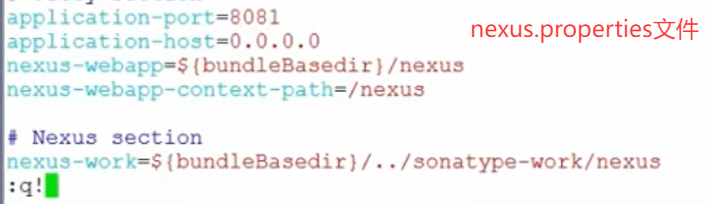
>
> 


### 启动nexus

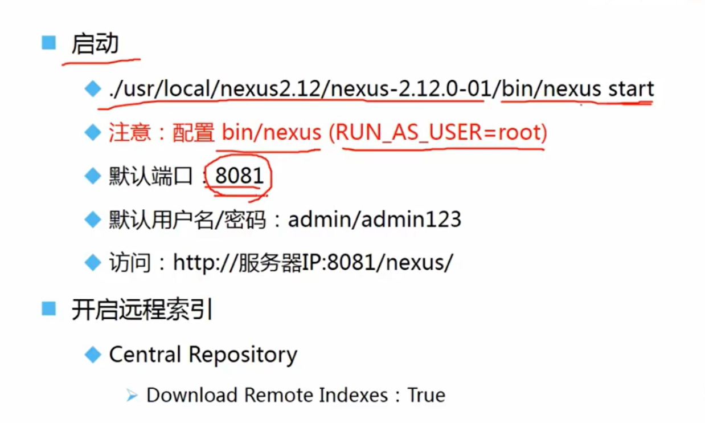

> 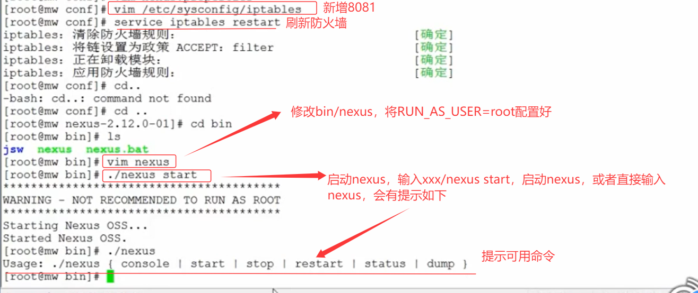
>
> 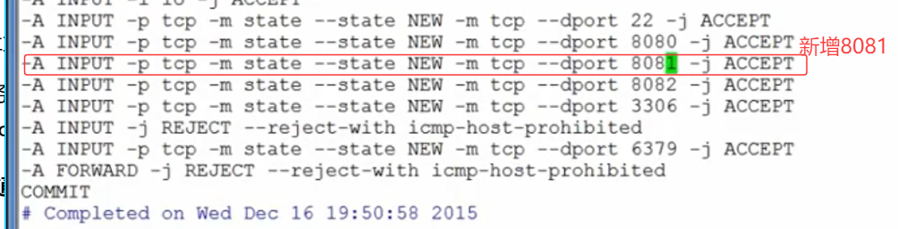
>
> 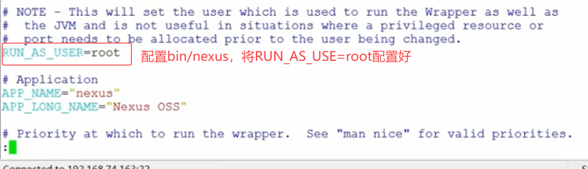

## 开启远程索引

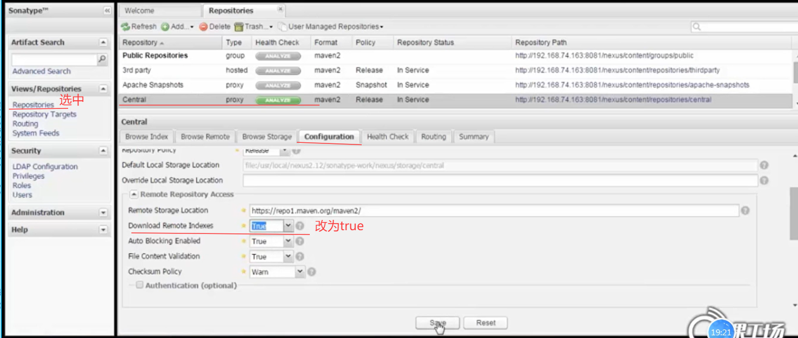

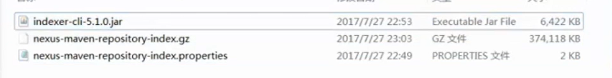

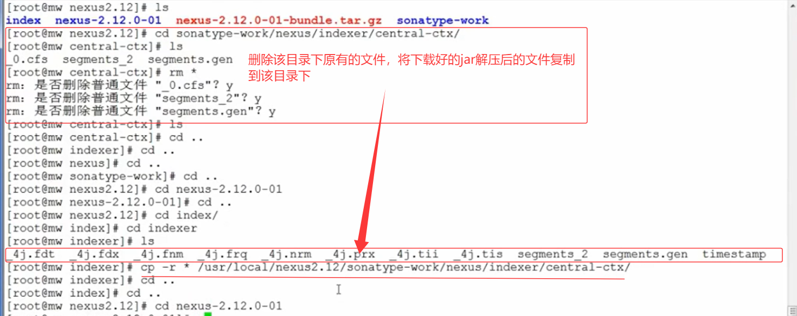