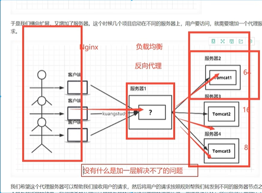
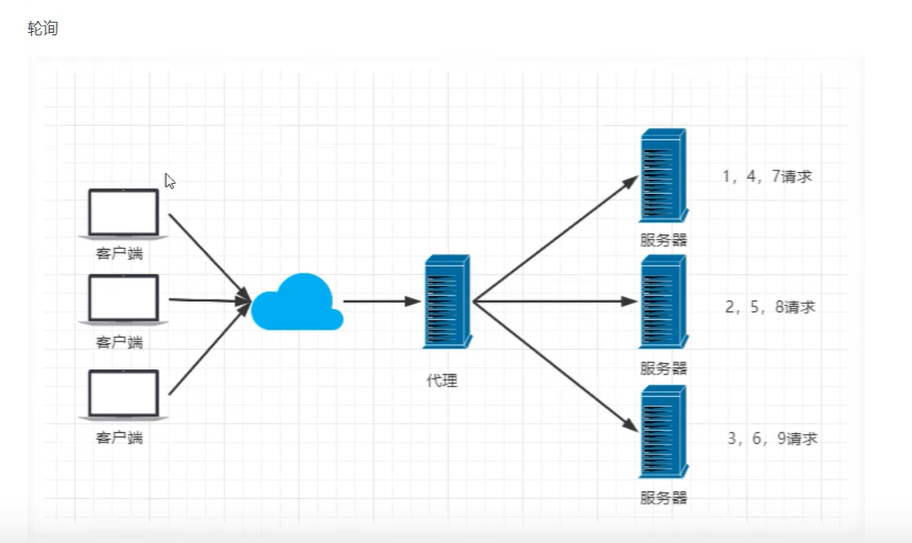
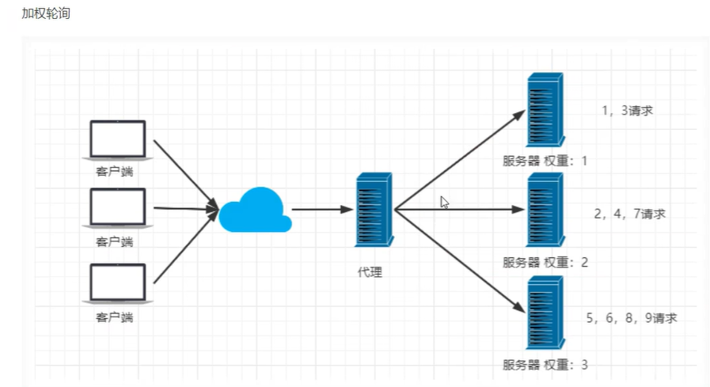
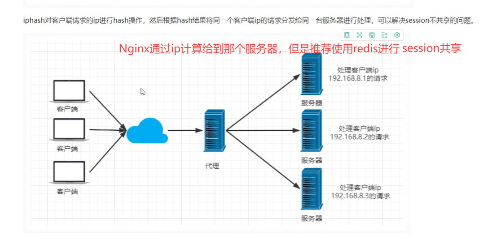
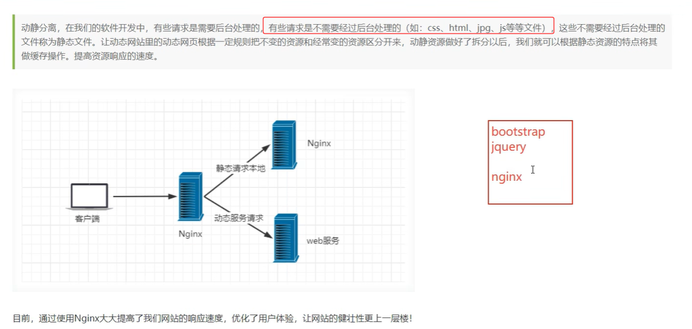
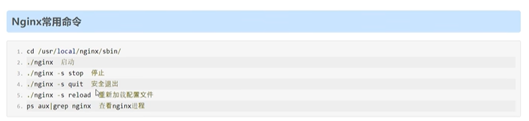
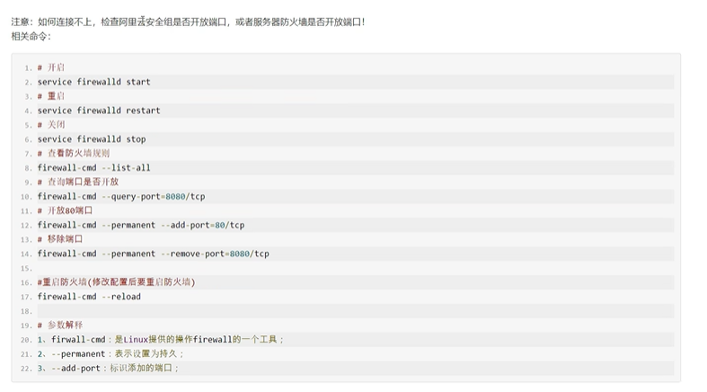

## Nginx简介




## 正向代理和反向代理

### 1. 正向代理 (Forward Proxy)

**定义**：代理客户端向服务器发起请求，服务器不知道真实的客户端是谁。

### 2. 反向代理 (Reverse Proxy)

**定义**：代理服务器接收客户端请求，然后转发给内部服务器，客户端不知道真正的服务器是谁。

| 特性           | 正向代理             | 反向代理            |
| :------------- | :------------------- | :------------------ |
| **代理对象**   | 代理客户端           | 代理服务器          |
| **客户端感知** | 知道在使用代理       | 不知道在使用代理    |
| **服务器感知** | 不知道真实客户端     | 知道代理的存在      |
| **主要目的**   | 客户端匿名、突破限制 | 负载均衡、安全防护  |
| **配置位置**   | 客户端配置           | 服务器端配置        |
| **典型应用**   | VPN、爬虫、翻墙      | Nginx、CDN、API网关 |


## 负载均衡

### 轮询



### 加权轮询



**session共享（不重要）**



### 动静分离




## Nginx安装

1. 安装目录不要有中文


## 常用命令



## 连接不上？



## Nginx配置


### 📋 配置文件总体结构

> Nginx 配置文件主要由三个核心部分组成：
>
> ```
> # 1. 全局配置块
> # 2. events 块
> # 3. http 块
> ```
>
> ------
>
> ## 1. 全局配置 (Global Context)
>
> **位置**：配置文件最外层，不在任何块内
>
> ### 主要配置指令：
>
> ```
> # 设置运行Nginx的用户和用户组
> #user nobody;
> 
> # 定义工作进程数量（建议设置为CPU核心数）
> worker_processes 1;
> 
> # 错误日志配置
> #error_log logs/error.log;          # 基本错误日志
> #error_log logs/error.log notice;   # 记录notice级别及以上
> #error_log logs/error.log info;     # 记录info级别及以上
> 
> # PID文件位置（存储主进程ID）
> #pid logs/nginx.pid;
> ```
>
> ### 配置说明：
>
> - `worker_processes`：推荐设置为 `auto`（自动检测CPU核心数）
> - 注释使用 `#`符号
> - 每行指令以分号 `;`结束(没有会报错)
>
> ------
>
> ## 2. Events 块 (Events Context)
>
> **作用**：配置网络连接相关的参数
>
> ```
> events {
>     # 每个工作进程的最大连接数
>     worker_connections 1024;
> }
> ```
>
> ### 重要参数：
>
> - `worker_connections`：限制单个进程的并发连接数
> - 实际最大并发数 = `worker_processes`× `worker_connections`
>
> ------
>
> ## 3. HTTP 块 (HTTP Context)
>
> **作用**：配置HTTP服务器相关参数，是配置最丰富的部分
>
> ### 基本结构：
>
> ```
> http {
>     # 包含MIME类型定义文件
>     include mime.types;
>     
>     # 默认MIME类型
>     default_type application/octet-stream;
>     
>     # 日志格式定义
>     #log_format main '$remote_addr - $remote_user [$time_local] "$request" '
>     #               '$status $body_bytes_sent "$http_referer" '
>     #               '"$http_user_agent" "$http_x_forwarded_for"';
>     
>     # 访问日志配置
>     #access_log logs/access.log main;
>     
>     # 启用高效文件传输模式
>     sendfile on;
>     
>     # 优化数据包发送（需要sendfile on）
>     #tcp_nopush on;
>     
>     # 连接超时时间配置
>     #keepalive_timeout 0;    # 禁用keepalive
>     keepalive_timeout 65;    # 65秒超时
>     
>     # Gzip压缩配置
>     #gzip on;
> }
> ```
>
> ### 关键配置详解：
>
> #### 🔹 MIME类型配置
>
> ```
> include mime.types;                  # 引入预定义的MIME类型
> default_type application/octet-stream;  # 默认类型（二进制流）
> ```
>
> #### 🔹 日志配置
>
> ```
> # 定义日志格式
> log_format main '$remote_addr - $remote_user [$time_local] "$request" '
>                '$status $body_bytes_sent "$http_referer" '
>                '"$http_user_agent" "$http_x_forwarded_for"';
> 
> # 启用访问日志
> access_log logs/access.log main;
> ```
>
> #### 🔹 性能优化配置
>
> ```
> sendfile on;        # 启用零拷贝文件传输
> #tcp_nopush on;     # 仅在sendfile开启时有效，优化数据包发送
> 
> # 连接保持超时
> keepalive_timeout 65;  # 65秒后关闭空闲连接
> 
> # Gzip压缩
> #gzip on;           # 启用Gzip压缩，减少传输体积
> ```
>
> ------
>
> ## 🎯 配置最佳实践
>
> ### 1. 性能优化建议
>
> ```
> worker_processes auto;              # 自动设置工作进程数
> worker_connections 4096;            # 根据服务器内存调整
> keepalive_timeout 30;               # 适当减少超时时间
> gzip on;                            # 启用压缩
> gzip_min_length 1k;                 # 最小压缩文件大小
> ```
>
> ### 2. 安全建议
>
> ```
> # 隐藏Nginx版本信息
> server_tokens off;
> 
> # 设置安全头部
> add_header X-Frame-Options SAMEORIGIN;
> add_header X-Content-Type-Options nosniff;
> ```
>
> ### 3. 文件路径规范
>
> ```
> # 使用绝对路径更安全
> error_log /var/log/nginx/error.log;
> access_log /var/log/nginx/access.log;
> pid /var/run/nginx.pid;
> ```
>
> ------
>
> ## 🔍 配置文件检查命令
>
> ```
> # 检查配置文件语法是否正确
> nginx -t
> 
> # 重载配置（不重启服务）
> nginx -s reload
> 
> # 查看当前运行的配置
> nginx -T
> ```
>
> ------
>
> ## 📊 配置结构总结
>
> | 配置区块     | 作用范围      | 关键指令                                | 备注             |
> | :----------- | :------------ | :-------------------------------------- | :--------------- |
> | **全局配置** | 整个Nginx实例 | `worker_processes`, `error_log`         | 影响所有工作进程 |
> | **Events块** | 网络连接      | `worker_connections`                    | 控制并发连接数   |
> | **HTTP块**   | HTTP服务      | `include`, `default_type`, `log_format` | 核心配置区域     |

### 负载均衡配置

> ### 1. 基础负载均衡配置
>
> 在 `http {}`块内添加 `upstream`指令来定义服务器组：
>
> ```
> http {
>     include mime.types;
>     default_type application/octet-stream;
>     
>     # 定义负载均衡服务器组
>     upstream backend_servers {
>         server 192.168.1.101:8080 weight=3;   # 权重为3
>         server 192.168.1.102:8080 weight=2;   # 权重为2
>         server 192.168.1.103:8080;            # 默认权重1
>         server 192.168.1.104:8080 backup;     # 备份服务器
>     }
> 
>     server {
>         listen 80;
>         server_name example.com;
>         
>         location / {
>             # 将请求代理到后端服务器组
>             proxy_pass http://backend_servers;
>             proxy_set_header Host $host;
>             proxy_set_header X-Real-IP $remote_addr;
>         }
>     }
> }
> ```
>
> ### 2. 负载均衡算法
>
> Nginx 支持多种负载均衡算法：
>
> #### 🔄 轮询（默认）
>
> ```
> upstream backend {
>     server 192.168.1.101:8080;
>     server 192.168.1.102:8080;
>     server 192.168.1.103:8080;
> }
> ```
>
> #### ⚖️ 加权轮询
>
> ```
> upstream backend {
>     server 192.168.1.101:8080 weight=5;  # 处理50%的请求
>     server 192.168.1.102:8080 weight=3;  # 处理30%的请求
>     server 192.168.1.103:8080 weight=2;  # 处理20%的请求
> }
> ```
>
> #### 🔍 IP哈希（会话保持）
>
> ```
> upstream backend {
>     ip_hash;  # 同一IP总是访问同一服务器
>     server 192.168.1.101:8080;
>     server 192.168.1.102:8080;
>     server 192.168.1.103:8080;
> }
> ```
>
> #### ⚡ 最少连接数
>
> ```
> upstream backend {
>     least_conn;  # 优先分配给连接数最少的服务器
>     server 192.168.1.101:8080;
>     server 192.168.1.102:8080;
>     server 192.168.1.103:8080;
> }
> ```
>
> ### 3. 健康检查配置
>
> ```
> upstream backend {
>     server 192.168.1.101:8080 max_fails=3 fail_timeout=30s;
>     server 192.168.1.102:8080 max_fails=3 fail_timeout=30s;
>     server 192.168.1.103:8080 max_fails=3 fail_timeout=30s;
>     
>     # 可选：主动健康检查（需要Nginx Plus）
>     # health_check interval=5s fails=3 passes=2;
> }
> ```
>
> ### 4. 完整的配置示例
>
> ```
> # 全局配置
> user nobody;
> worker_processes auto;  # 自动根据CPU核心数设置
> error_log /var/log/nginx/error.log warn;
> pid /var/run/nginx.pid;
> 
> # 事件配置
> events {
>     worker_connections 1024;
>     multi_accept on;
>     use epoll;
> }
> 
> # HTTP配置
> http {
>     include mime.types;
>     default_type application/octet-stream;
>     
>     # 日志格式
>     log_format main '$remote_addr - $remote_user [$time_local] "$request" '
>                    '$status $body_bytes_sent "$http_referer" '
>                    '"$http_user_agent" "$http_x_forwarded_for"';
>     
>     access_log /var/log/nginx/access.log main;
>     
>     sendfile on;
>     tcp_nopush on;
>     keepalive_timeout 65;
>     
>     # 负载均衡服务器组
>     upstream app_cluster {
>         # 负载均衡算法
>         least_conn;
>         
>         # 后端服务器
>         server 10.0.1.101:8080 weight=3 max_fails=2 fail_timeout=30s;
>         server 10.0.1.102:8080 weight=2 max_fails=2 fail_timeout=30s;
>         server 10.0.1.103:8080 weight=1 max_fails=2 fail_timeout=30s;
>         server 10.0.1.104:8080 backup;  # 备份服务器
>         
>         # 会话保持（如果需要）
>         # sticky cookie srv_id expires=1h domain=.example.com path=/;
>     }
>     
>     # 虚拟主机配置
>     server {
>         listen 80;
>         server_name yourdomain.com;
>         
>         # 反向代理配置
>         location / {
>             proxy_pass http://app_cluster;
>             
>             # 重要的代理头设置
>             proxy_set_header Host $host;
>             proxy_set_header X-Real-IP $remote_addr;
>             proxy_set_header X-Forwarded-For $proxy_add_x_forwarded_for;
>             proxy_set_header X-Forwarded-Proto $scheme;
>             
>             # 超时设置
>             proxy_connect_timeout 30s;
>             proxy_send_timeout 30s;
>             proxy_read_timeout 30s;
>             
>             # 错误处理
>             proxy_next_upstream error timeout invalid_header http_500 http_502 http_503 http_504;
>             proxy_next_upstream_tries 3;
>             proxy_next_upstream_timeout 30s;
>         }
>         
>         # 健康检查端点（可选）
>         location /nginx_status {
>             stub_status on;
>             access_log off;
>             allow 127.0.0.1;
>             deny all;
>         }
>     }
> }
> ```
>
> ## 关键配置参数说明
>
> | 参数           | 说明           | 示例                |
> | :------------- | :------------- | :------------------ |
> | `weight`       | 服务器权重     | `weight=5`          |
> | `max_fails`    | 最大失败次数   | `max_fails=3`       |
> | `fail_timeout` | 失败超时时间   | `fail_timeout=30s`  |
> | `backup`       | 备份服务器     | `server ... backup` |
> | `down`         | 标记服务器离线 | `server ... down`   |
>
> ## 验证和重载配置
>
> ```
> # 检查配置文件语法
> nginx -t
> 
> # 重载配置（不中断服务）
> nginx -s reload
> 
> # 查看负载均衡状态
> tail -f /var/log/nginx/access.log
> ```
>
> ## 监控和维护
>
> ```
> # 实时监控后端服务器状态
> watch -n 2 'curl http://localhost/nginx_status'
> 
> # 测试负载均衡
> for i in {1..10}; do curl http://yourdomain.com/; done
> ```