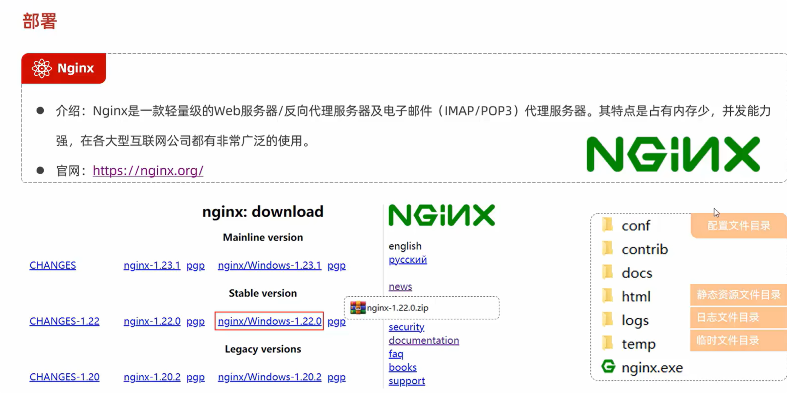
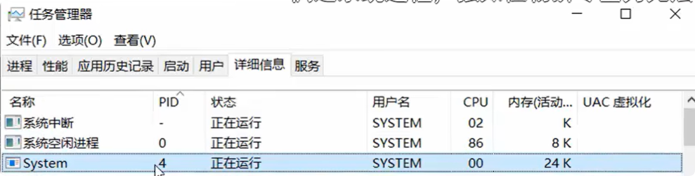
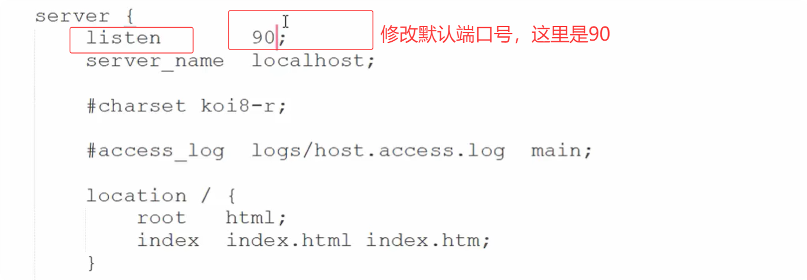
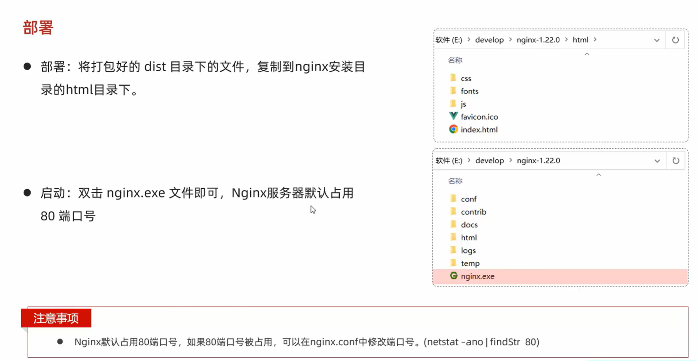

## 官网

[nginx官网](https://nginx.org/)

## 部署

#### 往nginx中部署打包好的静态资源文件（vue项目打包后的文件夹）放到html文件夹下

#### nginx默认会占用电脑本机80端口

1. 通过==nginx.exe==命令启动nginx服务器，可以在任务管理中查看是否有nginx服务。如果没有可能是端口占用了。
2. 修改默认端口，打开conf/nginx.xml

#### 此时访问localhost:90即可访问部署的项目

