## 抢购功能优化

## 线程安全测试

### 使用jmeter来进行如下测试

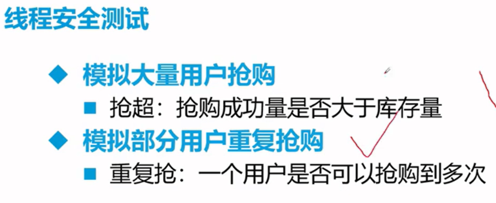

### jmeter下载安装

[Apache JMeter - Apache JMeter 分布式测试分步](https://jmeter.apache.org/usermanual/jmeter_distributed_testing_step_by_step.html)

### 测试

#### 问题

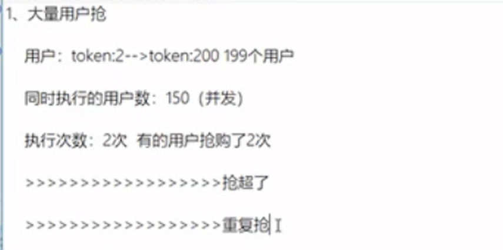

#### 问题分析

类似于单体项目中的线程同步问题，但是这里不能用到单线程中的线程锁，对于集群来说

synchronized没有用，可能在不同的服务器上

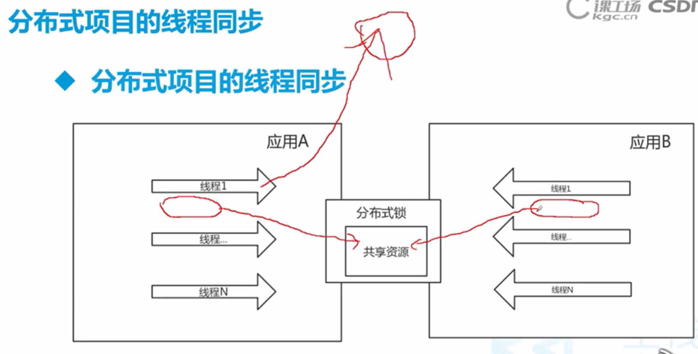

## 分布式锁

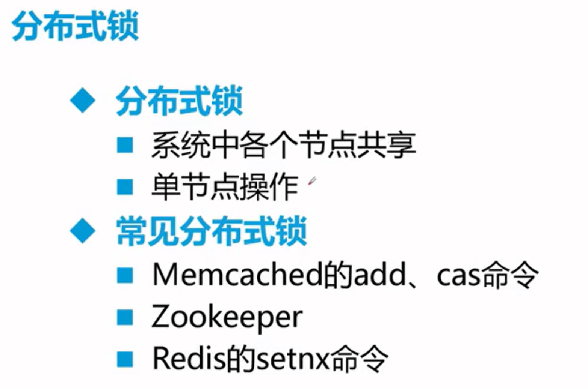

### 基于Redis的setnx命令实现分布式锁

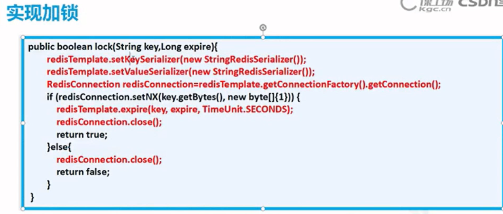

在 `StringRedisTemplate`中，`SETNX`命令对应的方法是 `setIfAbsent`。

- `true`: 设置成功，表示该键之前**不存在**，你成功获取了锁或占用了键。
- `false`: 设置失败，表示该键**已存在**，你未能获取锁。

~~~java
import org.springframework.beans.factory.annotation.Autowired;
import org.springframework.data.redis.core.StringRedisTemplate;
import org.springframework.stereotype.Component;

@Component
public class RedisLockService {

    @Autowired
    private StringRedisTemplate stringRedisTemplate;

    /**
     * 尝试获取一个简单的锁
     * @param key 锁的键
     * @param value 锁的值（通常设置为唯一标识，如请求ID、UUID等，用于安全释放锁）
     * @return true-获取成功；false-获取失败
     */
    public boolean tryLock(String key, String value) {
        return stringRedisTemplate.opsForValue().setIfAbsent(key, value);
    }

    /**
     * 释放锁
     * @param key 锁的键
     */
    public void releaseLock(String key) {
        stringRedisTemplate.delete(key);
    }
}
~~~

### 实现结果

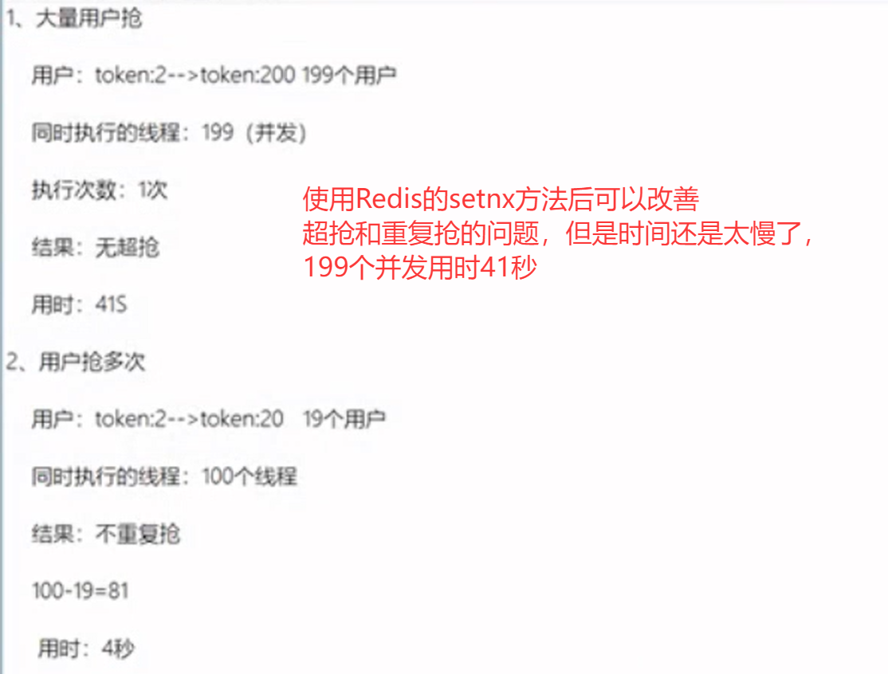

## 消息中间件

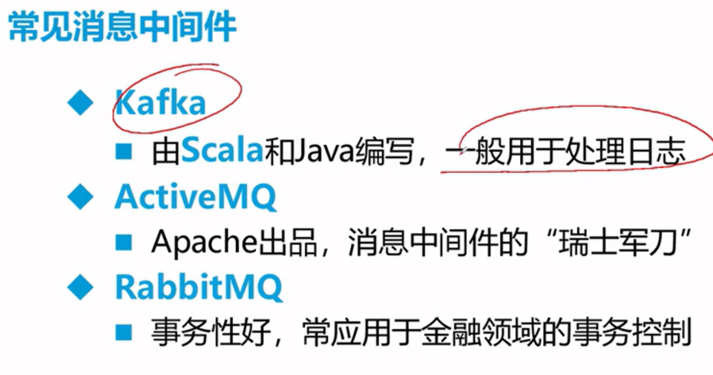

### 消息中间件作用

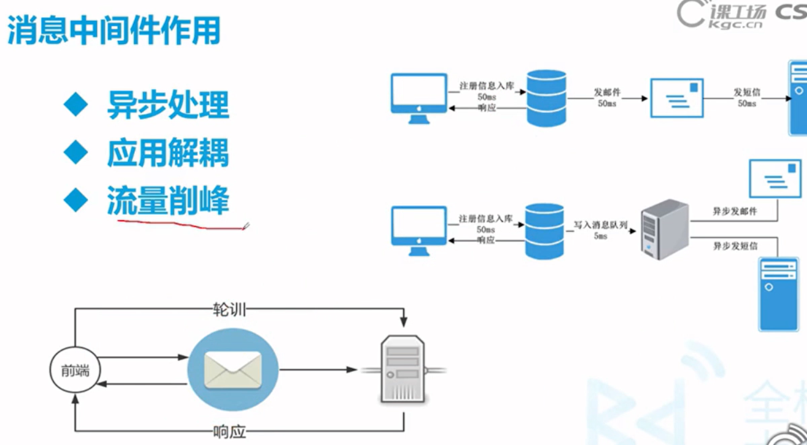

### 引入ActiveMQ相关依赖

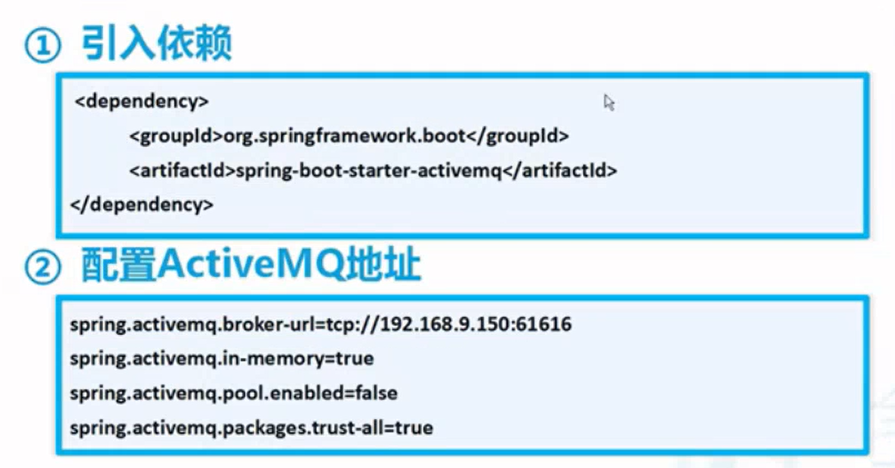

> ### 1. `spring.activemq.broker-url=tcp://192.168.9.150:61616`
>
> - •**含义**：这是最重要的配置项，用于指定应用程序**要连接到的 ActiveMQ 消息代理服务器（Broker）的网络地址**。
> - •**详解**：•`tcp`：表示使用 TCP 协议进行网络通信，这是最常用、最可靠的传输协议。•`192.168.9.150`：这是消息代理服务器的 IP 地址。这是一个内网地址，表明 ActiveMQ 服务部署在您局域网的某台服务器上。•`61616`：这是 ActiveMQ 默认监听的生产者和消费者连接的端口号。
> - •**作用**：没有这个配置，应用程序就无法找到 ActiveMQ 服务，所有消息功能都将失效。
>
> ### 2. `spring.activemq.in-memory=true`
>
> - •**含义**：**指示是否启动一个内存中的、嵌入式的 ActiveMQ 代理**。
> - •**详解**：•`true`：表示启用。当您的 Spring Boot 应用启动时，它会**自动在应用内部创建一个内存版的 ActiveMQ Broker**，而不是连接一个外部的独立服务。图片中的 `broker-url`配置在这种情况下可能会被忽略或指向这个内嵌代理。•`false`：表示不启用，应用将只作为客户端去连接 `broker-url`指定的外部代理。
> - •**作用与影响**：•**优点**：非常方便开发和测试，无需额外安装和启动 ActiveMQ 服务。•**缺点**：**消息默认不会持久化到磁盘**。一旦应用程序重启，所有在内存中的消息（如未消费的队列消息）都会**丢失**。**不适合生产环境**。
>
> ### 3. `spring.activemq.pool.enabled=false`
>
> - •**含义**：**是否启用连接池来管理到 ActiveMQ 的连接**。
> - •**详解**：•`false`：表示**不启用连接池**。每次需要与 ActiveMQ 交互时，可能会创建新的连接，使用完毕后关闭。•`true`：表示启用连接池。应用会维护一个活跃的连接池，使用时从池中获取，用完后归还，避免频繁创建和销毁连接的开销。
> - •**作用与影响**：•在**生产环境**中，强烈建议设置为 `true`（启用连接池），因为频繁创建 TCP 连接是非常消耗资源的操作，会严重影响性能。•在**开发或测试环境**中，可以设置为 `false`以简化配置。
>
> ### 4. `spring.activemq.packages.trust-all=true`
>
> - •**含义**：这是一个**安全相关**的配置，涉及消息的反序列化。
> - •**详解**：•ActiveMQ 在接收对象消息（ObjectMessage，基于 Java 序列化）时，需要将字节流反序列化成 Java 对象。•为了防范恶意攻击（如发送精心构造的字节流进行反序列化攻击），ActiveMQ 有一个“信任包”的白名单机制。默认只信任 `java.lang`, `java.util`等基础包。•`true`：表示**信任所有包**，允许反序列化任何类。•`false`：表示严格遵守信任列表，需要在 `spring.activemq.packages.trusted`中明确指定信任的包名（如 `com.yourcompany.model`）。
> - •**作用与影响**：•设置为 `true`**非常方便**，在开发时无需关心自己定义的实体类在哪个包下。•设置为 `true`**存在安全风险**，因为恶意消息可能会利用反序列化漏洞攻击您的应用。**在生产环境中，应设置为 `false`，并精确配置信任的包**。

### 消息订阅模式

| 特性         | 队列模式 (Queue)             | 发布订阅 (Pub/Sub)           |
| :----------- | :--------------------------- | :--------------------------- |
| **消息消费** | 一条消息只能被一个消费者处理 | 一条消息会被所有订阅者消费   |
| **耦合性**   | 生产者无需知道有哪些消费者   | 生产者无需知道有哪些订阅者   |
| **应用场景** | 任务分发、负载均衡、异步处理 | 事件广播、实时通知、状态更新 |

## 项目整合消息中间件

1. 引入ActiveMQ相关依赖

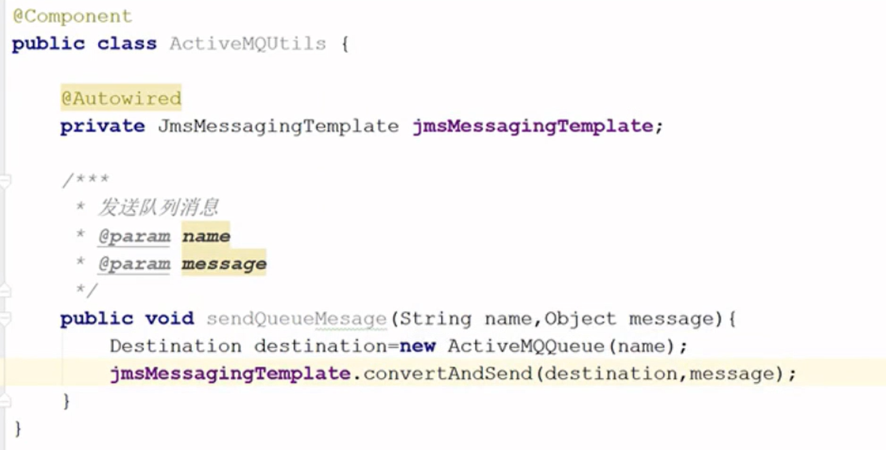

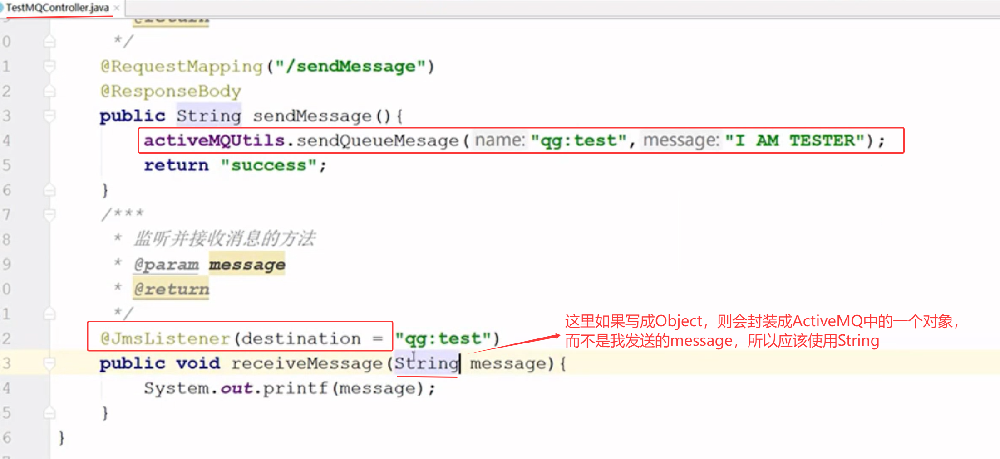

## 基于消息中间件实现流量削峰

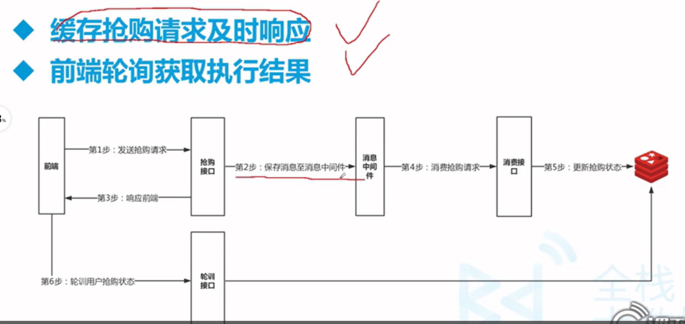

一、

> 