# SpringMVC

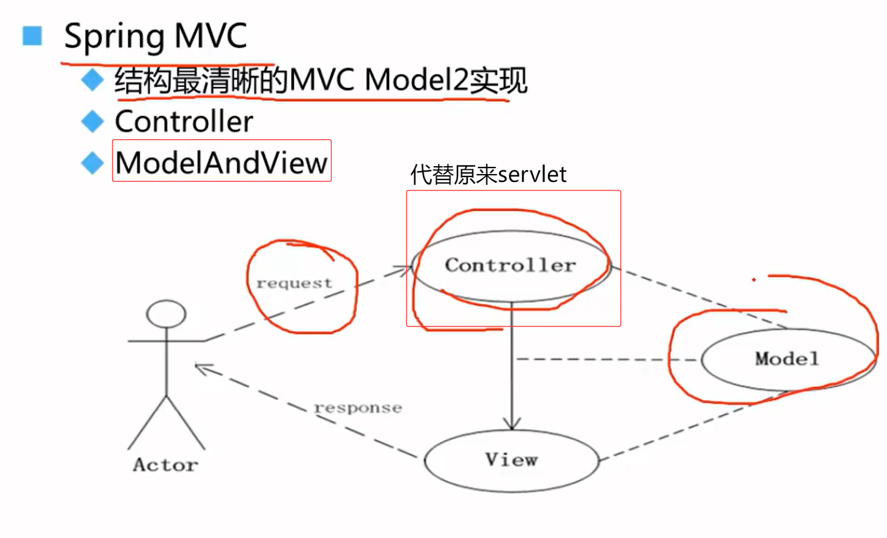

## 环境搭建

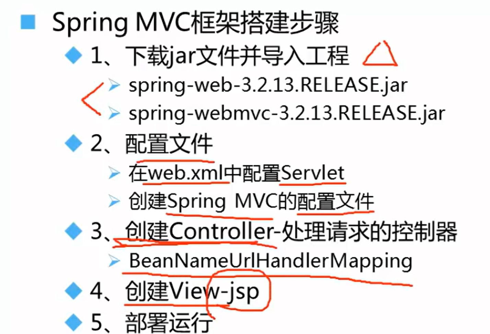

### 1.jar包下载

**spring-web：**是 Spring 框架中用于 Web 开发的基础模块，提供了通用的 Web 功能支持，与具体的 Web 框架（如 Servlet、Reactive）解耦。是 `spring-webmvc` 和 `spring-webflux` 的基础依赖。

**spring-webmvc**：是 Spring MVC 框架的实现模块，基于 Servlet API 构建，用于开发传统的同步 Web 应用（如 MVC、RESTful 服务）。

- 提供核心组件：`DispatcherServlet`、`@Controller`、`@RequestMapping` 等注解。
- 支持视图解析（`ViewResolver`）、数据绑定（`DataBinder`）、拦截器（`HandlerInterceptor`）。
- 依赖 `spring-web` 中的基础功能（如 HTTP 消息处理）。

### 2.配置文件

#### 在web.xml中配置Servlet

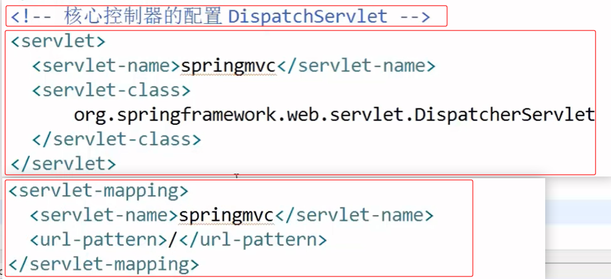

↓ 

未指定 Spring MVC 配置文件路径（默认会查找 `/WEB-INF/{servlet-name}-servlet.xml`），同时优化建议加上<load-on-starup>，让 Servlet 在容器启动时立即初始化，避免首次请求延迟。

~~~xml-dtd
<!-- 核心控制器的配置 DispatcherServlet -->
<servlet>
    <servlet-name>springmvc</servlet-name>
    <servlet-class>org.springframework.web.servlet.DispatcherServlet</servlet-class>
    <!-- 显式指定配置文件位置 -->
    <init-param>
        <param-name>contextConfigLocation</param-name>
        <param-value>classpath: spring-mvc.xml</param-value>
    </init-param>
    <!-- 启动时初始化 -->
    <load-on-startup>1</load-on-startup>
</servlet>
<servlet-mapping>
    <servlet-name>springmvc</servlet-name>
    <url-pattern>/</url-pattern>
</servlet-mapping>
~~~

#### 创建Spring MVC的配置文件

1. **配置Bean: HandlerMapping**（这里采用默认的，不需要配置）
   `HandlerMapping` 是 Spring MVC 的核心接口之一，负责 **将 HTTP 请求映射到对应的处理器（Handler）**，即确定哪个 `Controller` 或方法应该处理当前请求。它是 MVC 请求处理流程的第一步（在 `DispatcherServlet` 之后）。

   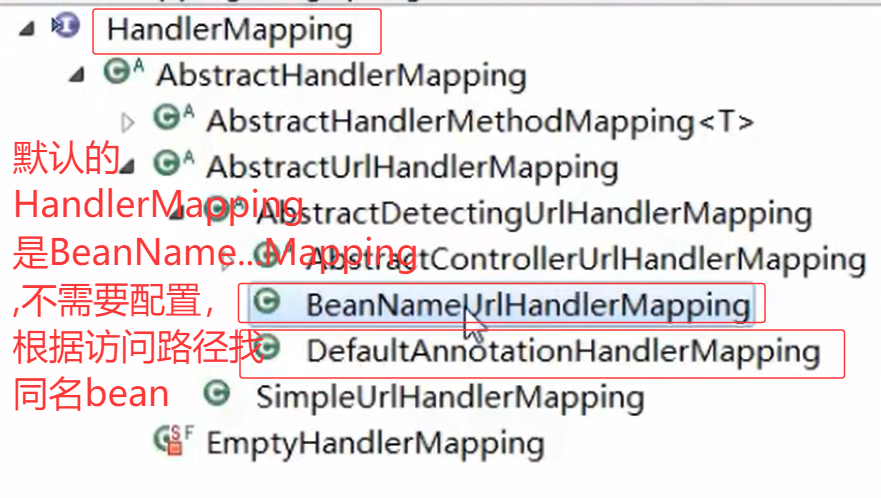

2. **配置controller相关bean**
   

   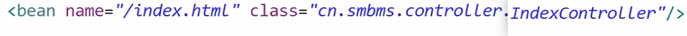

3. **配置视图解析器**

   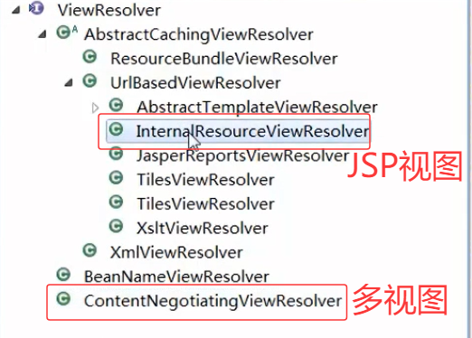

   jsp视图解析

   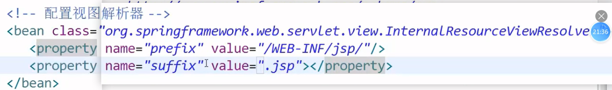

## 注解驱动控制器

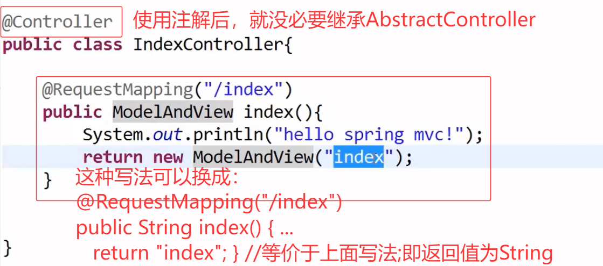

## Spring MVC请求处理流程

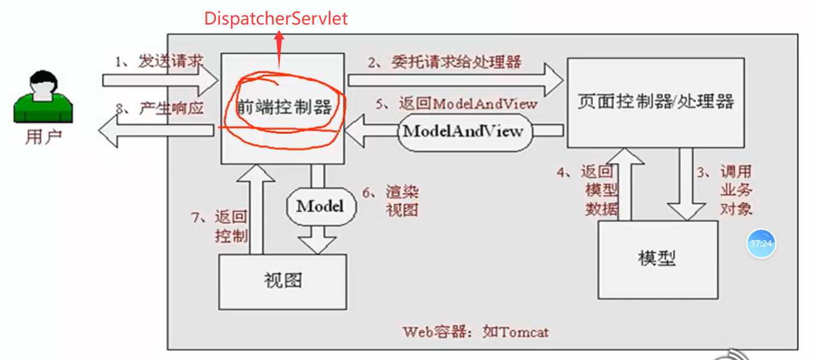

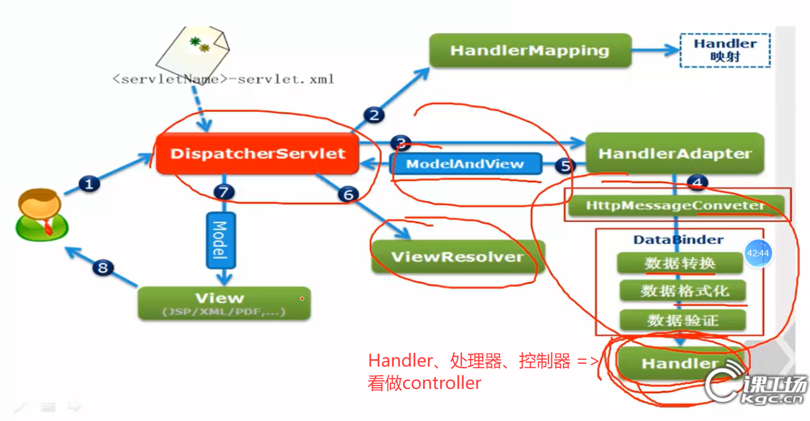

## 总结

 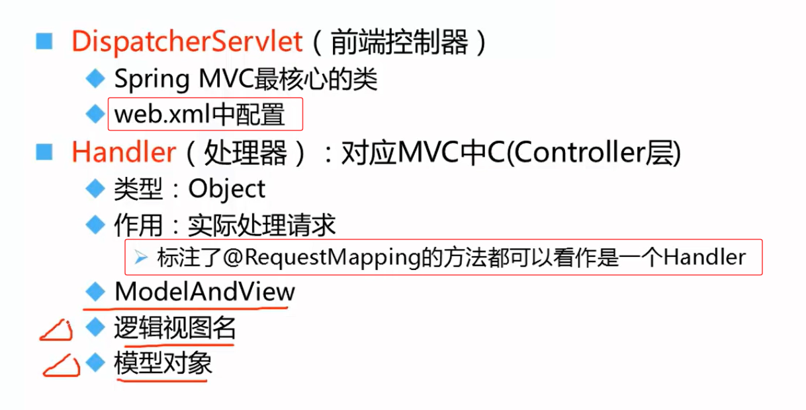

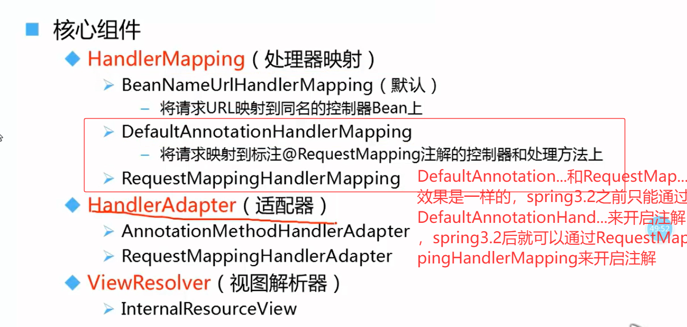

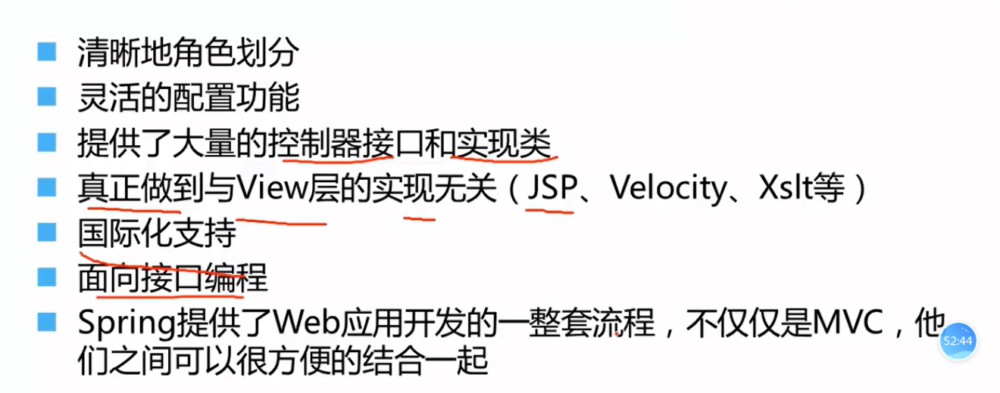

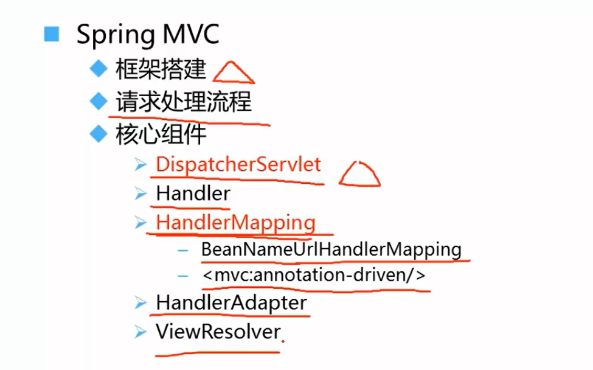
