# JSON对象的处理

[TOC]


## Spring MVC中处理JSON对象

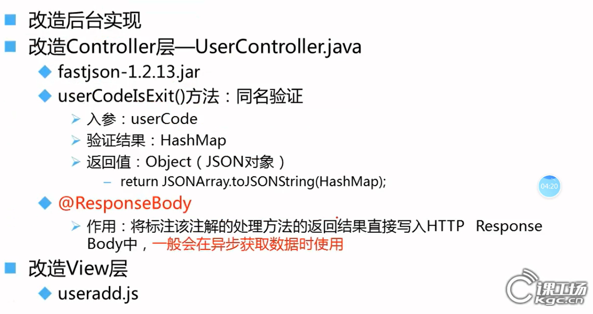

### 复杂数据类型 - json对象（问题）

#### 解决JSON数据传递中文乱码问题

> 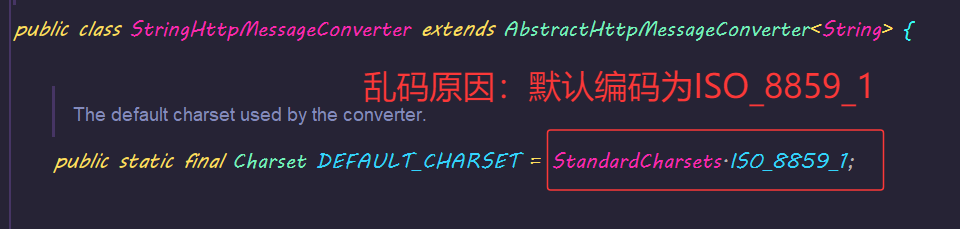
>
> 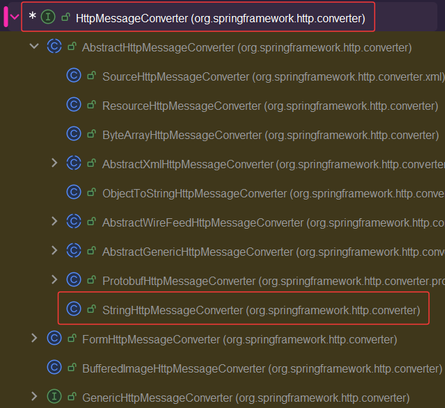
>
> HttpMessageConverter 的主要职责包括：
>
> - 将 Java 对象序列化为 HTTP 响应体（服务器端到客户端）
> - 将 HTTP 请求体反序列化为 Java 对象（客户端到服务器端）
> - 根据请求的 Content-Type 和 Accept 头部决定使用哪种转换器

##### 解决方案一（灵活）：

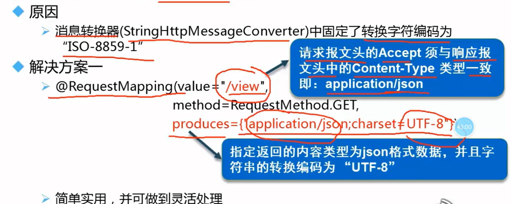

> @RequestMapping的value属性不能以.html结尾，否则springmvc会以html响应，从而导致前后端`请求头不一致`。
>
> 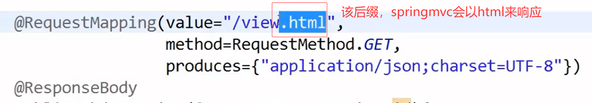
>
> 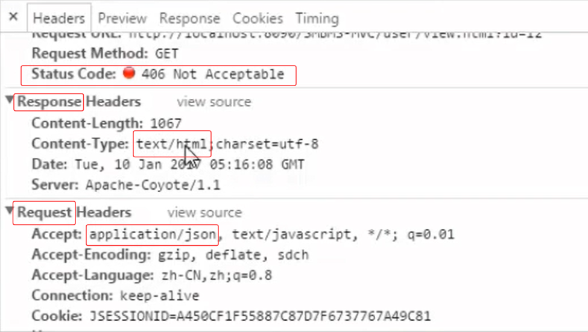

##### 解决方案二（一次配置，永久搞定）

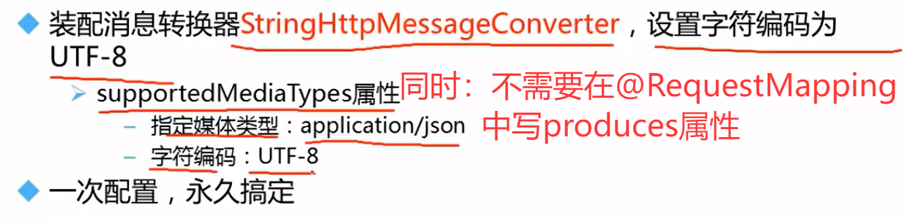

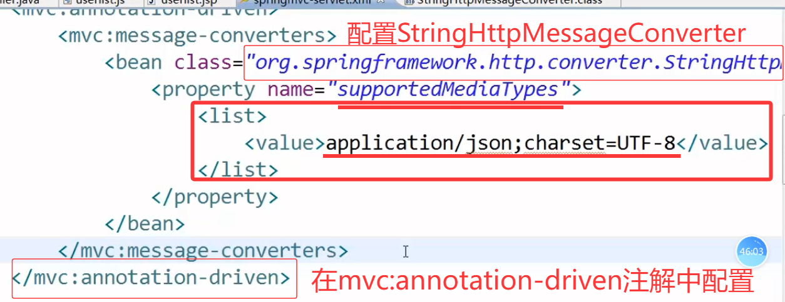


#### 解决JSON数据传递的日期格式问题

##### 解决方案一（注解）

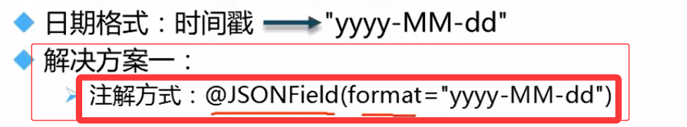

> `在对应的属性类对应属性上加上@JSONField注解`
>
> 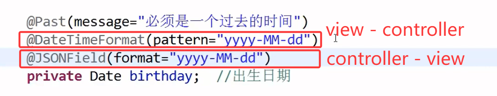
>
> `缺点`
>
> 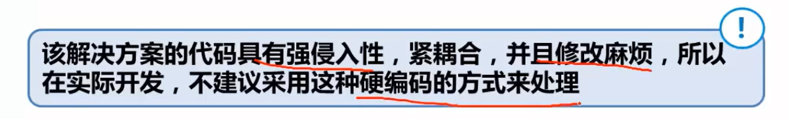

##### 解决方案二（配置消息转换器，针对不同json解析器）

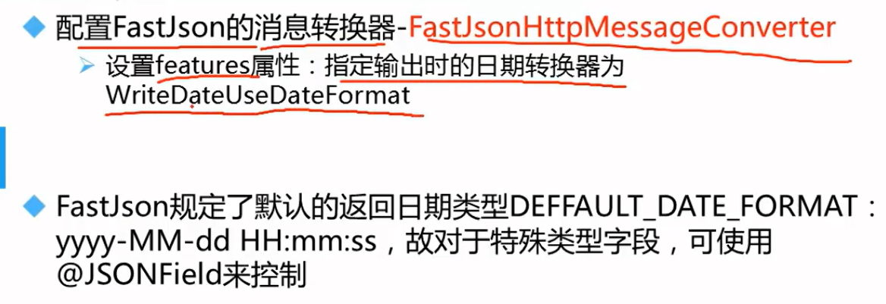

> `和剞劂json中文乱码方案二一样，还是在springmvc-config的配置文件中：<mvc:annotation-driven>的子标签<mvc:message-converters>中配置一个bean，该bean和StringHttpMessageConverter的bean同级`
>
> ~~~xml
> <bean class="com.alibaba.fastjson.support.spring.FastJsonHttpMessageConverter">
>     <!-- 支持的媒体类型（Content-Type） -->
>     <property name="supportedMediaTypes">
>         <list>
>             <value>text/html;charset=UTF-8</value>  <!-- 支持HTML格式响应 -->
>             <value>application/json</value>         <!-- 支持标准JSON格式 -->
>         </list>
>     </property>
>     <!-- FastJson的序列化特性配置 -->
>     <property name="features">
>         <list>
>             <value>WriteDateUseDateFormat</value>    <!-- 日期序列化为格式化字符串 -->
>         </list>
>     </property>
> </bean>
> ~~~
>
> 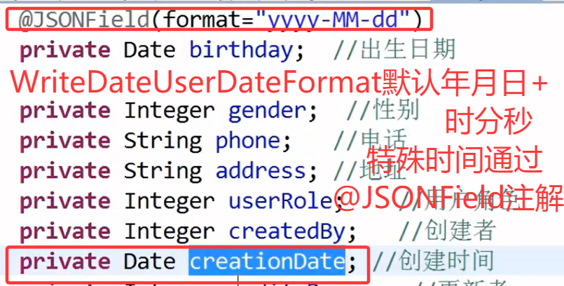
>
> 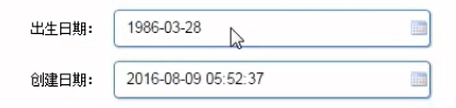
>
> 1. **FastJsonHttpMessageConverter**
>    - 阿里巴巴 FastJson 库提供的 HTTP 消息转换器，用于替代 Spring 默认的 Jackson 转换器。
>    - 需依赖 `fastjson`和 `fastjson-spring-support`包。
> 2. **supportedMediaTypes**
>    - 定义转换器支持的 HTTP 内容类型：
>      - `text/html;charset=UTF-8`：允许将 JSON 数据以 HTML 格式响应（如接口调试）。
>      - `application/json`：标准 JSON 格式支持。
> 3. **features**
>    - FastJson 的序列化特性配置：
>      - `WriteDateUseDateFormat`：自动将 `Date`类型转换为 `"yyyy-MM-dd HH:mm:ss"`格式字符串。

##### 解决方案三？？？

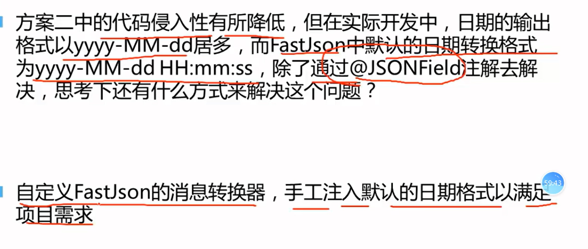

# 配置多视图解析器

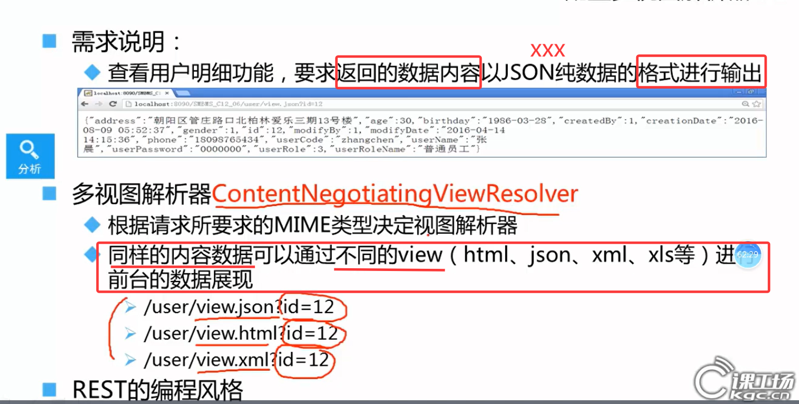

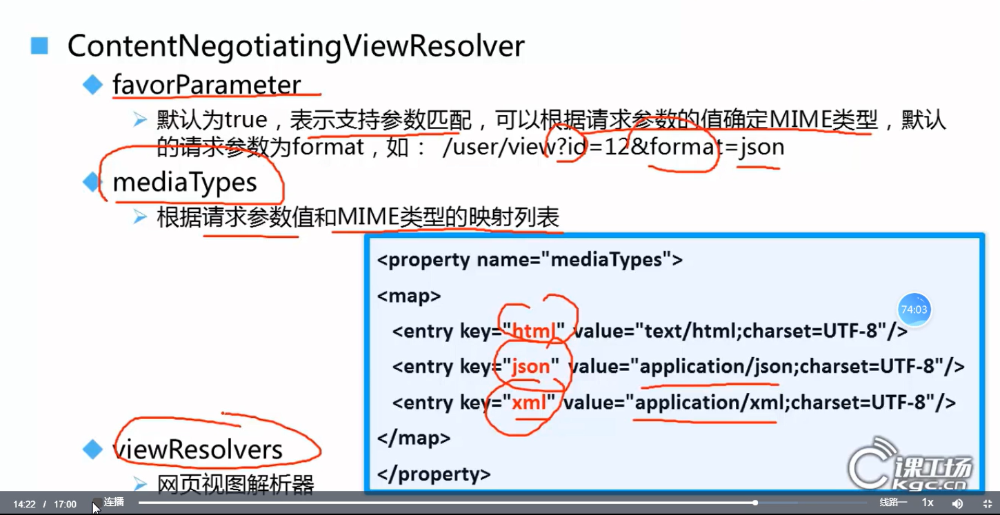

1. **核心机制**

   通过`ContentNegotiatingViewResolver`实现同一数据模型动态渲染不同视图，例如：

   - `?format=html`返回HTML页面
   - `?format=json`返回JSON数据
   - `?format=xml`返回XML数据

   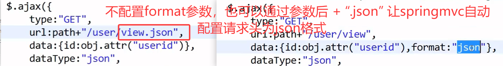

2. **关键参数**

   - `favorParameter=true`：优先从URL参数（默认参数名为`format`）判断格式

   - `mediaTypes`：定义了三种媒体类型映射：

     ```
     html → text/html;charset=UTF-8
     json → application/json;charset=UTF-8
     xml → application/xml;charset=UTF-8
     ```

3. **视图技术**（如JSP/Thymeleaf、Jackson、JAXB等）

   可以直接复制之前的jsp视图解析器

# 小结

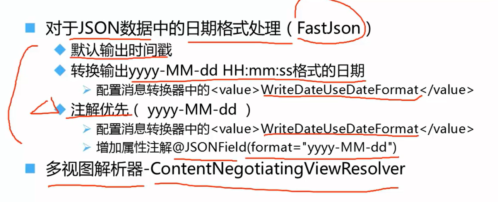


# springmvc数据转换和格式化

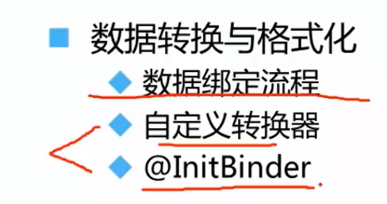

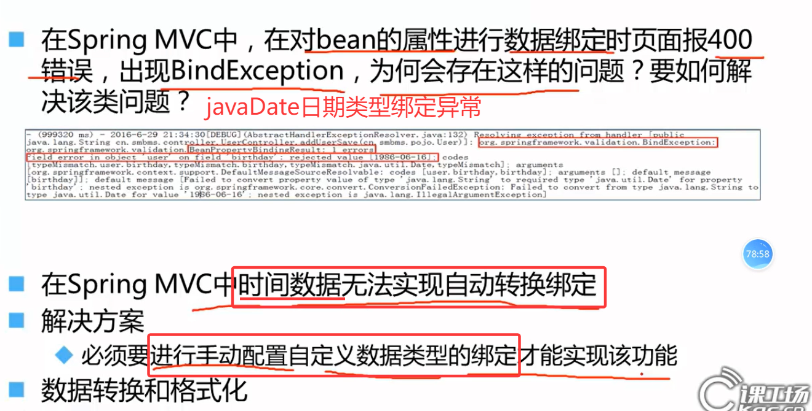

### 数据绑定流程

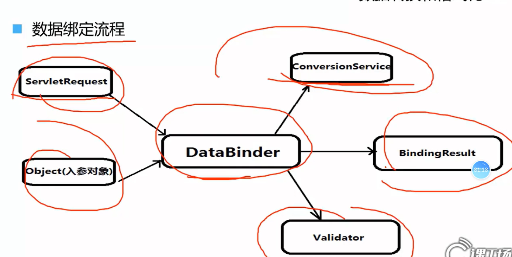

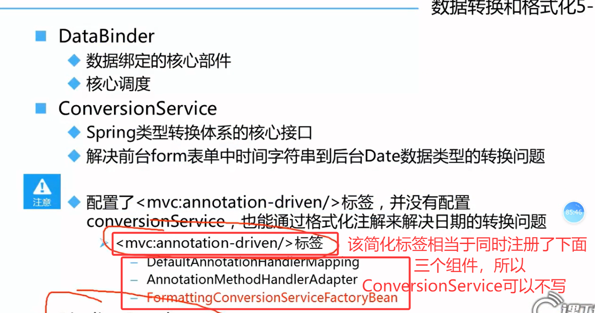

### 自定义转化器

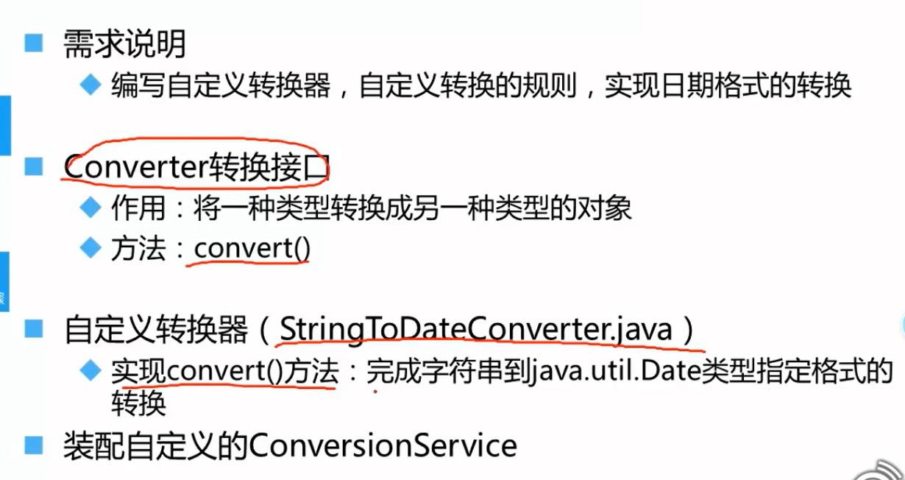

> ~~~java
> import org.springframework.core.convert.converter.Converter;
> import java.text.SimpleDateFormat;
> import java.util.Date;
> 
> public class StringToDateConverter implements Converter<String, Date> {
>     private final String dateFormat; // 例如："yyyy-MM-dd"
> 
>     public StringToDateConverter(String dateFormat) {// springmvc-config.xml配置时就通过构造注入
>         this.dateFormat = dateFormat;
>     }
> 
>     @Override
>     public Date convert(String source) {
>         try {
>             SimpleDateFormat sdf = new SimpleDateFormat(dateFormat);
>             sdf.setLenient(false); // 严格解析日期（避免自动容错）
>             return sdf.parse(source);
>         } catch (Exception e) {
>             throw new IllegalArgumentException("日期格式无效，应为：" + dateFormat);
>         }
>     }
> }
> ~~~
>
> `在springmvc-config.xml配置bean后，需要在<mvc:annotation-driven conversion-service="conversionService"/>`
>
> ~~~xml
> <bean id="conversionService" class="org.springframework.context.support.ConversionServiceFactoryBean">
>     <property name="converters">
>         <set>
>             <bean class="com.example.StringToDateConverter">
>                 <constructor-arg value="yyyy-MM-dd"/> <!-- 指定日期格式 -->
>             </bean>
>         </set>
>     </property>
> </bean>
> 
> <!-- 启用转换服务 -->
> <mvc:annotation-driven conversion-service="conversionService"/>
> ~~~
>
> 


### @InitBinder

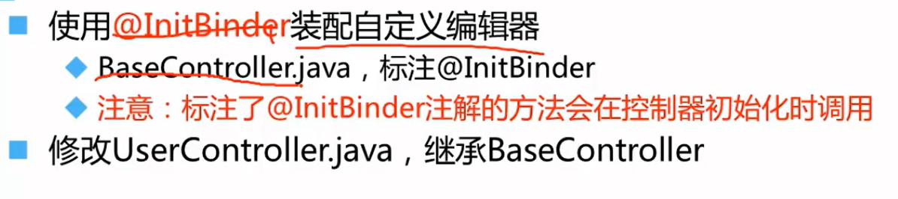

**使用 `@InitBinder`实现日期转换，控制器内直接配置（无需全局`ConversionService`）**

~~~java
@Controller
public class XxxxController {
    
    // 指定日期格式
    private static final String DATE_FORMAT = "yyyy-MM-dd";

    @InitBinder //只在当前controller内有效，可以写在一个BaseController内，其他Controller都继承该BaseController，就可以起到全局效果了。
    public void initBinder(WebDataBinder dataBinder) {
        System.out.println("initBinder===================");
        dataBinder.registerCustomEditor(
            Date.class, //指定需要自定义转换的目标类型
            new CustomDateEditor(new SimpleDateFormat("yyyy-MM-dd"), true)//提供字符串到Date对象的具体转化实现
        ); //CustomDateEditor构造函数的两个参数分别控制日期格式解析和是否允许为空值
    }

    @GetMapping("/event")
    public String handleRequest(@RequestParam("eventDate") Date date) {
        return "处理日期: " + date;
    }
}
~~~

### **`@InitBinder`与 `Converter`的对比**

|    **特性**    |             **`@InitBinder`**              |        **`Converter`**         |
| :------------: | :----------------------------------------: | :----------------------------: |
|  **作用范围**  |             仅对当前控制器生效             |     全局生效（所有控制器）     |
| **配置复杂度** |          简单（直接写在控制器内）          | 需声明`ConversionService`Bean  |
|  **适用场景**  | 控制器特有的格式需求（如不同接口不同格式） | 统一转换规则（如全局日期格式） |
|  **线程安全**  |     每次请求创建新`WebDataBinder`实例      |     转换器实例通常单例复用     |
|   **优先级**   |            高于全局`Converter`             |       低于`@InitBinder`        |


# 框架整合SSM

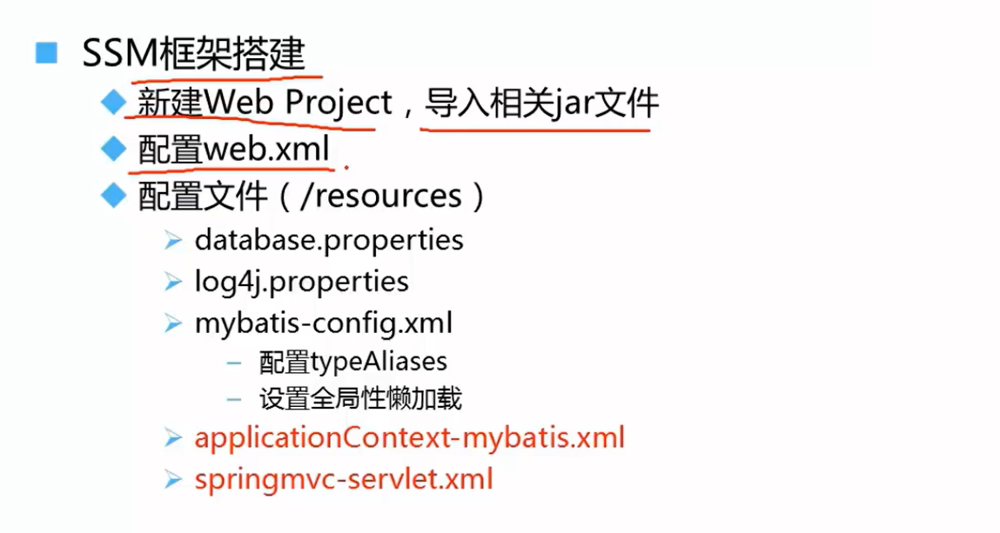

## mysql连接参数配置

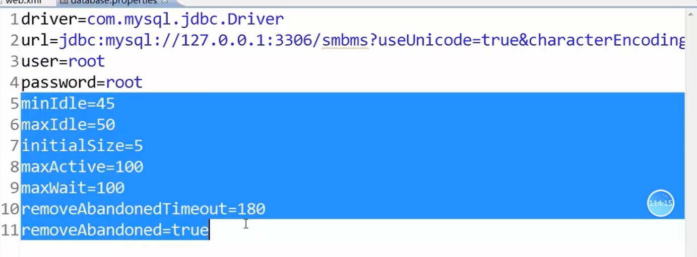

> ### 连接数量控制参数
>
> |   **参数**    | **值** |                         **作用**                         |
> | :-----------: | :----: | :------------------------------------------------------: |
> |   `minIdle`   |   45   | 连接池始终保持的最小空闲连接数（低于此数值时会新建连接） |
> |   `maxIdle`   |   50   |      连接池允许的最大空闲连接数（超出部分会被释放）      |
> | `initialSize` |   5    |             连接池初始化时立即创建的连接数量             |
> |  `maxActive`  |  100   |     同一时间可分配的最大活动连接数（超过此数需等待）     |
>
> **典型场景**：
>
> 当并发请求突增至80时：
>
> 1. 从初始5个连接快速扩容
> 2. 空闲连接维持在45-50之间
> 3. 超过100的请求将阻塞等待（由`maxWait`控制）
>
> ### 连接回收与超时参数
>
> |         **参数**         | **值** |                           **作用**                           |
> | :----------------------: | :----: | :----------------------------------------------------------: |
> |        `maxWait`         |  100   |         获取连接的最大等待时间（毫秒），超时抛出异常         |
> |    `removeAbandoned`     |  true  |         启用自动回收泄露的连接（如未手动关闭的连接）         |
> | `removeAbandonedTimeout` |  180   | 连接被判定为泄露的超时时间（秒），超过此时长未关闭则强制回收 |
>
> **泄露防护机制**：
>
> 若某连接被获取后180秒内未归还，连接池会：
>
> 1. 强制回收该连接
> 2. 记录警告日志（需配合`logAbandoned=true`）
>
> ### **SQL心跳检测配置**
>
> |            **参数**             |     **值**     |                           **作用**                           |
> | :-----------------------------: | :------------: | :----------------------------------------------------------: |
> |         `testWhileIdle`         |     `true`     |   对**空闲连接**定期做有效性检测（通过`validationQuery`）    |
> |         `testOnBorrow`          |    `false`     |     从连接池**获取连接时**不检测（设为`true`会影响性能）     |
> |         `testOnReturn`          |    `false`     |         连接**归还到池时**不检测（避免频繁检测开销）         |
> |        `validationQuery`        |   `select 1`   | 心跳检测SQL（MySQL/SQL Server等通用，Oracle需改为`select 1 from dual`） |
> | `timeBetweenEvictionRunsMillis` |     `600`      |     空闲连接检测线程的运行间隔（毫秒），此处为**0.6秒**      |
> |    `numTestsPerEvictionRun`     | `${maxActive}` | 每次检测的连接数量（动态引用`maxActive`值，检测全部活跃连接） |
>
> 1. **高性能策略**
>    - 关闭`testOnBorrow`/`testOnReturn`避免每次操作都执行SQL检测
>    - 通过`testWhileIdle`+短间隔（600ms）实现**后台异步检测**
> 2. **防连接泄漏**
>    - 每0.6秒检查一次所有连接（`numTestsPerEvictionRun=${maxActive}`）
>    - 失效连接会被自动移除（需配合`minEvictableIdleTimeMillis`使用）
> 3. **数据库兼容性**
>    - `select 1`适用于多数数据库（需根据实际DB调整，如Oracle需改为`select 1 from dual`）

## Spring配置

### 配置事务管理器


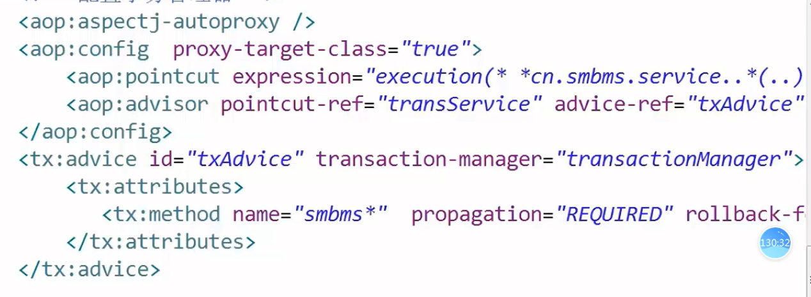

### 配置Mybatis

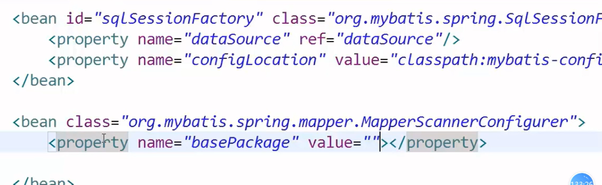

## SpringMVC配置

在springmvc核心应用2的配置基础上加配`拦截器`

