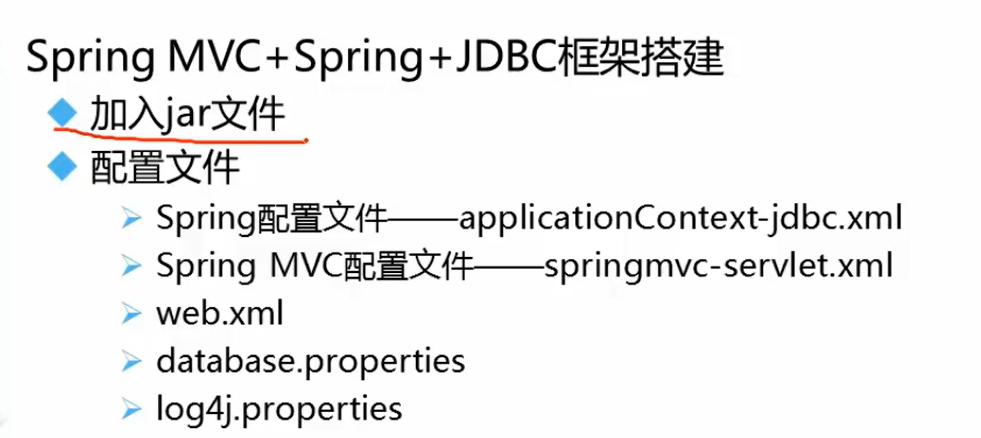
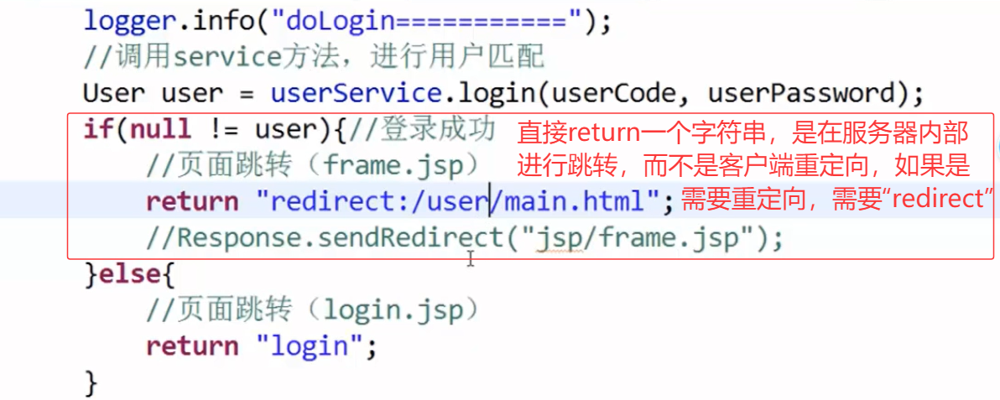
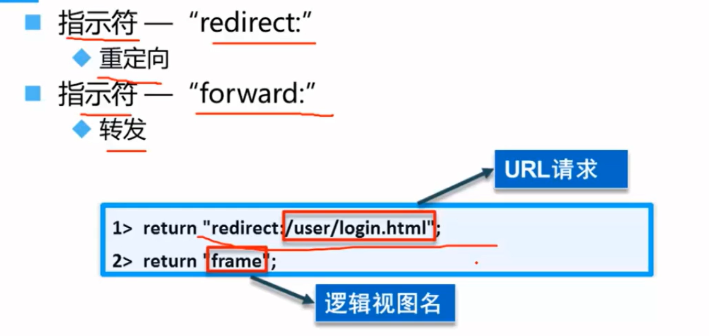
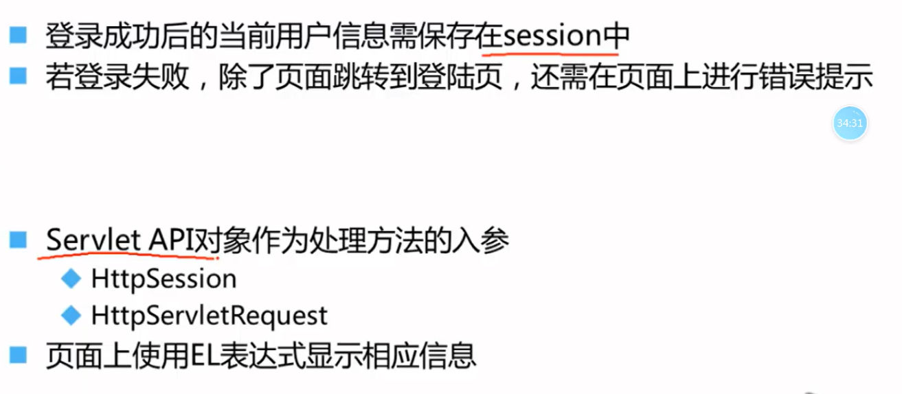
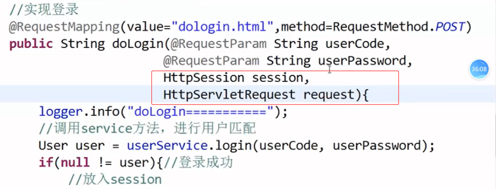
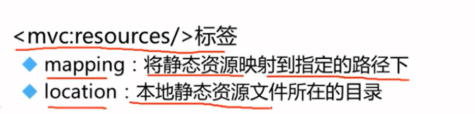
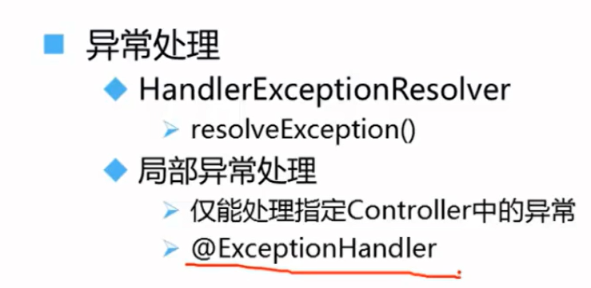
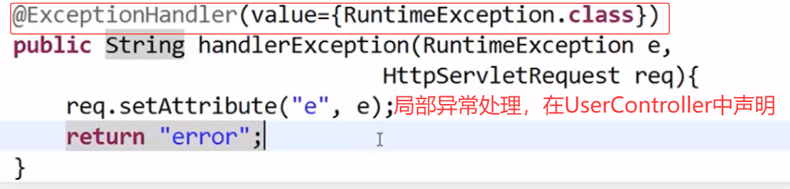
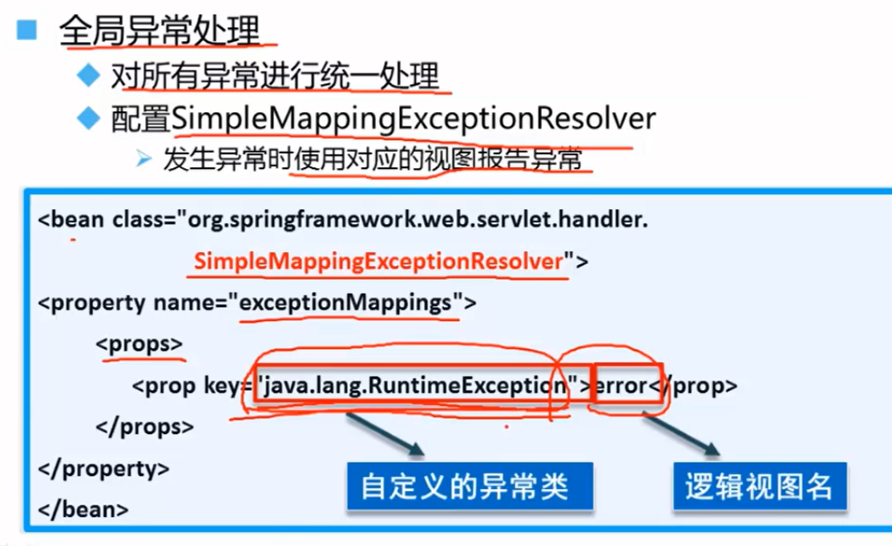
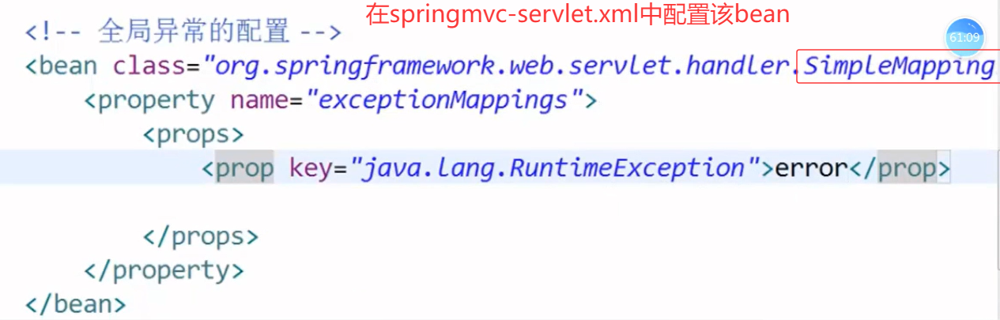

# 搭建Spring MVC + Spring + JDBC框架 并实现登录注销

1. 在web.xml中加载Spring配置文件

   ~~~xml-dtd
   <!-- web.xml -->
   <!-- 1. 通过监听器声明Spring容器（父容器） -->
   <context-param>
       <param-name>contextConfigLocation</param-name>
       <param-value>classPath: spring-config.xml</param-value>
   </context-param>
   <listener>
       <listener-class>
   		org.springframework.web.context.ContextLoaderListener
   	</listener-class>
   </listener>
   ~~~

2. 在web.xml中加载Spring MVC配置文件

   ~~~xml
   <!-- 2. 声明Spring MVC的DispatcherServlet（子容器） -->
   <servlet>
       <servlet-name>dispatcher</servlet-name>
       <servlet-class>org.springframework.web.servlet.DispatcherServlet</servlet-class>
       <init-param>
           <param-name>contextConfigLocation</param-name>
           <param-value>/WEB-INF/spring-mvc.xml</param-value>
       </init-param>
   </servlet>
   ~~~

## 登录功能

### 使用servlet API对象作为入参

### 静态资源文件的引入（springmvc-config.xml）

### 异常处理

#### 局部异常

> ​	当 `UserController` 中其他方法抛出 `RuntimeException` 或其子类异常时，会被此方法捕获，跳转到 `error` 视图（如 `error.jsp`），并将异常对象 `e` 传递到页面中。
>
> ​	`@ExceptionHandler` 是 Spring MVC 提供的异常处理机制，`value` 指定要捕获的异常类型（支持多个）。

#### 全局异常

